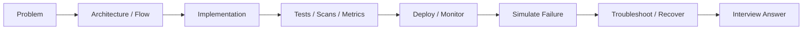

# Documentation Standard

Every important SignalForge note should help you explain the concept to another
engineer, not only remember commands.

Use this structure whenever we add or revise a topic:

```text
1. What problem are we solving?
2. Architecture or flow diagram
3. Plain-English explanation
4. Real production example
5. Commands, config, or code path
6. What can go wrong?
7. How do we troubleshoot?
8. How do we explain it in an interview?
```

## Mental Model



## Writing Style

Use this tone:

```text
I built this because...
The request flows like this...
This component exists because...
If this breaks, I would first check...
In production, I would protect it by...
In an interview, I would explain it as...
```

Avoid docs that only say:

```text
Run this command.
Create this resource.
Use this service.
```

Those are useful, but they are not enough for interviews.

## Diagram Rule

Use a diagram when the topic has movement:

```text
Traffic moving through AWS
GitHub Actions moving through CI/CD
OIDC token exchange
Terraform state and locking
Incident detection and response
Artifact promotion
```

Use a table when comparing:

```text
Security Group vs NACL
SonarQube vs Trivy
Dev vs Prod
S3 lockfile vs DynamoDB locking
```

Use commands only after the concept is clear.

## Interview Answer Rule

Every major doc should have a short talk track:

```text
If someone asks me this in an interview, I would say...
```

That section should be natural enough to speak out loud.
