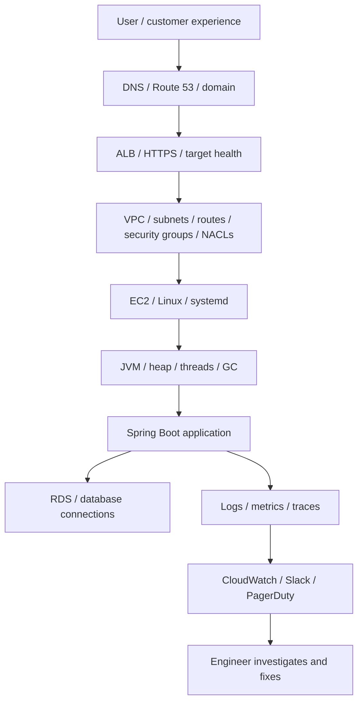
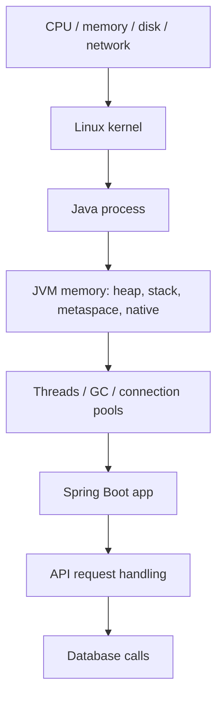

# SignalForge Learning Map

Use this doc when you feel, "I know many tools, but how do they connect?"

The best way to remember this project is to learn it from the bottom up, like a
stack. Troubleshooting becomes easier when you can ask, "Which layer is failing?"

## The Stack



Memory hook:

```text
User -> DNS -> ALB -> Network -> Linux -> JVM -> App -> DB -> Metrics -> Alert
```

If you can walk this path forward and backward, most interview scenarios become
less scary.

## The Delivery Pipeline

```mermaid
flowchart LR
    Code["Code"] --> Build["Maven build"]
    Build --> Test["JUnit tests"]
    Test --> Coverage["JaCoCo coverage"]
    Coverage --> Quality["SonarQube quality gate"]
    Quality --> Security["Trivy security scan"]
    Security --> Artifact["Versioned artifact"]
    Artifact --> OIDC["GitHub OIDC to AWS"]
    OIDC --> Terraform["Terraform infrastructure"]
    Terraform --> Deploy["Deploy to EC2"]
    Deploy --> Observe["Observe in CloudWatch"]
```



Memory hook:

```text
Code -> Build -> Test -> Scan -> Artifact -> Authenticate -> Provision -> Deploy -> Observe
```

Interview answer:

```text
I separate delivery into evidence-producing steps. Maven builds, tests, and
packages the app. SonarQube and Trivy add quality and security evidence. The
artifact is stored and deployed only after those checks. GitHub then uses OIDC to
get short-lived AWS credentials for Terraform and deployment.
```

## Read In This Order

Read these when you want the whole project story:

```text
1. docs/00-start-here-interview-runbook.md
2. docs/00-learning-map.md
3. docs/02-architecture.md
4. docs/03-github-actions-learning-path.md
5. docs/11-github-actions-ci.md
6. docs/12-java-maven-pom-artifacts.md
7. docs/13-quality-gates-and-ci-security.md
8. docs/16-oidc-explained-human-version.md
9. docs/15-aws-oidc-terraform-bootstrap.md
10. docs/04-terraform-operations.md
11. docs/05-interview-troubleshooting-notes.md
12. docs/09-scenario-catalog.md
```

Use these as supporting docs:

```text
docs/00-manual-prerequisites.md:
  What needs to exist before automation can run.

docs/01-two-day-execution-plan.md:
  What we are building in phases.

docs/06-linkedin-project-story.md:
  How to explain the project publicly.

docs/07-domain-and-branding.md:
  Domain, Route 53, ACM, ALB DNS story.

docs/08-disposable-lab-operations.md:
  How to destroy/recreate the lab safely.

docs/10-local-toolchain.md:
  Java, Maven, Terraform, AWS CLI, GitHub CLI path troubleshooting.
```

## Troubleshooting Memory Pattern

When something breaks, ask these questions in this order:

```text
1. Is the customer impacted?
2. Is traffic normal or spiking?
3. Is latency high?
4. Are errors increasing?
5. Which resource is saturated?
6. Which layer owns that resource?
7. What changed recently?
8. What is the safest mitigation?
9. What evidence do we need for root cause?
10. What alert/runbook prevents repeat confusion?
```

Memory hook:

```text
Impact -> Signal -> Layer -> Change -> Mitigate -> Root cause -> Prevent
```

## System-Level Thinking

For Java on EC2, think from bottom to top:



Example:

```text
High memory is not automatically a Java heap leak.
It could be OS cache, another process, JVM heap, thread stacks, direct buffers,
native memory, logs filling disk, or traffic causing more live objects.
```

That is why we troubleshoot in layers:

```text
free/top -> ps/pidstat -> jcmd/jstack/jmap -> app logs -> CloudWatch metrics
```

## What Comes Next

Current project checkpoint:

```text
Java CI works.
SonarQube, JaCoCo, and Trivy are wired.
Terraform state bucket exists.
GitHub OIDC provider and dev IAM role exist.
```

Next step:

```text
Create a GitHub Actions workflow that tests AWS OIDC.
The workflow should request an OIDC token, assume the dev IAM role, and run
aws sts get-caller-identity.
```

Success looks like:

```text
The GitHub Actions log shows Account 575108962419 and an assumed-role ARN for
signalforge-github-actions-dev.
```

After that:

```text
1. Add Terraform dev environment skeleton.
2. Add S3 backend using use_lockfile = true.
3. Run terraform fmt and validate.
4. Add terraform plan workflow.
5. Build the VPC module.
6. Add ALB and EC2 deployment.
```

## How To Memorize The Project

Use three passes:

```text
Pass 1:
  Read only diagrams and memory hooks.

Pass 2:
  Read the plain-English explanations.

Pass 3:
  Practice speaking the interview answers out loud.
```

Best daily review:

```text
Draw the architecture from memory.
Explain GitHub OIDC without looking.
Explain build once, test once, scan once, deploy same artifact.
Pick one incident scenario and walk through metrics, commands, mitigation, RCA.
```
