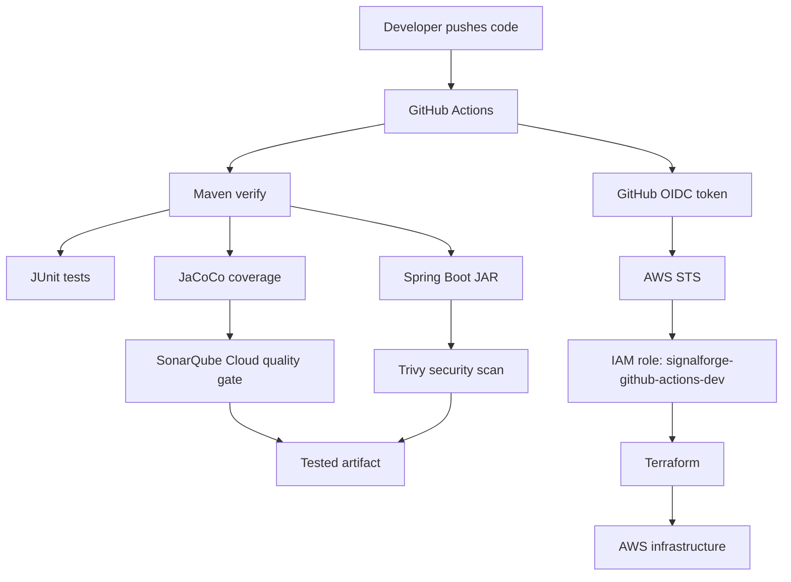

# SignalForge Interview Runbook

Read this first before interviews. It connects the project pieces into one story.

Before reading the detailed docs, remember the documentation standard:

```text
Every concept should have a problem, diagram/flow, plain-English explanation,
production example, commands/config, failure modes, troubleshooting path, and
interview answer.
```

See:

```text
docs/00-documentation-standard.md
```

## One-Minute Project Summary

SignalForge AI Ops Lab is a production-style DevOps/SRE lab for a Java 21 Spring Boot application on AWS.

The project teaches how to:

```text
Build a Java app
Test it
Measure coverage
Scan code quality
Scan security risk
Produce an artifact
Authenticate GitHub Actions to AWS without long-lived keys
Use Terraform to create AWS infrastructure
Deploy the tested artifact
Observe and troubleshoot production-style failures
```

Short interview answer:

```text
I built a Java DevOps/SRE lab using GitHub Actions, Maven, JUnit, JaCoCo, SonarQube Cloud, Trivy, Terraform, AWS OIDC, and CloudWatch. The goal is not just to deploy infrastructure, but to understand how teams build, secure, release, monitor, break, and troubleshoot production systems.
```

## Current State

Current branch:

```text
feature/java-app
```

Implemented so far:

```text
Java 21 Spring Boot app
Maven build lifecycle
JUnit unit tests
JaCoCo code coverage
SonarQube Cloud scan
Trivy security scan
GitHub Actions CI
JAR artifact upload
Terraform state S3 bucket
GitHub OIDC provider in AWS
GitHub Actions dev IAM role
Correct OIDC trust policy for GitHub environment dev
```

Next major work:

```text
GitHub OIDC test workflow
Terraform dev environment skeleton
VPC module
ALB/EC2 deployment
CloudWatch metrics and alerts
Incident simulations
```

## Big Picture Architecture

Think of the project in four lanes:

```text
Code lane:
  Java app, tests, Maven, artifact.

Quality lane:
  JaCoCo, SonarQube Cloud, Trivy.

Cloud lane:
  GitHub OIDC, AWS STS, IAM role, Terraform, AWS resources.

Operations lane:
  CloudWatch, alerts, failure simulation, incident response, AI summaries.
```

The important interview point is that these lanes are connected. We are not just
creating AWS resources. We are proving the code, producing a traceable artifact,
deploying it through controlled identity, and then observing how it behaves.



## CI Flow

Current CI flow:

```text
Push to feature/java-app
  -> GitHub Actions starts
  -> Checkout code
  -> Set up Java 21
  -> Run mvn -B verify
  -> JUnit tests run
  -> JaCoCo coverage report is generated
  -> Spring Boot JAR is packaged
  -> SonarQube Cloud analyzes quality/security/coverage
  -> Trivy scans vulnerabilities/secrets/filesystem risk
  -> GitHub uploads JAR and Trivy report artifacts
```

Analogy:

```text
The developer writes the recipe.
GitHub Actions becomes the kitchen.
Maven cooks the application.
JUnit tastes the basic behavior.
JaCoCo records which parts were tasted.
SonarQube checks cleanliness and quality.
Trivy checks whether ingredients have known safety issues.
The final packed meal is the JAR artifact.
```

What each tool owns:

```text
GitHub Actions:
  Pipeline orchestration.

Maven:
  Java build lifecycle and artifact generation.

JUnit:
  Unit testing framework.

JaCoCo:
  Code coverage report.

SonarQube Cloud:
  Code quality, reliability, maintainability, security hotspots, coverage, quality gate.

Trivy:
  Dependency vulnerabilities, secrets, filesystem risk, container/IaC scanning later.
```

Interview answer:

```text
My CI pipeline starts on push or pull request. Maven runs verify, which compiles the app, runs JUnit tests, builds the JAR, and generates JaCoCo coverage. SonarQube Cloud reads the coverage report and checks quality gates. Trivy scans for supply-chain and security risks. The pipeline only uploads the artifact after the build and checks complete.
```

If someone asks why the workflow runs automatically:

```text
GitHub Actions reads the `on:` block in `.github/workflows/java-ci.yaml`.
We configured pushes to main, dev, and feature/** branches, so a push to
feature/java-app starts the CI workflow automatically.
```

## Quality Gates

Beginner gate now:

```text
Code compiles
Unit tests pass
JAR builds
JaCoCo report exists
Sonar scan completes
Trivy report exists
Artifact uploads
```

Production gate later:

```text
Unit tests pass
Integration tests pass
Sonar quality gate passes
No blocker issues
No critical bugs
No critical vulnerabilities
Security hotspots reviewed
New code coverage >= 80%
Overall coverage >= 70%
Duplicated code <= 3%
Trivy has no unfixed HIGH/CRITICAL issues
No secrets detected
Terraform/IaC scan has no critical findings
```

Important nuance:

```text
Coverage does not prove correctness. It proves tests executed code paths.
Quality gates reduce risk. They do not replace engineering review.
```

## Artifact Flow

Current artifact flow:

```text
Maven builds app/target/signalforge-app-0.1.0-SNAPSHOT.jar
GitHub Actions uploads the JAR as workflow artifact
```

Production flow later:

```text
Build once
Test once
Scan once
Publish the same artifact
Promote the same artifact to dev, stage, and prod
Do not rebuild separately per environment
```

Why:

```text
If you rebuild separately for prod, prod may not run the same artifact that passed testing.
```

Interview answer:

```text
We promote the same tested artifact across environments. That gives traceability and prevents differences between what was tested and what was deployed.
```

## OIDC To AWS Flow

Problem:

```text
GitHub Actions needs AWS access for Terraform.
We do not want long-lived AWS keys in GitHub secrets.
```

Solution:

```text
Use GitHub OIDC and AWS STS to issue short-lived credentials.
```

Flow:

```text
1. GitHub Actions job starts.
2. The job declares `environment: dev`.
3. The job has `permissions: id-token: write`.
4. GitHub creates a signed OIDC token for that exact job.
5. The AWS credentials action sends that token to AWS STS.
6. STS checks whether AWS trusts GitHub as an OIDC provider.
7. STS checks the IAM role trust policy.
8. The trust policy checks token claims like audience, repo, and environment.
9. If the claims match, STS returns short-lived AWS credentials.
10. Terraform uses those credentials to plan or apply infrastructure.
```

Analogy:

```text
GitHub token = employee ID card
IAM trust policy = security guard checking who can enter
STS = front desk issuing temporary visitor badge
IAM permissions policy = rooms the badge can open
Terraform = worker using the badge to perform approved tasks
```

Correct dev trust condition:

```text
repo:PraveenB19/signalforge-ai-ops-lab:environment:dev
```

Why this matters:

```text
Only workflows from this repo using GitHub Environment dev can assume the dev AWS role.
```

Interview answer:

```text
I used GitHub OIDC instead of AWS access keys. GitHub issues a signed token for the workflow, AWS validates the token claims, and STS returns short-lived credentials only if the trust policy matches the repo and environment. This avoids storing long-lived AWS credentials in GitHub.
```

What we have configured right now:

```text
AWS account:
  575108962419

OIDC provider:
  token.actions.githubusercontent.com

Dev IAM role:
  signalforge-github-actions-dev

Trusted GitHub subject:
  repo:PraveenB19/signalforge-ai-ops-lab:environment:dev
```

This means a random GitHub repo, a random branch, or a workflow that does not use
the `dev` GitHub Environment should not be able to assume this role.

## Dev vs Prod Strategy

Same AWS account for lab:

```text
dev resources: signalforge-dev-*
prod resources: signalforge-prod-*
```

GitHub environments:

```text
dev:
  Used by dev Terraform workflows.
  No manual approval initially, because we want fast learning.

prod:
  Used by production workflows.
  Requires manual approval before apply/deploy.
```

Terraform folders:

```text
infra/envs/dev
infra/envs/prod
```

IAM roles:

```text
signalforge-github-actions-dev
signalforge-github-actions-prod
```

Trust subjects:

```text
dev:
  repo:PraveenB19/signalforge-ai-ops-lab:environment:dev

prod:
  repo:PraveenB19/signalforge-ai-ops-lab:environment:prod
```

Production note:

```text
Real companies often use separate AWS accounts for dev/stage/prod. This lab uses one account for cost and simplicity, but still separates environments through naming, tags, Terraform state keys, GitHub environments, and IAM roles.
```

How branch and environment work together:

```text
Branch:
  Tells us what code line is being built, such as feature/java-app, dev, or main.

GitHub Environment:
  Tells us which deployment boundary is being used, such as dev or prod.

IAM trust policy:
  Can restrict AWS access to a specific repo plus environment.

Environment protection:
  Can require human approval before a prod job receives secrets or OIDC access.
```

Production interview answer:

```text
For dev, the workflow can assume the dev AWS role using the dev GitHub Environment.
For prod, I would use a separate prod role, separate Terraform state key, and a
GitHub prod Environment with required reviewers. That means even if code reaches
main, the production apply/deploy job waits for manual approval before GitHub
issues environment-scoped access.
```

## Terraform State

Terraform state bucket:

```text
signalforge-tfstate-575108962419-us-east-1
```

Why it exists:

```text
Terraform needs state to remember which real AWS resources match which code resources.
```

State bucket settings:

```text
Block public access
Versioning enabled
Encryption enabled
SSE-S3 for lab simplicity
```

Why:

```text
State can contain sensitive infrastructure data.
Versioning helps recover from accidental overwrite.
Encryption protects data at rest.
```

## Production Failure Scenarios We Will Simulate

Application:

```text
High CPU
High memory
High latency
502 from backend failure
503 from no healthy ALB targets
Disk full
Bad deployment
```

AWS/Terraform:

```text
Security group rule removed
Manual console change creates drift
No NAT gateway
Staging works but prod fails
Wrong IAM permissions
Terraform state lock conflict
```

Interview answer:

```text
The project is designed to intentionally break common production paths, observe the metrics/logs, and practice recovery. That is more valuable than only provisioning infrastructure.
```

## Where To Read Next

```text
Documentation style:
  docs/00-documentation-standard.md

AWS architecture:
  docs/02-architecture.md

GitHub Actions syntax:
  docs/03-github-actions-learning-path.md

CI flow:
  docs/14-ci-interview-answer.md

Quality gates:
  docs/13-quality-gates-and-ci-security.md

Maven and artifacts:
  docs/12-java-maven-pom-artifacts.md

OIDC:
  docs/16-oidc-explained-human-version.md

AWS/Terraform bootstrap:
  docs/15-aws-oidc-terraform-bootstrap.md

Production scenarios:
  docs/09-scenario-catalog.md
```

Question-to-doc map:

```text
"Design the architecture."
  Read docs/02-architecture.md

"Explain GitHub Actions from scratch."
  Read docs/03-github-actions-learning-path.md and docs/11-github-actions-ci.md

"How do you avoid AWS keys in GitHub?"
  Read docs/16-oidc-explained-human-version.md

"How does Terraform state/locking/drift work?"
  Read docs/04-terraform-operations.md and docs/15-aws-oidc-terraform-bootstrap.md

"How do you know the right artifact is deployed?"
  Read docs/12-java-maven-pom-artifacts.md and docs/14-ci-interview-answer.md

"How do you troubleshoot memory, disk, 502, 503, latency?"
  Read docs/05-interview-troubleshooting-notes.md and docs/09-scenario-catalog.md
```
