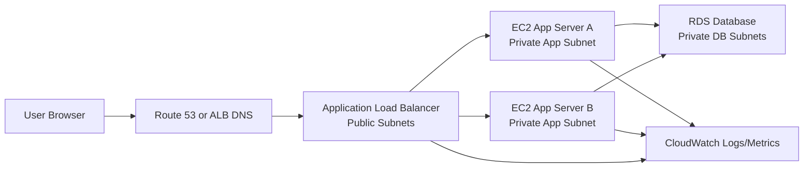
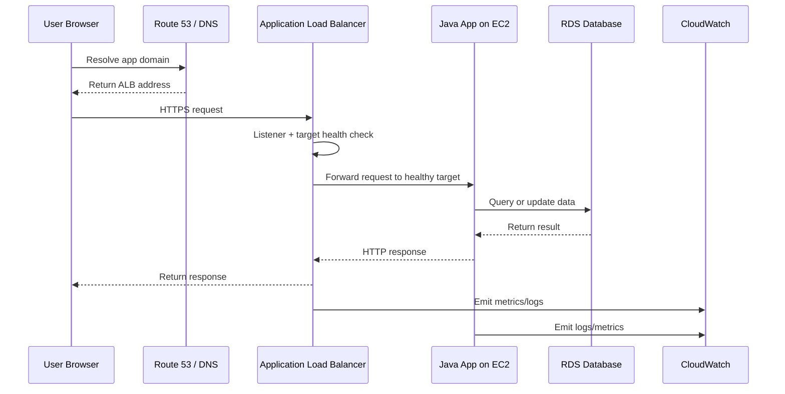
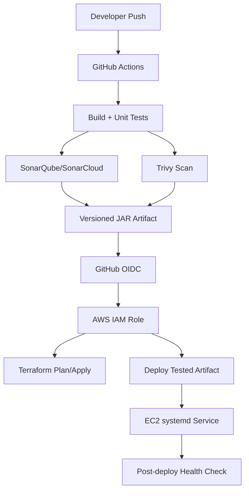
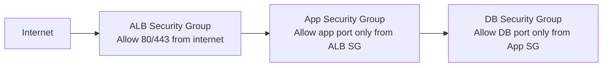

# Architecture

This doc is the whiteboard explanation for SignalForge. If someone asks
"design a production-style Java application on AWS," this is the story.

## Name

Application name: **SignalForge**

Repository name: **signalforge-ai-ops-lab**

Positioning:

```text
AI-assisted DevOps and reliability engineering lab for Java workloads on AWS.
```

## Initial AWS Architecture

High-level runtime design:



Plain-English explanation:

```text
The only public entry point is the Application Load Balancer. The Java EC2
servers live in private subnets, so users cannot directly reach them. The
database lives even deeper in private DB subnets, and only the app security group
can talk to it.
```

Interview talk track:

```text
I designed the app as a three-tier AWS architecture: public ALB, private
application tier, and private database tier. The ALB receives user traffic,
checks target health, and forwards requests only to healthy EC2 instances. The
EC2 app servers connect to RDS through security group rules. This gives a clear
network boundary and allows us to scale the app tier without exposing servers
directly to the internet.
```

## Request And Response Flow



How to explain packet flow simply:

```text
The browser does not know about the private EC2 instance. It only knows the ALB
DNS name. The ALB receives the request and forwards it inside the VPC to a
healthy target. The Java app talks to RDS over private networking. The response
travels back through the same logical path: RDS to app, app to ALB, ALB to user.
```

## CI/CD and Security Architecture

Delivery design:



Plain-English explanation:

```text
The CI/CD pipeline proves the application before it touches AWS. GitHub Actions
builds and tests the Java app, SonarQube checks quality, Trivy checks security
risk, and the artifact is stored. AWS access happens through OIDC, so GitHub does
not store long-lived AWS keys.
```

Production rule:

```text
Build once, test once, scan once, deploy the same artifact.
```

## Traffic Flow

When a user opens the application:

```text
1. Browser resolves the domain using DNS.
2. DNS returns the ALB address.
3. Browser sends HTTP/HTTPS request to the ALB.
4. ALB listener receives the request.
5. ALB forwards the request to a healthy EC2 target in a private subnet.
6. Java app processes the request.
7. If needed, Java app connects to RDS using the DB security group rule.
8. RDS returns data to the Java app.
9. Java app returns response to ALB.
10. ALB returns response to the browser.
```

If something fails in this path:

```text
DNS problem:
  User cannot resolve the name.

ALB listener or certificate problem:
  User reaches ALB but HTTPS/listener fails.

Target health problem:
  ALB returns 503 because no healthy targets exist.

App crash or bad backend response:
  ALB may return 502.

Database/security group problem:
  App returns errors or latency increases.
```

## Security Boundaries

```text
Public subnet:
  ALB only

Private app subnet:
  EC2 app servers
  No direct public inbound traffic

Private DB subnet:
  RDS database
  No public access
  Allows database port only from app security group
```

Security group flow:



Interview talk track:

```text
Security is layered. I do not depend on one control. The ALB is public, but EC2
and RDS are private. Security groups allow traffic by source security group, not
by wide CIDR ranges. IAM uses OIDC and least privilege. Secrets stay out of code.
Logs and metrics go to CloudWatch so we can detect issues after deployment.
```

## Why This Is Highly Available

Initial HA design:

- At least two Availability Zones
- Public subnet per AZ
- Private app subnet per AZ
- Private DB subnet per AZ
- ALB distributes traffic across healthy targets
- RDS can be upgraded to Multi-AZ
- Auto Scaling Group can replace failed EC2 instances

Failure example:

```text
If one EC2 instance fails, the ALB health check marks it unhealthy and stops
sending traffic to it. The Auto Scaling Group can replace it. Users continue
through the healthy instance in the other Availability Zone.
```

## Why This Is Scalable

Scaling options:

- Horizontal scaling with more EC2 instances
- Auto Scaling based on CPU, memory, request count, or target response time
- Database read replicas later
- CloudFront caching later
- Microservices or ECS/EKS later
- Serverless version later using Lambda/API Gateway

Scaling example:

```text
If request count and CPU increase, an Auto Scaling policy can add more EC2
instances behind the ALB. The ALB spreads requests across the larger target pool.
```

## Why This Is Reliable

Reliability controls:

- Health checks
- Rolling or blue/green deployments later
- CloudWatch alarms
- Incident simulation
- Runbooks
- Rollback plan
- Terraform drift detection
- No manual production changes without review

Reliability example:

```text
If a deployment causes high 5xx errors, CloudWatch alarms should fire, the
deployment should stop or roll back, and we should use logs/metrics to confirm
whether the issue is app, ALB, database, or network related.
```

## Why This Is Durable

Durability controls:

- S3 versioning for Terraform state
- RDS automated backups
- RDS snapshots
- Multi-AZ database option
- Versioned artifacts
- Git history
- Infrastructure as Code

Durability example:

```text
If the dev VPC is destroyed at the end of the day, Git, Terraform code, remote
state history, and artifacts remain. We can recreate the environment instead of
manually rebuilding it from memory.
```

## Why This Is Secure

Security controls:

- GitHub OIDC instead of static AWS access keys
- Least-privilege IAM roles
- Private subnets for app and DB
- Security groups with narrow inbound rules
- No public RDS access
- Secrets in GitHub Secrets, AWS Secrets Manager, or SSM Parameter Store
- Trivy scans for IaC, dependencies, and containers later
- SonarQube quality gate
- CloudWatch logs and VPC Flow Logs
- IMDSv2 on EC2
- SSM Session Manager preferred over SSH

Security interview answer:

```text
I handle security across identity, network, secrets, supply chain, runtime, data,
and detection. OIDC avoids static AWS keys. Private subnets reduce exposure.
Security groups restrict east-west traffic. SonarQube and Trivy reduce code and
supply-chain risk. CloudWatch and VPC Flow Logs help detect issues after release.
```
