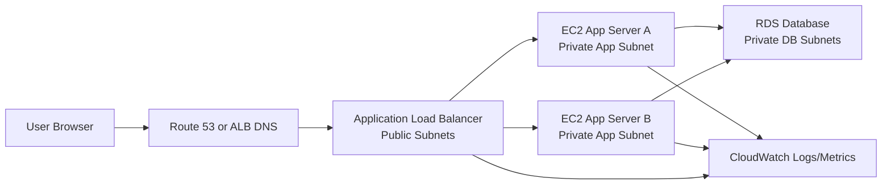
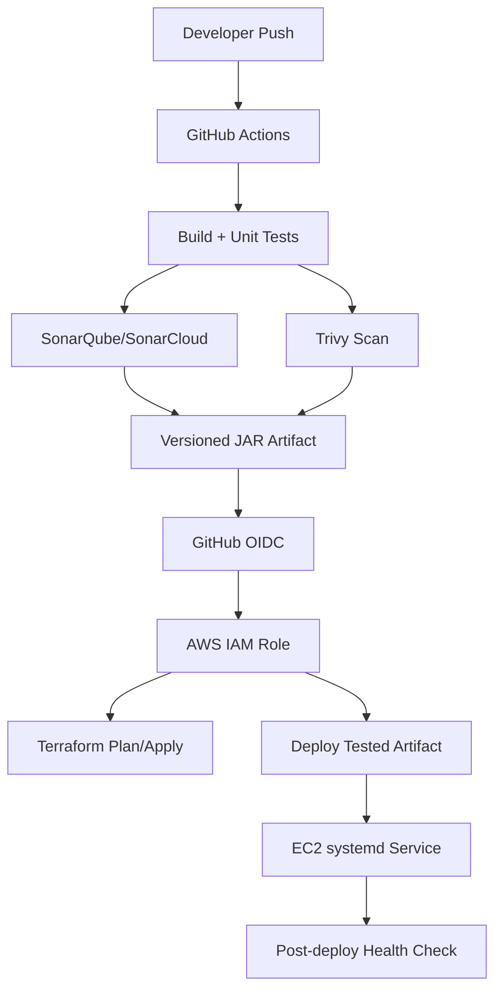

# Architecture

## Name

Application name: **SignalForge**

Repository name: **signalforge-ai-ops-lab**

Positioning:

```text
AI-assisted DevOps and reliability engineering lab for Java workloads on AWS.
```

## Initial AWS Architecture



## CI/CD and Security Architecture



## Traffic Flow

When a user opens the application:

```text
1. Browser resolves the domain using DNS.
2. DNS returns the ALB address.
3. Browser sends HTTP/HTTPS request to the ALB.
4. ALB listener receives the request.
5. ALB forwards the request to a healthy EC2 target in a private subnet.
6. Java app processes the request.
7. If needed, Java app connects to RDS using the DB security group rule.
8. RDS returns data to the Java app.
9. Java app returns response to ALB.
10. ALB returns response to the browser.
```

## Security Boundaries

```text
Public subnet:
  ALB only

Private app subnet:
  EC2 app servers
  No direct public inbound traffic

Private DB subnet:
  RDS database
  No public access
  Allows database port only from app security group
```

## Why This Is Highly Available

Initial HA design:

- At least two Availability Zones
- Public subnet per AZ
- Private app subnet per AZ
- Private DB subnet per AZ
- ALB distributes traffic across healthy targets
- RDS can be upgraded to Multi-AZ
- Auto Scaling Group can replace failed EC2 instances

## Why This Is Scalable

Scaling options:

- Horizontal scaling with more EC2 instances
- Auto Scaling based on CPU, memory, request count, or target response time
- Database read replicas later
- CloudFront caching later
- Microservices or ECS/EKS later
- Serverless version later using Lambda/API Gateway

## Why This Is Reliable

Reliability controls:

- Health checks
- Rolling or blue/green deployments later
- CloudWatch alarms
- Incident simulation
- Runbooks
- Rollback plan
- Terraform drift detection
- No manual production changes without review

## Why This Is Durable

Durability controls:

- S3 versioning for Terraform state
- RDS automated backups
- RDS snapshots
- Multi-AZ database option
- Versioned artifacts
- Git history
- Infrastructure as Code

## Why This Is Secure

Security controls:

- GitHub OIDC instead of static AWS access keys
- Least-privilege IAM roles
- Private subnets for app and DB
- Security groups with narrow inbound rules
- No public RDS access
- Secrets in GitHub Secrets, AWS Secrets Manager, or SSM Parameter Store
- Trivy scans for IaC, dependencies, and containers later
- SonarQube quality gate
- CloudWatch logs and VPC Flow Logs
- IMDSv2 on EC2
- SSM Session Manager preferred over SSH

