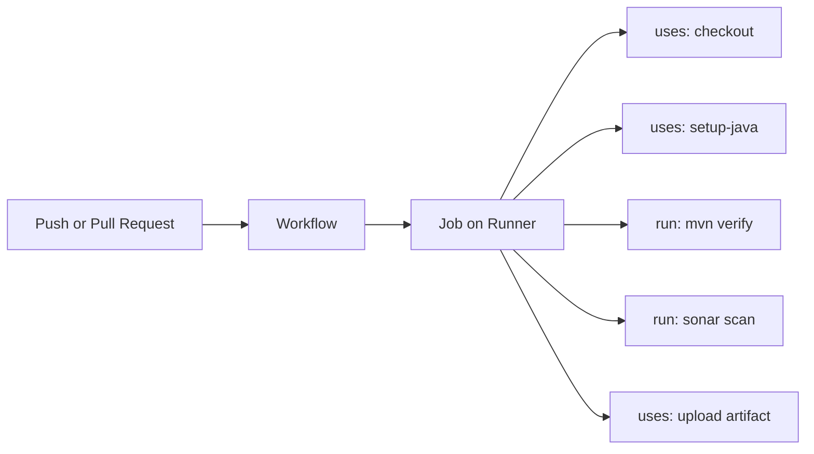
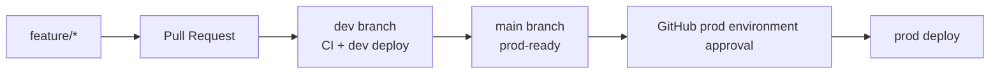

# GitHub Actions Learning Path

This doc explains GitHub Actions as a pipeline story first, then YAML syntax.

Mental model:

```text
Event happens
  -> workflow starts
  -> one or more jobs run
  -> each job has steps
  -> steps either use an action or run a shell command
```



Analogy:

```text
A workflow is the full factory process.
A job is one workstation.
A runner is the machine doing the work.
A step is one instruction.
`uses` means use a prebuilt tool.
`run` means execute a command yourself.
```

## Core Syntax

Basic workflow shape:

```yaml
name: CI

on:
  push:
    branches:
      - main
      - develop
  pull_request:

permissions:
  contents: read

jobs:
  build:
    runs-on: ubuntu-latest

    steps:
      - name: Checkout
        uses: actions/checkout@v4

      - name: Set up Java
        uses: actions/setup-java@v4
        with:
          distribution: temurin
          java-version: "21"

      - name: Test
        run: mvn test
```

How to read this:

```text
name:
  Human-friendly workflow name in the GitHub Actions UI.

on:
  The trigger. It answers "when should this workflow start?"

permissions:
  The default access given to the workflow token.

jobs:
  The work GitHub should run.

runs-on:
  The runner operating system.

steps:
  Ordered commands/actions inside the job.
```

## Concepts To Learn In Order

1. `name`
2. `on`
3. `jobs`
4. `runs-on`
5. `steps`
6. `uses`
7. `run`
8. `with`
9. `env`
10. `secrets`
11. `vars`
12. `permissions`
13. `needs`
14. `if`
15. `strategy`
16. `matrix`
17. `artifacts`
18. `cache`
19. `environments`
20. `workflow_dispatch`
21. `schedule`

## Branching Strategy

```text
main
  production-ready code

dev
  integration branch

feature/*
  new work

release/*
  release preparation

hotfix/*
  urgent production fixes
```

For this lab:

```text
feature/java-app:
  Learning branch where we make changes.

dev:
  Integration and dev deployment branch.

main:
  Production-ready branch later.
```

Interview talk track:

```text
Feature branches run CI. Dev is where code integrates and can deploy to the dev
AWS environment. Main represents production-ready code and should require
stronger checks and manual approval before production deployment.
```

## Environment Promotion

```text
feature branch
  -> CI only

dev
  -> deploy dev

release/*
  -> deploy stage

main
  -> deploy prod after approval
```



## Artifact Rule

Do not rebuild for each environment.

Correct flow:

```text
Build once
Test once
Scan once
Publish artifact once
Deploy same artifact to dev
Promote same artifact to stage
Promote same artifact to prod
```

## AWS OIDC Permissions

For OIDC, the workflow needs:

```yaml
permissions:
  id-token: write
  contents: read
```

This allows GitHub Actions to request an OIDC token that AWS can validate.

Important:

```text
`id-token: write` does not directly mean "AWS admin."
It only allows the workflow to request an identity token.
AWS still checks the IAM role trust policy and permissions policy.
```

Interview answer:

```text
GitHub Actions is event-driven automation. A push or pull request triggers a
workflow. The workflow runs jobs on hosted runners. Each job has steps that use
actions or run commands. For AWS deployments, we add id-token permission so the
workflow can request an OIDC token, then AWS decides whether that workflow is
trusted to assume a role.
```
