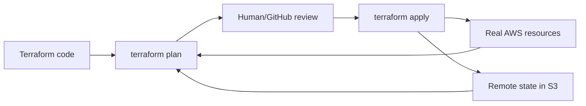
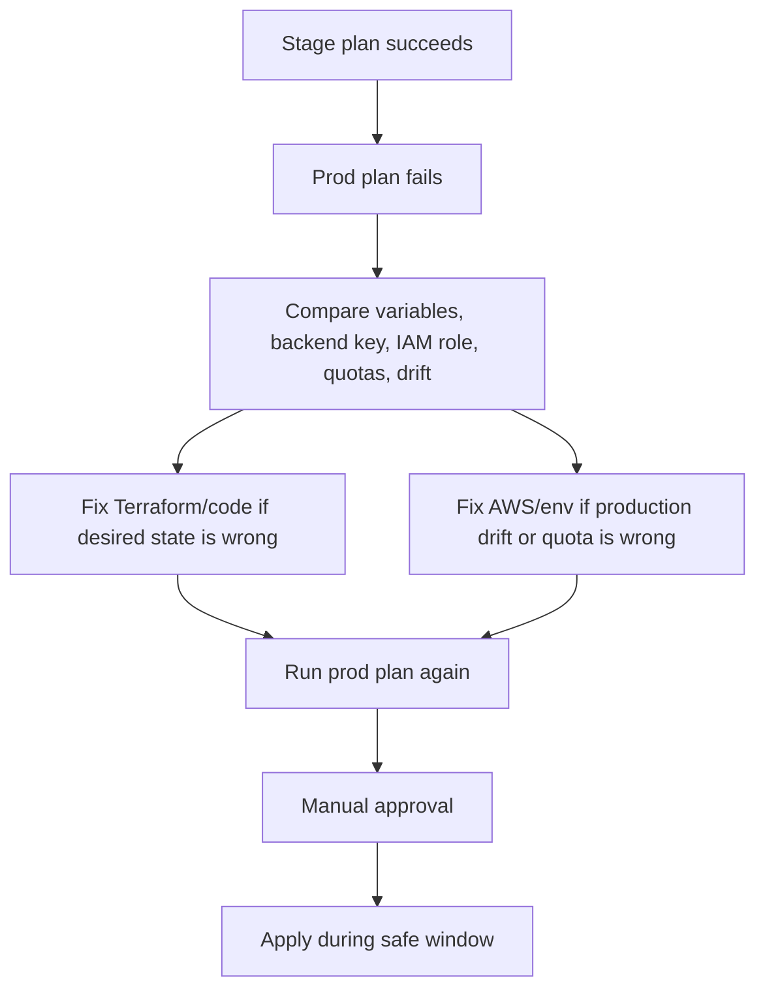

# Terraform Operations

Terraform is the infrastructure source-of-truth layer for this lab.

Plain-English model:

```text
Terraform code says what AWS should look like.
Terraform state remembers what AWS currently looks like from Terraform's view.
Terraform plan compares desired state to current state.
Terraform apply changes AWS to match the code.
```



## Backend Strategy

We will use S3 for Terraform state and modern S3 lockfiles for state locking.

Example backend:

```hcl
terraform {
  backend "s3" {
    bucket       = "signalforge-tfstate-575108962419-us-east-1"
    key          = "dev/terraform.tfstate"
    region       = "us-east-1"
    use_lockfile = true
  }
}
```

Analogy:

```text
Terraform state is the project inventory notebook.
The S3 bucket is the shared, protected cabinet.
The lockfile is the "someone is editing this notebook" sign.
```

Important:

- S3 bucket versioning should be enabled.
- S3 bucket encryption should be enabled.
- Public access should be blocked.
- Access should be limited to the Terraform role.
- Each environment should use a separate state key.

Why backend matters:

```text
Without remote state, each laptop or runner may have a different view of the
infrastructure. Remote state makes GitHub Actions and local Terraform use the
same infrastructure record.
```

## Why Not DynamoDB Locking?

Older Terraform S3 backends used DynamoDB for state locking.

Modern Terraform supports S3 native lockfiles using `use_lockfile = true`. HashiCorp now marks DynamoDB-based locking as deprecated for the S3 backend, so this project uses S3 lockfiles.

Interview answer:

```text
I am using S3 for remote Terraform state and S3 native lockfiles for locking.
That prevents two Terraform runs from modifying the same state at once. DynamoDB
locking was the older common pattern, but current Terraform S3 backend supports
native lockfiles and marks DynamoDB locking as deprecated.
```

## Environment Layout

```text
infra/
  envs/
    dev/
      backend.tf
      main.tf
      terraform.tfvars
    stage/
      backend.tf
      main.tf
      terraform.tfvars
    prod/
      backend.tf
      main.tf
      terraform.tfvars
  modules/
    vpc/
    alb/
    ec2/
    rds/
    monitoring/
    iam/
```

## Drift Detection

Drift means real AWS resources no longer match Terraform state/code.

Examples:

- Someone manually opened a security group.
- Someone changed EC2 instance size.
- Someone deleted a route table.
- Someone modified an ALB listener.
- Someone changed RDS settings.

Commands:

```bash
terraform plan
terraform plan -refresh-only
terraform apply -refresh-only
terraform state list
terraform state show <resource>
terraform import <resource> <id>
```

Command meanings:

```text
terraform plan:
  Compare Terraform code/state with AWS and show what would change.

terraform plan -refresh-only:
  Refresh state from real AWS without proposing code-driven changes.

terraform apply -refresh-only:
  Update state to match real AWS after review.

terraform state list:
  Show resources currently tracked in state.

terraform state show:
  Inspect one tracked resource.

terraform import:
  Bring an existing manually created resource under Terraform management.
```

Drift workflow:

```text
Scheduled GitHub Action runs terraform plan
If plan shows changes, send Slack alert
Do not auto-apply production drift
Human reviews
Either revert AWS manual change or update Terraform code
```

Production example:

```text
During a Sev1, an engineer may temporarily open a security group rule manually to
restore service. After the incident, Terraform plan will detect drift because AWS
no longer matches code. The correct follow-up is to either revert the manual AWS
change or intentionally update Terraform code, review it, and apply it.
```

Interview answer:

```text
I do not blindly apply drift in production. I run a plan or refresh-only plan,
review what changed, identify whether it was an emergency manual fix or an
unauthorized change, and then decide whether Terraform code or the live resource
should be corrected.
```

## Staging Works But Production Fails

Common reasons:

- Different variable values
- Missing prod GitHub environment secret
- Prod IAM role has stricter permissions
- Prod VPC/subnet CIDR conflict
- AWS service quota hit
- Different AMI availability
- Manual drift in prod
- Wrong Terraform backend key
- Missing ACM certificate or Route 53 zone
- Security group stricter in prod

Handling strategy:

```text
Use the same modules for all environments
Keep only tfvars different
Run fmt, validate, tflint, and Trivy before plan
Run plan before apply
Require manual approval for prod
Compare stage and prod plans
Use least privilege but verify required permissions
Never skip state locking
```

Production flow:



Interview answer:

```text
If Terraform works in staging but fails in production, I do not assume Terraform
is broken. I compare variables, IAM permissions, state backend keys, service
quotas, manual drift, region differences, and production-only dependencies such
as ACM certificates or Route 53 zones. Then I rerun plan and require approval
before production apply.
```
