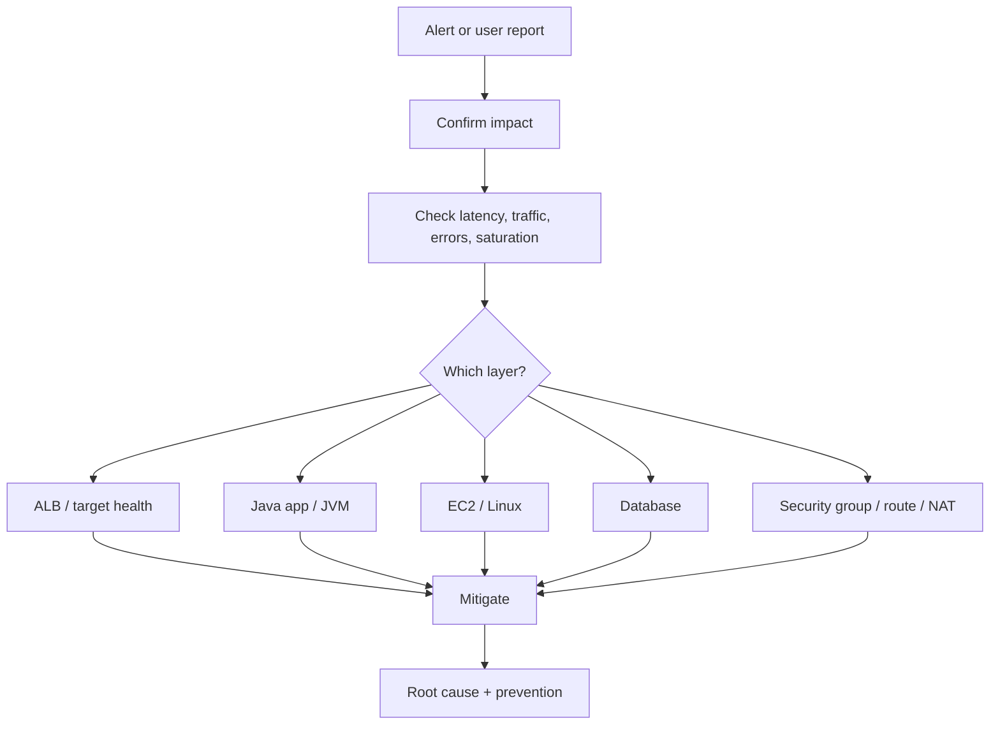
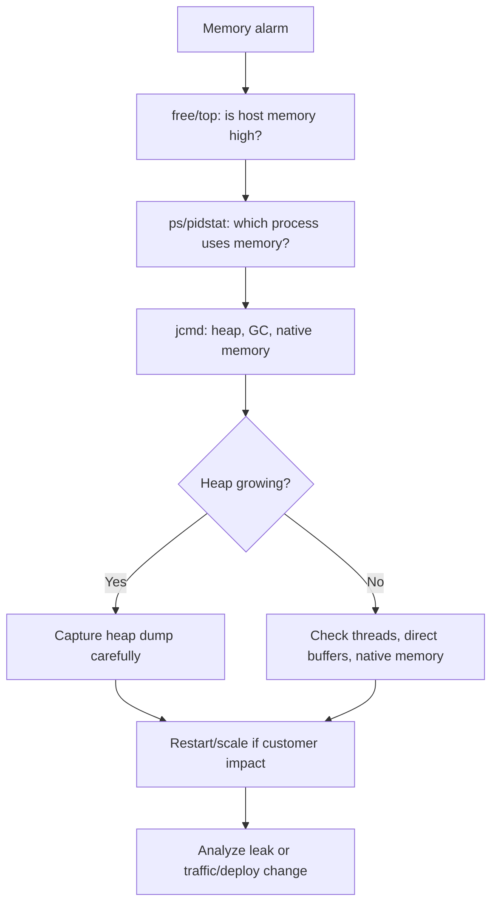
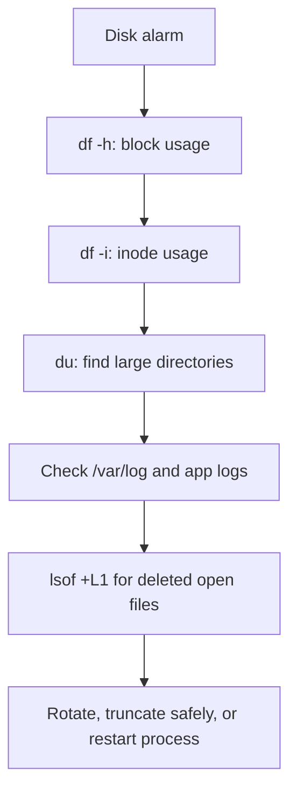
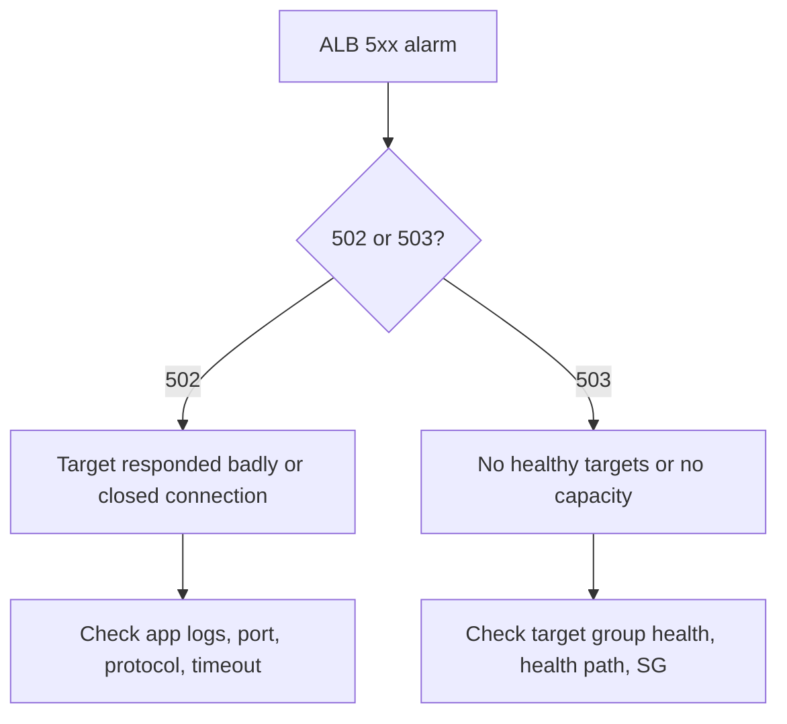
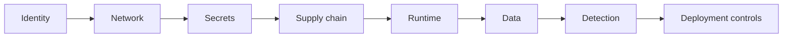

# Interview Troubleshooting Notes

These notes are written for scenario-based DevOps/SRE interviews.

Troubleshooting mindset:

```text
1. Confirm customer impact.
2. Check the golden signals.
3. Identify which layer is failing.
4. Mitigate first if production is impacted.
5. Collect evidence.
6. Fix root cause.
7. Add prevention or alerting.
```



## Golden Signals

The four golden signals:

```text
Latency
Traffic
Errors
Saturation
```

How to use them:

```text
Latency tells whether users are waiting.
Traffic tells whether load changed.
Errors tell whether requests are failing.
Saturation tells whether a resource is running out.
```

### Latency

How long a request takes.

```text
P50 = normal user experience
P95 = slowest 5 percent of requests
P99 = worst 1 percent of requests
```

### Traffic

How much demand the system receives.

Examples:

```text
requests per second
active users
ALB request count
database connections
```

### Errors

Failed requests.

Examples:

```text
HTTP 5xx
HTTP 4xx
exceptions
failed health checks
database connection errors
```

### Saturation

How full or overloaded a resource is.

Examples:

```text
CPU
memory
disk
network
thread pool
connection pool
database connections
```

## Java Memory Troubleshooting

Strong interview answer:

```text
I first determine whether the memory pressure is OS-level, process-level, or JVM-level. Then I check heap, non-heap, thread count, GC behavior, native memory, traffic pattern, and recent deployments. I mitigate first if production is impacted, then collect evidence for root cause.
```

Linux commands:

```bash
free -h
top
ps aux --sort=-%mem
vmstat 1
pidstat -r -p <pid> 1
dmesg
```

Java commands:

```bash
jps -l
jcmd <pid> VM.flags
jcmd <pid> GC.heap_info
jcmd <pid> GC.class_histogram
jcmd <pid> VM.native_memory summary
jstack <pid>
jmap -heap <pid>
jmap -dump:live,format=b,file=/tmp/heap.hprof <pid>
```

Troubleshooting flow:



Production example:

```text
If memory is increasing in production, I first check whether the whole EC2 host
is under pressure or only the Java process. Then I check JVM heap, GC behavior,
thread count, and recent deployments. If users are impacted, I mitigate by
scaling out or restarting one instance at a time behind the ALB, then collect a
heap dump or JVM evidence for root cause.
```

Heap vs stack:

```text
Heap:
  Stores Java objects.
  Memory leaks usually happen here.

Stack:
  Stores method call frames and local variables per thread.
  Too many threads or deep recursion can cause stack issues.

Metaspace:
  Stores class metadata.

Native memory:
  Used by JVM internals, direct buffers, thread stacks, native libraries.
```

## File System Troubleshooting

Commands:

```bash
df -h
df -i
du -sh /*
du -ah /var/log | sort -h | tail
lsblk
mount
find /var/log -type f -size +100M
lsof +L1
journalctl --disk-usage
sudo journalctl --vacuum-time=3d
```

Important scenario:

```text
df shows disk is full but du does not show large files.
```

Likely cause:

```text
A process is still holding a deleted file.
```

Command:

```bash
lsof +L1
```

Fix:

```text
Restart the process holding the deleted file, or rotate/truncate logs safely.
```

File system flow:



Interview answer:

```text
For disk issues I check both space and inode usage. If df shows full but du does
not explain it, I suspect deleted files still held by a running process and use
lsof +L1. I avoid blindly deleting files; I identify the owner, rotate logs, or
restart the process safely.
```

## 502 vs 503

502 Bad Gateway:

```text
ALB reached a target, but the target returned an invalid response or closed the connection.
```

Common causes:

- App crashed during request
- App returned malformed response
- Port mismatch
- Timeout
- TLS/backend protocol mismatch

503 Service Unavailable:

```text
ALB has no healthy targets or service capacity is unavailable.
```

Common causes:

- All targets unhealthy
- Target group empty
- Health check path wrong
- App not listening
- Security group blocks ALB to EC2

ALB failure decision tree:



Interview answer:

```text
For 502 I look at whether the ALB reached the target but received a bad response,
such as app crash, timeout, wrong port, or protocol mismatch. For 503 I check
target group health first because it usually means the ALB has no healthy target
to send traffic to.
```

## Security Interview Answer

Do not answer only with "security groups."

Better answer:

```text
I handle security in layers: identity, network, secrets, supply chain, runtime, data, detection, and deployment controls.
```

Examples:

- Identity: least-privilege IAM, GitHub OIDC, no static AWS keys
- Network: private subnets, ALB public only, restricted security groups
- Secrets: Secrets Manager, SSM Parameter Store, GitHub Secrets
- Supply chain: SonarQube, Trivy, pinned GitHub Actions, dependency scanning
- Runtime: IMDSv2, SSM Session Manager, patching
- Data: RDS encryption, backups, no public DB
- Detection: CloudWatch, VPC Flow Logs, ALB logs, GuardDuty later
- Deployment: branch protection, approvals, artifact promotion, rollback

Security answer structure:


