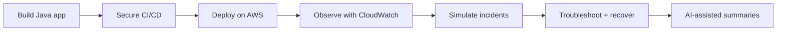

# LinkedIn Project Story

Use this doc when explaining the project publicly. The point is to show that the
project is not just "I created EC2 with Terraform." It is a reliability lab.

Story flow:



One-line positioning:

```text
SignalForge turns a Java AWS deployment into a production incident simulation
and interview-prep lab.
```

## Short Version

I built SignalForge AI Ops Lab, an AI-assisted DevOps and reliability engineering platform for deploying and operating a Java application on AWS using GitHub Actions, Terraform, OIDC, SonarQube, Trivy, CloudWatch, and Slack/PagerDuty-style alerting.

The focus was not just infrastructure creation. I simulated real production issues like 502/503 errors, high P95 latency, JVM memory pressure, disk saturation, unhealthy load balancer targets, Terraform drift, and failed environment promotion, then documented how to detect, troubleshoot, and recover from them.

## Portfolio Positioning

```text
SignalForge AI Ops Lab is a production-style reliability lab that teaches secure CI/CD, AWS infrastructure automation, observability, incident simulation, and AI-assisted operations for Java workloads.
```

## What Makes It Modern

- GitHub Actions with OIDC to AWS instead of static access keys
- Terraform with S3 remote state, versioning, encryption, and lockfiles
- Drift detection workflow with Slack notification
- Secure artifact promotion: build once, test once, scan once, deploy same artifact
- SonarQube and Trivy in CI/CD
- CloudWatch metrics, logs, alarms, and dashboards
- AI-generated incident summaries from logs and metrics
- Scenario-based troubleshooting notes for Java, Linux, networking, and AWS

What to emphasize:

```text
Modern DevOps is not just writing Terraform. It is secure delivery, traceable
artifacts, least-privilege cloud access, observability, incident response, and
continuous learning from failures.
```

## LinkedIn Post Draft

I started building **SignalForge AI Ops Lab**, a hands-on DevOps and reliability engineering project focused on operating Java workloads on AWS.

Instead of stopping at a basic three-tier deployment, I designed it as a production simulation lab:

- GitHub Actions CI/CD from scratch
- AWS authentication using GitHub OIDC
- Terraform remote state, locking, modules, and drift detection
- Java artifact build, test, scan, and promotion
- SonarQube and Trivy for quality and security
- ALB, EC2, RDS, CloudWatch, and private subnet architecture
- 502/503, latency, CPU, memory, disk, and unhealthy target simulations
- AI-assisted incident summaries and runbook generation

The main learning goal is simple: anyone can create infrastructure, but real engineering skill shows up when you can secure it, observe it, break it, troubleshoot it, recover it, and explain the tradeoffs clearly.

I am documenting the project step by step so it can also serve as an interview preparation lab for scenario-based DevOps, SRE, and cloud engineering discussions.
