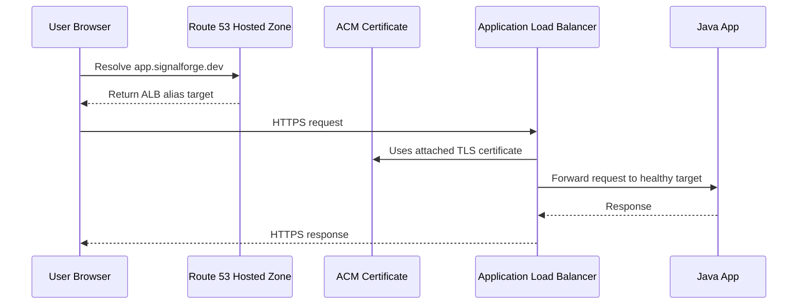

# Domain and Branding

This doc explains the name and the future DNS flow. A domain is not required for
the first deployment, but it helps later when we add HTTPS, Route 53, and
CloudFront.

## Recommended Name

Application name:

```text
SignalForge
```

Repository name:

```text
signalforge-ai-ops-lab
```

Why this works:

- "Signal" connects to observability, alerts, metrics, and incident signals.
- "Forge" suggests building and improving systems.
- It is broad enough for EC2, microservices, serverless, AI, and platform engineering.
- It does not sound like a beginner three-tier clone.

## Domain Ideas

Check availability before buying:

```text
signalforge.dev
signalforgeai.dev
signalforgeops.com
signalforge.cloud
signalforge.app
signalops.dev
opsforgeai.com
reliabilityforge.dev
```

Best personal recommendation:

```text
signalforge.dev
```

If unavailable:

```text
signalforgeai.dev
signalforgeops.com
```

## Do You Need a Domain Now?

No.

For the first deployment, use the ALB DNS name:

```text
http://<alb-dns-name>
```

Buy a domain later when:

- ALB deployment works
- Health checks work
- HTTPS setup is next
- You are ready to add Route 53 and ACM

## Where To Buy

Good options:

```text
Cloudflare Registrar
Porkbun
Namecheap
```

Recommendation:

```text
Use Cloudflare Registrar if the TLD is supported and the price looks good.
Use Porkbun as a strong low-cost alternative.
Use Namecheap if you prefer its UI or find a better first-year deal.
```

Avoid choosing only by first-year price. Renewal price matters more.

## DNS Direction

For AWS learning, Route 53 is useful because we can practice:

- Hosted zones
- Alias records to ALB
- ACM DNS validation
- Health checks
- Failover routing later

Possible setup:

```text
Domain registered at Cloudflare/Porkbun/Namecheap
Nameservers pointed to Route 53
Route 53 manages DNS records
ACM provides TLS certificate
ALB serves HTTPS
```

DNS request flow later:



Beginner explanation:

```text
A domain is the human-friendly name. Route 53 is AWS DNS. An A/alias record can
point the domain to the ALB. ACM provides the TLS certificate so users can access
the app over HTTPS.
```

Interview answer:

```text
I do not need a domain for the first deployment because the ALB DNS name works.
Later, I can buy a domain, delegate DNS to Route 53, create an alias record to
the ALB, validate an ACM certificate through DNS, and serve the app over HTTPS.
```
