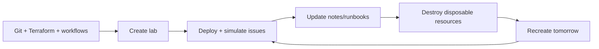
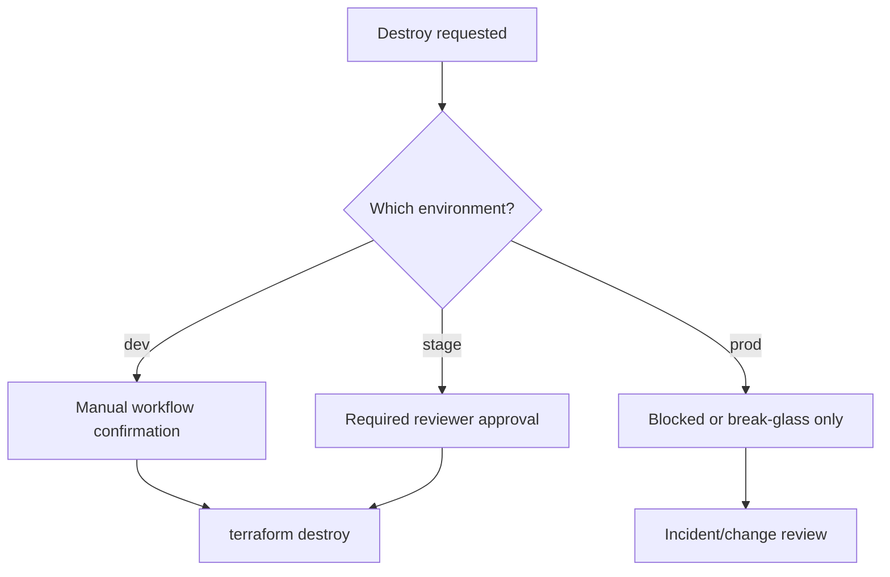

# Disposable Lab Operations

The main reason for automation in this project is repeatability.

We want to create infrastructure, learn from it, break it, fix it, destroy it, and recreate it without manually rebuilding everything.

Big picture:



Interview talk track:

```text
I designed the lab to be disposable because repeatability is the point of
automation. The AWS console should not be the source of truth. Git, Terraform,
remote state, workflows, and artifacts should let me recreate the same
environment when I need it and destroy it when I am done practicing.
```

## Daily Workflow

```text
Start of day:
  GitHub Actions -> terraform apply -> AWS environment created

During practice:
  Deploy app
  Trigger incidents
  Observe metrics
  Troubleshoot
  Update notes/code

End of day:
  GitHub Actions -> terraform destroy -> AWS resources deleted

Next day:
  Re-run workflow
  Recreate environment from code
```

## Why This Matters

Analogy:

```text
Terraform is like a recipe.
AWS resources are the cooked meal.
If you throw away the meal, the recipe still exists.
The next day, you can cook the same meal again.
```

Technical meaning:

```text
The source of truth is not the AWS console.
The source of truth is Git + Terraform code + versioned artifacts.
```

## What Should Persist After Destroy?

These should remain:

- GitHub repository
- Git history
- Terraform code
- Documentation
- GitHub Actions workflows
- Optional S3 Terraform state bucket
- Optional S3 artifact bucket
- Optional Route 53 hosted zone
- Optional domain registration

These can be destroyed and recreated:

- VPC
- Subnets
- Route tables
- ALB
- EC2
- Security groups
- RDS lab database
- CloudWatch dashboards and alarms
- Test SNS topics

## What Not To Destroy Accidentally

Be careful with:

- Domain registration
- Route 53 hosted zone
- Terraform state bucket
- Artifact bucket
- Production-like database snapshots
- IAM OIDC provider and bootstrap role, depending on design

## GitHub Actions Workflows We Need

```text
ci.yml
  Build, test, scan, and upload artifact.

terraform-plan.yml
  Show infrastructure changes.

terraform-apply.yml
  Create or update AWS resources.

terraform-destroy.yml
  Destroy disposable lab resources.

drift-detection.yml
  Detect manual AWS changes.

deploy.yml
  Deploy tested artifact to EC2.
```

## Terraform Destroy Safety

Production teams are very careful with destroy.

For this lab:

- `dev` can allow destroy with manual approval.
- `stage` can allow destroy with stronger confirmation.
- `prod` should not have automatic destroy.

GitHub Environment protection:

```text
dev destroy:
  manual workflow dispatch

stage destroy:
  manual approval

prod destroy:
  disabled or heavily restricted
```

Destroy decision flow:



Production explanation:

```text
Destroy is normal for a learning dev lab, but dangerous for production. In
production I would disable automated destroy or require a very strict break-glass
process with approvals, backups, and change records.
```

## Beginner Explanation: terraform destroy

Command:

```bash
terraform destroy -var-file=dev.tfvars
```

Meaning:

```text
terraform destroy:
  Reads Terraform state and code, then deletes the managed resources.

-var-file=dev.tfvars:
  Loads environment-specific values from dev.tfvars.
```

Important:

```text
Terraform only destroys resources it manages in state.
If a resource was created manually and never imported, Terraform may not delete it.
```
