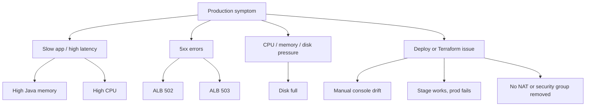

# Scenario Catalog

This file tracks the production-style scenarios we will simulate and practice.

Use this catalog like an incident menu:



How to speak about any scenario:

```text
I start from customer impact, then check metrics to locate the failing layer. I
mitigate if production is impacted, collect evidence, fix root cause, and add an
alert or runbook so the same issue is easier to catch next time.
```

Each scenario should answer:

```text
What happened?
What does the customer see?
Which metric or log confirms it?
Which commands do we run?
What do the command flags mean?
How do we mitigate quickly?
How do we fix permanently?
How do we explain it in an interview?
```

## Scenario 1: High Java Memory Usage

Customer symptom:

```text
Application becomes slow or crashes.
Some requests fail with 5xx.
```

Metrics:

```text
EC2 memory used percent is high.
JVM heap usage is high.
GC time increases.
ALB TargetResponseTime increases.
```

Commands:

```bash
free -h
ps aux --sort=-%mem
jcmd <pid> GC.heap_info
jcmd <pid> GC.class_histogram
jcmd <pid> VM.native_memory summary
```

Command explanations:

```text
free:
  Shows system memory usage.

-h:
  Human-readable output, such as MB or GB.

ps aux:
  Shows running processes.

--sort=-%mem:
  Sorts by memory usage descending. The minus sign means highest first.

jcmd:
  Sends diagnostic commands to a running JVM process.

GC.heap_info:
  Shows Java heap details.

GC.class_histogram:
  Shows object counts and memory usage by class.
```

Fast mitigation:

```text
Scale out if possible.
Restart one unhealthy instance at a time behind the ALB.
Increase heap only if evidence supports it.
Rollback if issue started after deployment.
```

Permanent fix:

```text
Analyze heap dump.
Fix memory leak or inefficient object usage.
Tune JVM flags.
Add memory alerts.
Add load test for memory-sensitive path.
```

## Scenario 2: High CPU Usage

Customer symptom:

```text
App responds slowly.
P95/P99 latency increases.
Requests may timeout.
```

Metrics:

```text
EC2 CPUUtilization high.
ALB TargetResponseTime high.
Request count may be high.
```

Commands:

```bash
top
ps -eo pid,ppid,cmd,%mem,%cpu --sort=-%cpu
pidstat -u -p <pid> 1
jstack <pid>
```

Command explanations:

```text
top:
  Live view of CPU and memory usage.

ps -eo:
  Selects specific process output columns.

--sort=-%cpu:
  Sorts by CPU usage descending.

pidstat:
  Shows resource usage for a process over time.

-u:
  Report CPU usage.

-p <pid>:
  Watch a specific process ID.

1:
  Refresh every 1 second.

jstack:
  Captures Java thread stack traces to identify busy or blocked threads.
```

Fast mitigation:

```text
Scale out.
Restart bad instance if one instance is abnormal.
Throttle expensive endpoint if needed.
Rollback recent deployment.
```

Permanent fix:

```text
Optimize hot code path.
Add caching.
Tune thread pools.
Add autoscaling policy.
Add performance tests.
```

## Scenario 3: Disk Full

Customer symptom:

```text
App cannot write logs or temp files.
Deployments fail.
Database or app may crash depending on disk usage.
```

Metrics:

```text
DiskUsedPercent high.
App logs show write failures.
```

Commands:

```bash
df -h
df -i
du -ah /var/log | sort -h | tail
lsof +L1
journalctl --disk-usage
```

Command explanations:

```text
df -h:
  Shows filesystem free space in human-readable format.

df -i:
  Shows inode usage. Inodes are file entries. Disk can fail if inodes are exhausted even when GB space remains.

du -ah:
  Shows disk usage for files and directories.

sort -h:
  Sorts human-readable sizes correctly.

tail:
  Shows the last lines, usually the largest items after sorting.

lsof +L1:
  Finds deleted files still held open by a process.
```

Fast mitigation:

```text
Clean safe logs.
Vacuum old journal logs.
Increase EBS volume if needed.
Restart process holding deleted large file.
```

Permanent fix:

```text
Configure log rotation.
Ship logs to CloudWatch.
Set disk alarms.
Keep app logs bounded.
```

## Scenario 4: ALB 502

Customer symptom:

```text
User sees Bad Gateway.
```

Meaning:

```text
ALB reached a target, but the response was bad, broken, or timed out.
```

Checks:

```text
ALB HTTPCode_ELB_5XX_Count
ALB HTTPCode_Target_5XX_Count
TargetResponseTime
Application logs
Target group health
```

Commands:

```bash
systemctl status signalforge
journalctl -u signalforge -n 100
curl -v http://localhost:8080/health
```

Command explanations:

```text
systemctl status:
  Checks systemd service status.

journalctl -u signalforge:
  Shows logs for the signalforge service.

-n 100:
  Shows the last 100 log lines.

curl -v:
  Makes an HTTP request with verbose connection details.
```

## Scenario 5: ALB 503

Customer symptom:

```text
User sees Service Unavailable.
```

Meaning:

```text
ALB has no healthy targets or no available backend capacity.
```

Common causes:

- App is down
- Wrong health check path
- Security group blocks ALB to EC2
- Target group has no registered targets
- App listens on wrong port

Fast mitigation:

```text
Fix health check path or port.
Restore security group rule.
Restart app service.
Rollback bad deployment.
Register healthy targets.
```

## Scenario 6: Security Group Rule Removed

Customer symptom:

```text
ALB cannot reach EC2.
Users may see 503.
```

Learning point:

```text
This is both a networking incident and a Terraform drift scenario if the rule was changed manually in AWS console.
```

Detection:

```bash
terraform plan
```

Expected result:

```text
Terraform shows it wants to recreate the missing security group rule.
```

Production response:

```text
If customer impact is active, restore the rule immediately.
Then run terraform plan.
Then update state/code if needed.
Document the manual emergency change.
```

Interview explanation:

```text
In a Sev1, customer recovery comes first. If the safest immediate fix is a manual console change, I make the minimal change, document it, then reconcile Terraform afterward so infrastructure code remains the source of truth.
```

## Scenario 7: Manual Console Fix Causes Drift

Example:

```text
During an incident, an engineer manually opens port 8080 from ALB SG to app SG.
```

Why drift occurs:

```text
AWS real state changed outside Terraform.
Terraform state/code still has the old desired configuration.
```

Handling:

```text
Run terraform plan.
If manual change is correct, update Terraform code.
If manual change was temporary, revert it.
If resource exists outside state, import it.
```

Important command:

```bash
terraform plan -refresh-only
```

Explanation:

```text
-refresh-only:
  Updates Terraform state from real infrastructure without proposing config changes.
  Useful for understanding drift, but should be reviewed carefully.
```

## Scenario 8: Staging Works, Production Fails

Common causes:

- Prod variables differ from stage
- Prod secret missing
- Prod IAM role lacks permission
- Prod subnet has no route
- Service quota reached
- AMI not available
- Manual drift exists
- Security group is stricter

Handling:

```text
Compare stage and prod tfvars.
Check GitHub environment secrets.
Review terraform plan output.
Check AWS IAM AccessDenied errors.
Check CloudTrail for failed API calls.
Do not blindly apply fixes to prod.
```

## Scenario 9: No NAT Gateway

What happens:

```text
Private EC2 instances cannot reach the internet for package downloads, external APIs, or OS updates.
```

What still works:

```text
ALB can send traffic to private EC2.
EC2 can talk to RDS in private subnets.
VPC internal traffic works.
```

Solutions:

```text
Use NAT Gateway.
Use VPC endpoints for AWS services.
Bake AMIs with needed packages.
Avoid internet dependency at runtime.
```
