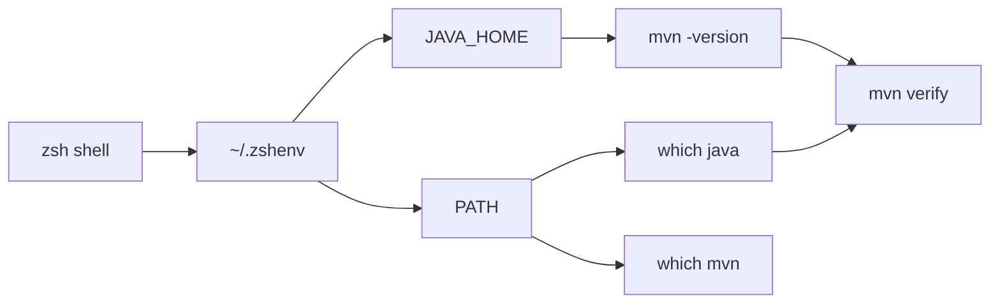

# Local Toolchain Setup

This file explains the local tools used by SignalForge AI Ops Lab and how to troubleshoot common path/version issues.

Mental model:

```text
Your terminal does not magically know which Java, Maven, Terraform, or AWS CLI to
use. It follows environment variables and PATH order.
```



Interview framing:

```text
When a local build fails, I first verify tool versions and paths. Many Java/Maven
issues are not code problems; they are environment mismatches between JAVA_HOME,
PATH, and the JDK Maven is actually using.
```

## Current Local Versions

Checked on July 1, 2026:

```text
Java: OpenJDK 21.0.11
Maven: 3.9.16
Terraform: 1.15.2
AWS CLI: 2.26.5
Trivy: 0.72.0
TFLint: 0.63.1
GitHub CLI: 2.95.0
Git: 2.50.1
VS Code CLI: 1.126.0
```

## Why Java 21

This project targets Java 21 LTS.

Java 21 is modern, stable, and widely adopted in enterprise environments. Java 25 is also an LTS release and is a good future upgrade path, but Java 21 is a better baseline for this lab because ecosystem adoption is stronger and it keeps the beginner workflow smoother.

## Shell Configuration

The local shell uses:

```text
~/.zshenv
```

Current Java/Maven setup:

```bash
export JAVA_HOME="/opt/homebrew/opt/openjdk@21/libexec/openjdk.jdk/Contents/Home"
export M2_HOME="/opt/homebrew/opt/maven"
export PATH="/opt/homebrew/opt/openjdk@21/bin:/opt/homebrew/bin:/opt/homebrew/sbin:$M2_HOME/bin:$PATH"
```

## What JAVA_HOME Means

Analogy:

```text
JAVA_HOME is like the address of the Java installation.
Maven asks JAVA_HOME where Java lives before it compiles or runs tests.
```

Technical meaning:

```text
JAVA_HOME points to the JDK root directory.
PATH decides which java/mvn executable is found first when you type a command.
```

## Commands To Check Java

```bash
echo $JAVA_HOME
which java
java -version
/usr/libexec/java_home -V
```

Command meanings:

```text
echo $JAVA_HOME:
  Prints the configured JDK path.

which java:
  Shows which java executable the shell will run.

java -version:
  Shows the Java runtime version.

/usr/libexec/java_home -V:
  Lists JDKs registered with macOS Java wrappers.
```

## Commands To Check Maven

```bash
which mvn
mvn -version
```

What to verify:

```text
Maven path should be under /opt/homebrew/bin or /opt/homebrew/Cellar.
Maven's Java version should show Java 21.
```

## Common Problem: Maven Says JAVA_HOME Is Wrong

Symptom:

```text
The JAVA_HOME environment variable is not defined correctly.
```

Meaning:

```text
Maven found a JAVA_HOME value, but that path does not point to a valid JDK.
```

Fix:

```bash
echo $JAVA_HOME
ls "$JAVA_HOME"
java -version
mvn -version
```

Then update `~/.zshenv` so `JAVA_HOME` points to the correct JDK.

## Common Problem: java -version And mvn -version Show Different Java Versions

Meaning:

```text
The shell PATH and JAVA_HOME disagree.
```

Example:

```text
java -version shows Java 21
mvn -version shows Java 8
```

Likely cause:

```text
JAVA_HOME points to Java 8, even if PATH finds Java 21.
```

Fix:

```text
Set JAVA_HOME to Java 21 and restart the terminal.
```

## Maven Local Repository

For this project, local test runs use a project-local Maven cache:

```bash
mvn -Dmaven.repo.local=.m2/repository test
```

Meaning:

```text
mvn:
  Runs Maven.

-Dmaven.repo.local=.m2/repository:
  Stores downloaded dependencies under app/.m2/repository instead of ~/.m2.

test:
  Compiles code and runs tests.
```

Why:

```text
It keeps the lab self-contained and avoids permission issues with the home Maven cache.
```

## Tool Checks

Run these before serious work:

```bash
java -version
mvn -version
terraform version
aws --version
trivy --version
tflint --version
gh --version
git --version
```

## GitHub CLI Auth

GitHub CLI is installed but may not be logged in.

Check:

```bash
gh auth status
```

Login:

```bash
gh auth login
```

For now, normal `git push` already works. GitHub CLI login is useful later for creating pull requests and checking workflow runs from the terminal.

## Interview Explanation

If asked how you troubleshoot Java/Maven version issues:

```text
I check JAVA_HOME, PATH, which java, java -version, and mvn -version. If Maven and Java disagree, I know Maven is probably reading a different JAVA_HOME than the java command on PATH. I fix the shell config, restart the terminal, and verify again before running the build.
```
