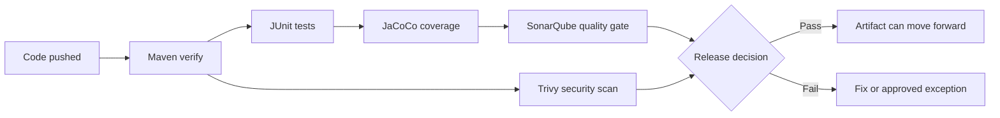

# Quality Gates, Coverage, And CI Security

This note explains what we check in CI before an artifact is allowed to move toward deployment.

Quality and security flow:



Plain-English explanation:

```text
Quality gates are traffic lights for releases. They do not make code perfect,
but they stop clearly risky code from moving forward without review.
```

## CI Order

Current workflow order:

```text
Checkout code
Set up Java 21
Run Maven verify
Run SonarQube Cloud scan
Run Trivy filesystem scan
Upload Trivy report
Upload JAR artifact
```

Why the order matters:

```text
Maven verify runs first because it creates the evidence.
SonarQube reads that evidence.
Trivy then checks the repository and dependency/security surface.
Artifacts are uploaded only after the build and checks complete.
```

Production analogy:

```text
Before releasing a car, the factory does mechanical checks, safety checks, and
paperwork. CI is the same idea for software: build proof, test proof, quality
proof, security proof, then release the artifact.
```

## Why Maven `verify`

Command:

```bash
mvn -B verify
```

Meaning:

```text
-B:
  Batch mode. Cleaner CI logs.

verify:
  Runs Maven lifecycle phases through verification.
  This includes compiling, testing, packaging, and running verification plugins.
```

In our project, `verify` also generates a JaCoCo coverage report:

```text
app/target/site/jacoco/jacoco.xml
```

## Unit Tests vs Integration Tests

JUnit:

```text
The Java testing framework.
```

Unit test:

```text
Fast test for a small piece of code.
Example: HealthController returns status UP.
```

Integration test:

```text
Slower test that checks multiple components working together.
Example: Spring Boot app starts, calls API endpoint, talks to database.
```

Current state:

```text
JUnit: yes
Unit tests: yes
Integration tests: not yet
```

Later, when RDS/database logic is added:

```text
Add integration tests for database-backed endpoints.
```

## SonarQube Cloud

SonarQube Cloud checks:

```text
Bugs
Vulnerabilities
Security hotspots
Code smells
Coverage
Duplications
Maintainability
Reliability
Security rating
```

Why it runs after tests:

```text
Tests and coverage must run first so Sonar can read test/coverage reports.
```

Coverage report configured in `pom.xml`:

```xml
<sonar.coverage.jacoco.xmlReportPaths>target/site/jacoco/jacoco.xml</sonar.coverage.jacoco.xmlReportPaths>
```

Quality gate meaning:

```text
A quality gate is a pass/fail policy.
It converts analysis results into a release decision.
```

Example gate language:

```text
Fail the pipeline if new code has blocker bugs, critical vulnerabilities,
unreviewed security hotspots, too much duplication, or coverage below target.
```

## JaCoCo

JaCoCo measures Java code coverage.

Analogy:

```text
Tests are students answering questions.
JaCoCo is the attendance sheet showing which parts of the code were actually visited.
```

Coverage does not prove code is perfect.

It helps answer:

```text
Did tests exercise the important code paths?
Are we shipping code nobody tested?
```

## Trivy

Trivy checks risks that Sonar may not fully cover:

```text
Known dependency vulnerabilities
Secrets accidentally committed
Container image vulnerabilities later
Terraform/IaC misconfigurations later
Filesystem risks
```

Why we need both:

```text
SonarQube focuses on code quality and maintainability.
Trivy focuses on supply chain, secrets, container, dependency, and IaC risk.
```

Interview answer:

```text
We use SonarQube and Trivy together because they cover different failure modes. SonarQube tells us whether our code is maintainable, reliable, and secure at source level. Trivy checks whether dependencies, secrets, containers, and IaC introduce known operational or security risk.
```

## Beginner Quality Gate

Current beginner gate:

```text
Maven verify must pass
Unit tests must pass
JAR must be generated
SonarQube scan must complete
Trivy report must be generated
Artifact must upload successfully
```

Why this is intentionally lighter:

```text
At the beginning, we first prove the tools are wired correctly.
Then we gradually make the gates stricter so we understand every failure.
```

## Production Quality Gate

Later production-style gate:

```text
Unit tests pass
Integration tests pass
SonarQube quality gate passes
No blocker issues
No critical bugs
No critical vulnerabilities
Security hotspots reviewed
New code coverage >= 80%
Overall coverage >= 70%
Duplicated code <= 3%
Trivy has no unfixed HIGH/CRITICAL findings
No secrets detected
Terraform scan has no critical misconfiguration
```

How we would enforce it:

```text
SonarQube Cloud:
  Configure the Quality Gate in the SonarQube Cloud project.
  Make the GitHub Actions Sonar step fail when the gate fails.

Trivy:
  Change exit-code from "0" to "1" for blocking severity.
  Tune severity and ignore rules carefully.

GitHub branch protection:
  Require the CI workflow to pass before merging to dev or main.
```

Production exception process:

```text
Not every finding automatically blocks forever.
For real production work, high-risk findings should either be fixed or have a
documented exception with owner, reason, expiry date, and compensating control.
```

## Why We Do Not Enforce Everything Immediately

Early project stage:

```text
Collect reports first.
Understand findings.
Avoid blocking learning with noisy gates.
```

Mature project stage:

```text
Turn reports into hard gates.
Fail builds on real high-risk issues.
Require review/approval for exceptions.
```

## Production Explanation

Use this in interviews:

```text
Our CI pipeline builds confidence before deployment. Maven verify proves the app compiles, tests pass, a JAR is generated, and coverage is measured. SonarQube enforces code quality and security gates. Trivy adds supply-chain, secret, dependency, container, and IaC scanning. Only artifacts that pass these checks should be promoted to deployment environments.
```
