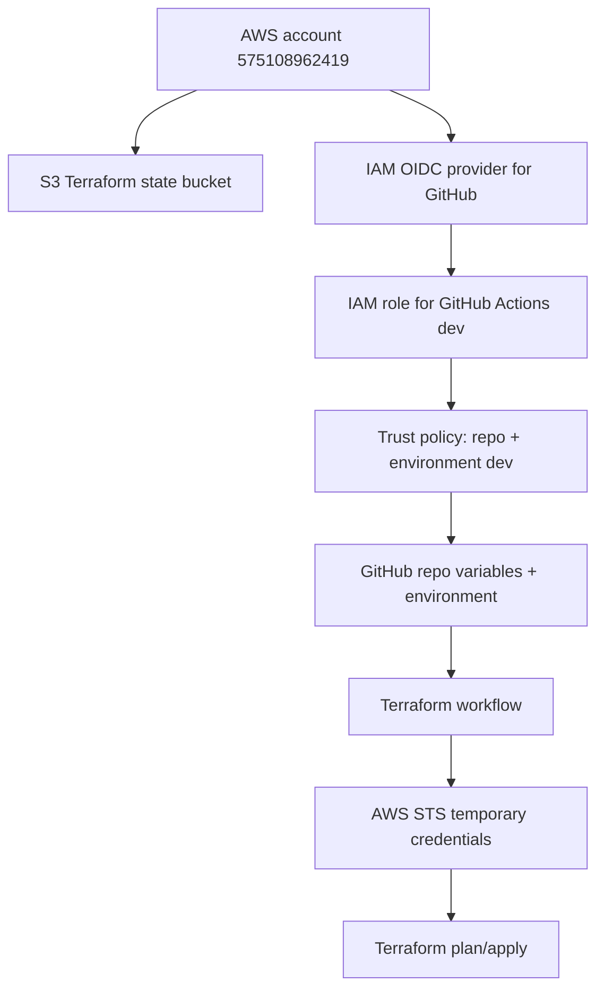

# AWS OIDC And Terraform Bootstrap

This note explains how GitHub Actions will securely authenticate to AWS and run Terraform.

Bootstrap flow:



Plain-English explanation:

```text
Before Terraform can create the main AWS architecture, we need a secure bootstrap
path. The state bucket stores Terraform's memory. The OIDC provider tells AWS how
to trust GitHub identity tokens. The IAM role defines what a trusted workflow can
do. GitHub Actions then assumes that role without long-lived AWS keys.
```

## Current Bootstrap Status

Completed:

```text
Terraform state bucket:
  signalforge-tfstate-575108962419-us-east-1

AWS OIDC provider:
  token.actions.githubusercontent.com

Dev IAM role:
  signalforge-github-actions-dev

Trust policy:
  Restricted to repo PraveenB19/signalforge-ai-ops-lab and GitHub Environment dev
```

Next test:

```text
Create a GitHub Actions OIDC smoke-test workflow.
The workflow should assume signalforge-github-actions-dev and run:

aws sts get-caller-identity
```

Expected result:

```text
Account: 575108962419
Arn: arn:aws:sts::575108962419:assumed-role/signalforge-github-actions-dev/...
```

If this works, GitHub Actions is successfully authenticated to AWS through OIDC.

Workflow file:

```text
.github/workflows/aws-oidc-smoke-test.yml
```

Terraform plan workflow:

```text
.github/workflows/terraform-dev-plan.yml
```

The Terraform workflow uses the same OIDC trust path, then runs:

```text
terraform fmt -check
terraform init
terraform validate
terraform plan -input=false
```

Important:

```text
This workflow only plans.
It does not apply.
It should not create AWS infrastructure yet.
```

## Goal

We want GitHub Actions to create AWS infrastructure without storing long-lived AWS access keys in GitHub.

## Project AWS Account

Use only this AWS account for this lab:

```text
Account: 575108962419
Admin user ARN: arn:aws:iam::575108962419:user/admin-user
Region: us-east-1
```

Before any AWS change, verify:

```bash
aws sts get-caller-identity
```

Expected:

```json
{
  "Account": "575108962419",
  "Arn": "arn:aws:iam::575108962419:user/admin-user"
}
```

Correct production pattern:

```text
GitHub Actions
  -> requests short-lived OIDC token
  -> AWS validates token claims
  -> AWS allows assuming a limited IAM role
  -> workflow receives temporary AWS credentials
  -> Terraform runs with those temporary credentials
```

## Why OIDC Instead Of AWS Access Keys

Access key approach:

```text
Create IAM user
Store AWS_ACCESS_KEY_ID and AWS_SECRET_ACCESS_KEY in GitHub
Keys can be leaked or forgotten
Keys are long-lived unless rotated
```

OIDC approach:

```text
No long-lived AWS keys in GitHub
Short-lived credentials only
Trust can be restricted to repo, branch, or environment
Better auditability
Better least-privilege posture
```

Interview answer:

```text
We use GitHub OIDC with AWS IAM because it avoids long-lived cloud credentials in GitHub secrets. The workflow gets a short-lived token, AWS validates the token claims, and only then allows a tightly scoped role to be assumed.
```

## AWS Objects We Need

```text
IAM OIDC provider:
  Teaches AWS to trust tokens from GitHub.

IAM role:
  The role GitHub Actions can assume.

Trust policy:
  Controls which GitHub repo/branch/environment can assume the role.

Permissions policy:
  Controls what the role can do in AWS.

S3 bucket:
  Stores Terraform state.

S3 lockfile:
  Handles Terraform state locking with modern Terraform S3 backend locking.
```

## GitHub OIDC Provider Values

Provider URL:

```text
https://token.actions.githubusercontent.com
```

Audience:

```text
sts.amazonaws.com
```

GitHub's official AWS OIDC guidance uses these values for AWS.

## Trust Policy Concept

Trust policy answers:

```text
Who is allowed to assume this role?
```

Permissions policy answers:

```text
What can this role do after it is assumed?
```

Analogy:

```text
Trust policy = who can enter the building.
Permissions policy = what rooms they can access after entering.
```

## Secure Trust Policy Shape

For the dev environment, prefer GitHub Environment-based trust:

```text
repo:PraveenB19/signalforge-ai-ops-lab:environment:dev
```

This means:

```text
Only workflows from this repo using the dev GitHub Environment can assume this AWS role.
```

GitHub official docs recommend restricting the `sub` claim so untrusted repositories cannot request cloud access.

## GitHub Workflow Permissions

For AWS OIDC, the workflow needs:

```yaml
permissions:
  id-token: write
  contents: read
```

Meaning:

```text
id-token: write:
  Allows GitHub Actions to request an OIDC token.
  It does not directly grant AWS permissions.

contents: read:
  Allows checkout to read repo code.
```

## OIDC Smoke-Test Workflow

The smoke-test workflow proves the trust path before we create infrastructure.

```yaml
name: AWS OIDC Smoke Test

on:
  workflow_dispatch:
  push:
    branches:
      - feature/java-app

permissions:
  id-token: write
  contents: read

jobs:
  assume-dev-role:
    runs-on: ubuntu-latest
    environment: dev
```

Meaning:

```text
workflow_dispatch:
  Allows us to run the workflow manually from the GitHub Actions UI.

push:
  Also runs this smoke test when we push to feature/java-app.
  This helps GitHub detect and execute the workflow while it is still on the
  feature branch.

permissions.id-token: write:
  Allows the job to request a GitHub OIDC token.

permissions.contents: read:
  Allows the checkout step to read repository files.

environment: dev:
  Makes the token subject match the IAM role trust policy:
  repo:PraveenB19/signalforge-ai-ops-lab:environment:dev
```

AWS credential step:

```yaml
- name: Configure AWS credentials through OIDC
  uses: aws-actions/configure-aws-credentials@v6.1.0
  with:
    role-to-assume: ${{ vars.AWS_ROLE_TO_ASSUME_DEV }}
    aws-region: ${{ vars.AWS_REGION }}
    role-session-name: signalforge-oidc-smoke-test
    allowed-account-ids: "575108962419"
```

Meaning:

```text
role-to-assume:
  The IAM role GitHub Actions should assume.

aws-region:
  AWS region used by the action and later AWS CLI/Terraform commands.

role-session-name:
  Human-readable session name visible in AWS logs.

allowed-account-ids:
  Safety check. The workflow fails if AWS returns credentials for a different
  account.
```

Verification command:

```bash
aws sts get-caller-identity
```

Expected:

```text
Account: 575108962419
Arn: arn:aws:sts::575108962419:assumed-role/signalforge-github-actions-dev/...
```

## GitHub Repository Variables And Secrets

With OIDC, we should not store AWS access keys.

Use GitHub Variables for non-secret values:

```text
AWS_REGION=us-east-1
AWS_ROLE_TO_ASSUME_DEV=arn:aws:iam::575108962419:role/signalforge-github-actions-dev
TF_STATE_BUCKET=signalforge-tfstate-575108962419-us-east-1
```

Use GitHub Secrets only for actual secrets:

```text
SONAR_TOKEN
SLACK_WEBHOOK_URL later
OPENAI_API_KEY or ANTHROPIC_API_KEY later
```

Do not store:

```text
AWS_ACCESS_KEY_ID
AWS_SECRET_ACCESS_KEY
```

## Terraform State And Locking

Terraform state answers:

```text
What real AWS resources currently belong to this Terraform code?
```

Analogy:

```text
Terraform code is the building blueprint.
AWS is the real building.
Terraform state is the inspection notebook that maps blueprint items to real
doors, rooms, wiring, and equipment.
```

Why remote state:

```text
Your laptop should not be the only place that remembers infrastructure.
GitHub Actions and future teammates need the same state.
S3 gives us durable, versioned, encrypted state storage.
```

Current state bucket:

```text
signalforge-tfstate-575108962419-us-east-1
```

Modern S3 backend locking:

```hcl
terraform {
  backend "s3" {
    bucket       = "signalforge-tfstate-575108962419-us-east-1"
    key          = "dev/terraform.tfstate"
    region       = "us-east-1"
    use_lockfile = true
  }
}
```

What `use_lockfile = true` does:

```text
Terraform creates a temporary lock object next to the state file.
That prevents two applies from changing the same state at the same time.
```

Why we are not starting with DynamoDB locking:

```text
Older Terraform S3 backends commonly used DynamoDB for state locking.
Current Terraform S3 backend supports native S3 lockfiles with `use_lockfile`.
DynamoDB locking is now deprecated in Terraform documentation, so this lab uses
the newer S3 lockfile approach.
```

Production example:

```text
Two engineers trigger Terraform apply at the same time. Without locking, both
could read old state and make conflicting AWS changes. With locking, one apply
gets the lock and the other waits or fails safely.
```

State file security:

```text
Block public access
Enable versioning
Enable encryption
Restrict IAM access
Never commit terraform.tfstate to Git
Use separate state keys for dev and prod
```

## First AWS Bootstrap Order

Recommended beginner-safe order:

```text
1. Confirm AWS account, region, billing alert, and MFA.          DONE
2. Create S3 bucket for Terraform state.                         DONE
3. Enable S3 bucket versioning and encryption.                    DONE
4. Create GitHub OIDC provider in IAM.                            DONE
5. Create dev IAM role for GitHub Actions.                        DONE
6. Restrict trust policy to this repo and dev environment.        DONE
7. Create GitHub Environment named dev.                           NEXT / CONFIRM
8. Add GitHub repository variables.                               NEXT / CONFIRM
9. Create AWS OIDC smoke-test workflow.                           DONE
10. Run aws sts get-caller-identity from GitHub Actions.          DONE
11. Attach/tighten limited permissions for Terraform phase.       NEXT
12. Create terraform plan workflow.                               DONE
13. Run plan.                                                     NEXT
14. Add apply workflow with environment protection.                LATER
```

## First IAM Permission Strategy

For the very first Terraform bootstrap, keep it limited to what we are building next.

Phase 1 permissions:

```text
S3 state bucket access
EC2/VPC read/write for VPC resources
IAM read only where possible
CloudWatch logs later
```

Beginner reality:

```text
Terraform often needs broad permissions during early learning.
```

Enterprise approach:

```text
Start with a scoped dev role.
Use separate roles for dev/stage/prod.
Require approval for prod.
Gradually tighten permissions based on actual Terraform resources.
Use CloudTrail to audit actions.
```

## Environment Separation

GitHub:

```text
dev environment:
  Terraform apply allowed for dev.

prod environment:
  Requires approval before deployment.
```

Terraform:

```text
infra/envs/dev
infra/envs/prod
```

AWS naming:

```text
signalforge-dev-vpc
signalforge-prod-vpc
```

## What To Do In GitHub Next

In GitHub:

```text
1. Confirm GitHub Environment exists:
   Repo -> Settings -> Environments -> dev

2. Add repository variables:
   Repo -> Settings -> Secrets and variables -> Actions -> Variables

3. Add:
   AWS_REGION = us-east-1
   AWS_ROLE_TO_ASSUME_DEV = arn:aws:iam::575108962419:role/signalforge-github-actions-dev
   TF_STATE_BUCKET = signalforge-tfstate-575108962419-us-east-1
```

Do not add these AWS secrets:

```text
AWS_ACCESS_KEY_ID
AWS_SECRET_ACCESS_KEY
```

Why:

```text
OIDC replaces those long-lived AWS keys with temporary credentials from STS.
```

## Official References

- GitHub OIDC with AWS: https://docs.github.com/en/actions/how-tos/secure-your-work/security-harden-deployments/oidc-in-aws
- AWS configure credentials action: https://github.com/aws-actions/configure-aws-credentials
- Terraform S3 backend: https://developer.hashicorp.com/terraform/language/backend/s3
