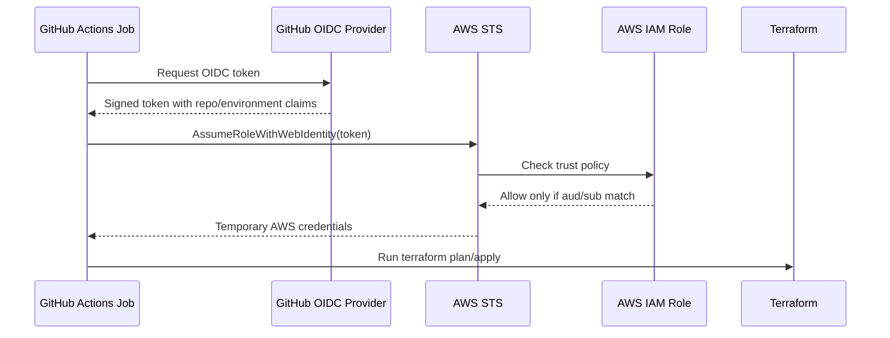

# GitHub OIDC To AWS: Human Explanation

This note explains the GitHub Actions to AWS OIDC setup in a natural way.

Visual reference:

```text
docs/visuals/github-oidc-aws-flow.svg
```

## The One Sentence Version

```text
GitHub Actions proves to AWS, with a short-lived signed identity token, that a
specific workflow from our repo and GitHub Environment is allowed to assume a
specific AWS IAM role.
```

If you remember only one thing:

```text
OIDC replaces stored AWS access keys with temporary credentials created only
when a trusted workflow runs.
```

## Where We Are Right Now

Current checkpoint:

```text
AWS OIDC provider exists.
IAM role signalforge-github-actions-dev exists.
Trust policy is restricted to GitHub Environment dev.
Terraform state bucket exists.
Next step is testing whether GitHub Actions can assume the AWS role.
```

What we did in AWS:

```text
1. Used the AWS IAM OIDC provider for GitHub:
   token.actions.githubusercontent.com

2. Created the AWS IAM role:
   signalforge-github-actions-dev

3. Updated the role trust policy:
   Only this repo using GitHub Environment dev can assume the role.
```

What we did not do:

```text
We did not store AWS_ACCESS_KEY_ID in GitHub.
We did not store AWS_SECRET_ACCESS_KEY in GitHub.
We did not give every GitHub branch automatic AWS access.
We did not give every GitHub repository access.
```

## What The IAM Role Is Doing

The IAM role is the AWS identity that GitHub Actions temporarily becomes.

Think of it like this:

```text
GitHub workflow:
  Visitor requesting entry.

OIDC token:
  Visitor ID card issued by GitHub.

IAM OIDC provider:
  AWS configuration that says GitHub tokens can be evaluated.

IAM role trust policy:
  Security desk guest list.

AWS STS:
  Front desk that checks the ID card and issues a temporary badge.

IAM role permissions policy:
  Rooms/actions the temporary badge is allowed to use.

Terraform:
  Worker using the temporary badge to create or update AWS resources.
```

The role has two separate questions:

```text
Trust policy:
  Who is allowed to assume this role?

Permissions policy:
  What can this role do after it is assumed?
```

So when someone asks, "Did you add GitHub as provider to the role?", the precise
answer is:

```text
I configured AWS IAM with GitHub as an OIDC identity provider. Then I created an
IAM role whose trust policy allows that GitHub OIDC provider to assume the role
only when the token claims match my repo and GitHub Environment dev.
```

## What We Need To Test Now

Now we need to prove that the trust relationship works.

We will create a GitHub Actions smoke-test workflow that:

```text
1. Runs manually using workflow_dispatch.
2. Uses GitHub Environment dev.
3. Requests a GitHub OIDC token.
4. Sends that token to AWS STS.
5. Assumes signalforge-github-actions-dev.
6. Runs aws sts get-caller-identity.
7. Confirms the AWS account is 575108962419.
```

Success should look like:

```text
Account:
  575108962419

Arn:
  arn:aws:sts::575108962419:assumed-role/signalforge-github-actions-dev/...
```

If that works:

```text
GitHub Actions can securely talk to AWS without static AWS keys.
Then we can safely move to Terraform plan/apply workflows.
```

## Interview Follow-Up Answer

If someone asks, "You used OIDC. Then what? How does it work?"

Use this:

```text
I used GitHub OIDC to avoid storing long-lived AWS keys in GitHub. In AWS IAM, I
configured GitHub as an OIDC identity provider using token.actions.githubusercontent.com.
Then I created an IAM role for GitHub Actions and restricted its trust policy to
my repository and GitHub Environment dev.

When the workflow runs, GitHub issues a signed OIDC token for that job. The
workflow sends that token to AWS STS using AssumeRoleWithWebIdentity. AWS checks
that the token audience is sts.amazonaws.com and that the subject matches my repo
and environment. If it matches, STS returns temporary AWS credentials for the
role. Terraform then uses those temporary credentials to create or manage AWS
resources.
```

If they ask, "What is the role doing here?"

Use this:

```text
The role is the AWS identity the workflow temporarily assumes. The trust policy
controls who can assume it, and the permissions policy controls what actions are
allowed after it is assumed. OIDC proves the workflow identity; the IAM role
defines AWS access.
```

## What We Are Trying To Solve

We want GitHub Actions to create AWS infrastructure using Terraform.

Bad approach:

```text
Create AWS access keys.
Store AWS_ACCESS_KEY_ID and AWS_SECRET_ACCESS_KEY in GitHub.
Let GitHub Actions use those long-lived keys.
```

Why that is risky:

```text
Keys can leak.
Keys can be forgotten.
Keys need rotation.
If someone steals them, they can use them outside GitHub.
```

Better approach:

```text
Use GitHub OIDC and AWS STS.
No long-lived AWS keys in GitHub.
GitHub gets short-lived AWS credentials only when a workflow runs.
```

Real-time production example:

```text
A company wants every Terraform apply to run from GitHub Actions, but they do
not want AWS access keys sitting in GitHub secrets for months. With OIDC, a
workflow gets temporary credentials for only that run. If the workflow ends, the
credentials expire. If someone copies old logs, they do not get reusable AWS keys.
```

## What OIDC Means Here

OIDC means OpenID Connect.

In this project:

```text
GitHub is the identity provider.
AWS is the system deciding whether to trust that identity.
```

Analogy:

```text
GitHub issues an ID card for the workflow.
AWS checks the ID card.
If the ID card matches the trust rules, AWS gives the workflow a temporary visitor badge.
```

The ID card contains claims. Claims are facts about the workflow.

Important claims for us:

```text
aud:
  Who the token is meant for.
  For AWS, this should be sts.amazonaws.com.

sub:
  The subject identity.
  This tells AWS which repo, branch, tag, pull request, or environment the
  workflow came from.
```

## What STS Means

STS means AWS Security Token Service.

STS issues temporary AWS credentials.

Temporary credentials include:

```text
Access key ID
Secret access key
Session token
Expiration time
```

Important:

```text
STS credentials are short-lived.
They are not permanent IAM user access keys.
```

## Who Does What

```text
GitHub Actions:
  Runs the workflow.

GitHub OIDC:
  Issues a signed identity token for the workflow.

AWS IAM OIDC provider:
  Tells AWS that token.actions.githubusercontent.com is a trusted identity provider.

AWS IAM role:
  Defines what trusted GitHub workflows can do.

Trust policy:
  Defines who can assume the role.

Permissions policy:
  Defines what the role can do after it is assumed.

AWS STS:
  Exchanges the valid GitHub OIDC token for temporary AWS credentials.

Terraform:
  Uses those temporary credentials to create/update AWS resources.
```

Architecture flow:



## Authentication vs Authorization

Authentication:

```text
Who are you?
```

In this setup:

```text
GitHub OIDC token proves the workflow identity.
```

Authorization:

```text
What are you allowed to do?
```

In this setup:

```text
IAM role permissions define what Terraform can create/update/delete.
```

Analogy:

```text
Authentication = showing your ID card at the building entrance.
Authorization = which rooms your badge can open.
```

## What We Created

AWS OIDC provider:

```text
https://token.actions.githubusercontent.com
```

Audience:

```text
sts.amazonaws.com
```

IAM role:

```text
signalforge-github-actions-dev
```

AWS account:

```text
575108962419
```

GitHub repo:

```text
PraveenB19/signalforge-ai-ops-lab
```

GitHub environment:

```text
dev
```

AWS role ARN:

```text
arn:aws:iam::575108962419:role/signalforge-github-actions-dev
```

## Why The AWS Console Wizard Was Confusing

The AWS role wizard asked for branch/environment input, but it produced this kind of incorrect `sub` value:

```text
repo:PraveenB19/signalforge-ai-ops-lab:ref:refs/heads/environment:dev
```

That means AWS interpreted `environment:dev` as a branch name.

But we wanted a GitHub Environment, not a branch.

Correct environment-based subject:

```text
repo:PraveenB19/signalforge-ai-ops-lab:environment:dev
```

Branch-based subject would look like:

```text
repo:PraveenB19/signalforge-ai-ops-lab:ref:refs/heads/dev
```

## Correct Trust Policy

The trust policy should restrict role assumption to this repo and GitHub environment:

```json
{
  "Version": "2012-10-17",
  "Statement": [
    {
      "Effect": "Allow",
      "Principal": {
        "Federated": "arn:aws:iam::575108962419:oidc-provider/token.actions.githubusercontent.com"
      },
      "Action": "sts:AssumeRoleWithWebIdentity",
      "Condition": {
        "StringEquals": {
          "token.actions.githubusercontent.com:aud": "sts.amazonaws.com",
          "token.actions.githubusercontent.com:sub": "repo:PraveenB19/signalforge-ai-ops-lab:environment:dev"
        }
      }
    }
  ]
}
```

## Why This Is Secure

This trust policy says:

```text
Only GitHub Actions workflows from this specific repo,
using the dev GitHub Environment,
can assume this AWS role.
```

It does not allow:

```text
Other GitHub repos
Other GitHub users
Random branches without the dev environment
Long-lived AWS keys
```

What this does not mean:

```text
It does not mean every GitHub workflow gets AWS admin access.
It does not mean every branch can deploy.
It does not mean OIDC itself creates infrastructure.
It only means AWS can trust a specific workflow identity enough to issue
temporary credentials for an IAM role.
```

The permissions policy attached to the role is still what decides what Terraform
can actually do.

## GitHub Workflow Requirement

For a workflow to use OIDC, it must include:

```yaml
permissions:
  id-token: write
  contents: read
```

Meaning:

```text
id-token: write:
  Allows GitHub Actions to request an OIDC token.

contents: read:
  Allows checkout to read the repo code.
```

The workflow job also needs to use the environment we trusted:

```yaml
jobs:
  terraform-plan:
    environment: dev
```

If the job does not use `environment: dev`, the token subject will not match:

```text
repo:PraveenB19/signalforge-ai-ops-lab:environment:dev
```

When that happens, AWS STS should deny the request.

## Dev Branch vs Dev Environment

This is a common confusion.

```text
Branch:
  A Git line of code, such as feature/java-app, dev, or main.

GitHub Environment:
  A deployment boundary, such as dev or prod.
```

A workflow can run from branch `feature/java-app` but still deploy to the GitHub
Environment `dev`.

In that case, the OIDC subject can be environment-based:

```text
repo:PraveenB19/signalforge-ai-ops-lab:environment:dev
```

If we wanted branch-based trust instead, the subject would look like:

```text
repo:PraveenB19/signalforge-ai-ops-lab:ref:refs/heads/dev
```

For this lab, environment-based trust is better because it lines up with
deployment controls. It lets us later add required reviewers for `prod`.

## How Prod Approval Fits

Dev flow:

```text
Developer pushes code
  -> CI passes
  -> Terraform plan/apply can run against GitHub Environment dev
  -> AWS role signalforge-github-actions-dev is assumed
```

Prod flow later:

```text
Code is merged to main
  -> CI passes
  -> Prod deployment job requests GitHub Environment prod
  -> GitHub pauses for required reviewer approval
  -> After approval, GitHub exposes prod environment access
  -> Job receives OIDC token with subject environment:prod
  -> AWS allows assuming signalforge-github-actions-prod
```

Why this matters:

```text
Manual approval is enforced before production credentials are used.
The AWS prod role trusts only the prod environment subject.
Dev credentials cannot accidentally deploy prod if permissions and state are separated.
```

## Same Account vs Multiple Accounts

For this learning lab:

```text
One AWS account
Separate names, tags, Terraform state keys, GitHub environments, and IAM roles
```

Enterprise pattern:

```text
Separate AWS accounts for dev, stage, and prod
Separate OIDC roles in each account
Central logging and security monitoring
Stricter production approvals
```

Interview answer:

```text
In this lab I am using one AWS account to control cost, but I still separate dev
and prod logically using GitHub Environments, IAM roles, naming, tags, and
Terraform state keys. In a mature enterprise setup I would prefer separate AWS
accounts for stronger blast-radius isolation.
```

## Troubleshooting OIDC Failures

Symptom:

```text
Not authorized to perform sts:AssumeRoleWithWebIdentity
```

Common causes:

```text
Wrong AWS account or role ARN
Missing permissions: id-token: write
Workflow job did not specify environment: dev
Trust policy uses branch subject but workflow token has environment subject
Trust policy uses environment subject but workflow token has branch subject
Repo name, owner, or environment name has a typo
OIDC provider audience is not sts.amazonaws.com
```

How to think about it:

```text
STS is the front desk.
The trust policy is the guest list.
If the token claims do not match the guest list exactly, STS refuses the badge.
```

## Interview Explanation

Use this natural answer:

```text
I set up GitHub Actions to authenticate to AWS using OIDC instead of storing AWS
access keys in GitHub. GitHub becomes the identity provider and AWS IAM trusts
tokens from token.actions.githubusercontent.com. In the IAM role trust policy, I
restricted the subject to my repo and the dev GitHub Environment. When a workflow
runs with id-token: write and environment: dev, it requests an OIDC token, AWS STS
validates the token claims, and then returns temporary credentials for the dev
role. Terraform uses those credentials to create AWS resources. For production, I
would use a separate prod role and GitHub prod Environment with required manual
approval before credentials are issued.
```
