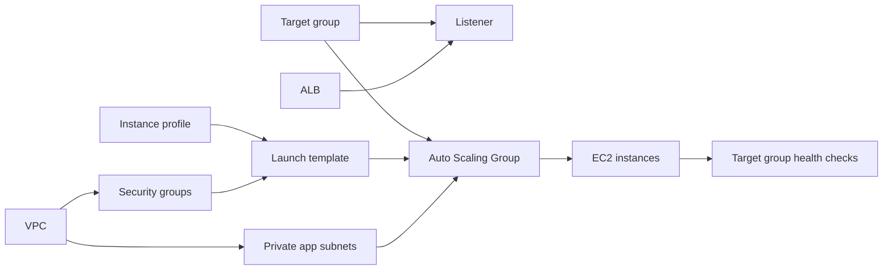

# Terraform Enterprise Runbook

Use this note when you want to explain Terraform like a production engineer:

```text
What files do humans write?
What files does Terraform generate?
What does state mean?
What commands do we run before apply?
What happens if a file is deleted?
How do we handle drift?
How do we scale this across dev, stage, prod, accounts, and clouds?
```

## One-Minute Mental Model

```text
Terraform code:
  Desired infrastructure.

Terraform state:
  Terraform's memory of real infrastructure.

Terraform provider:
  Plugin that knows how to talk to a cloud API.

Terraform plan:
  Difference between desired infrastructure and current state/real cloud.

Terraform apply:
  Makes real infrastructure match the plan and updates state.
```

Memory hook:

```text
Code says what we want.
State says what Terraform knows.
Plan shows the difference.
Apply changes reality.
```

## State Is Not backend.tf

This is important.

```text
backend.tf:
  A human-written config file.
  It tells Terraform where state should live.

terraform.tfstate:
  Terraform's state data.
  It records the real resources Terraform manages.
```

Analogy:

```text
backend.tf is the address of the warehouse.
terraform.tfstate is the inventory stored inside that warehouse.
```

In our project:

```hcl
terraform {
  backend "s3" {
    bucket       = "signalforge-tfstate-575108962419-us-east-1"
    key          = "dev/terraform.tfstate"
    region       = "us-east-1"
    use_lockfile = true
  }
}
```

This means:

```text
Store dev Terraform state in S3:
  s3://signalforge-tfstate-575108962419-us-east-1/dev/terraform.tfstate

Use S3 lockfile:
  Prevent two Terraform runs from changing the same state at the same time.
```

## Why terraform show Says State Is Empty

If you run:

```bash
terraform show
```

and it says state is empty, it usually means:

```text
Terraform has not applied anything into this state yet.
```

That is expected before the first `terraform apply`.

Current SignalForge situation:

```text
We ran terraform plan.
We did not run terraform apply for VPC resources.
So the state does not contain VPC resources yet.
```

Important:

```text
terraform plan can show resources that would be created.
terraform show shows what is already in state.
```

Interview answer:

```text
An empty state before apply is normal. Terraform code may define resources, and
plan may show what will be created, but state only records resources after apply
or after importing existing resources.
```

## Human-Written Files

These are source code. We write and commit them.

```text
backend.tf:
  Remote state location and locking.

providers.tf:
  Terraform version and provider plugin requirements.

variables.tf:
  Inputs that can change per environment.

locals.tf:
  Standard computed values, naming, and tags.

main.tf:
  Resources, data sources, and module calls.

outputs.tf:
  Important values to print or pass to other modules/workflows.

terraform.tfvars.example:
  Example values for humans.

modules/*:
  Reusable infrastructure building blocks.
```

Terraform does not require these exact filenames, but humans use them because
they make production reviews and troubleshooting easier.

## Terraform-Generated Files

These are created by Terraform commands.

```text
.terraform/:
  Created by terraform init.
  Contains provider/module/backend working data.
  Do not commit.
  Safe to delete; run terraform init again.

.terraform.lock.hcl:
  Created by terraform init.
  Locks provider versions and checksums.
  Commit this.

terraform.tfstate:
  Created/updated by terraform apply if using local state.
  With S3 backend, state is stored remotely in S3.
  Do not commit local state files.

*.tfplan:
  Created when using terraform plan -out=...
  Do not commit.

crash.log:
  Created if Terraform crashes.
  Usually do not commit.
```

## Command Flow Before Apply

Normal local flow:

```bash
terraform fmt -recursive
terraform init
terraform validate
terraform plan -input=false
```

Production CI flow:

```text
Pull request opened
  -> terraform fmt -check
  -> terraform init
  -> terraform validate
  -> terraform plan -input=false
  -> security scan
  -> human review
  -> apply only after approval
```

Command meanings:

```text
terraform fmt:
  Formats Terraform files.
  No output usually means files were already formatted.

terraform init:
  Initializes backend, providers, and modules.
  Run again when backend, provider, or module source changes.

terraform validate:
  Checks syntax and provider/resource references.

terraform plan:
  Shows what Terraform would create/change/destroy.

terraform plan -input=false:
  CI-friendly. Terraform fails instead of asking questions.

terraform apply:
  Creates/changes/destroys resources and updates state.
```

## Terraform Creation Order And Dependency Graph

Terraform does not create resources simply in the order they appear in
`main.tf`.

Terraform creates a dependency graph.

Plain-English model:

```text
Terraform reads all .tf files.
Terraform finds references between resources and modules.
Terraform builds a graph of dependencies.
Terraform creates independent resources in parallel.
Terraform waits when one resource needs another resource first.
```

Memory hook:

```text
References create relationships.
Relationships create the graph.
The graph controls the order.
```

Example:

```hcl
vpc_id = module.vpc.vpc_id
```

This tells Terraform:

```text
This resource or module cannot be fully planned/applied until module.vpc has a
VPC ID output.
```

You can also force an explicit dependency:

```hcl
depends_on = [module.alb]
```

Use `depends_on` only when Terraform cannot infer the dependency from normal
references. Most of the time, references are better.

## SignalForge Resource Order

Terraform may create independent resources in parallel, but the logical order in
this project is:

```text
1. Provider/backend initialization
2. VPC
3. Internet Gateway
4. Public/private subnets
5. Route tables and subnet associations
6. NAT Gateway and Elastic IP
7. Security groups
8. IAM roles and EC2 instance profile
9. S3 artifact bucket
10. ALB target group
11. ALB and listener
12. Launch template
13. Auto Scaling Group and EC2 instances
14. RDS subnet group, secret, and database
15. VPC Flow Logs, CloudWatch log groups, alarms, dashboard
```

Important:

```text
This is the logical dependency order, not necessarily one-by-one execution.
Terraform may create S3, IAM, security groups, and log groups in parallel once
their dependencies are ready.
```

## ALB, Target Group, ASG, And Health Checks

This is the part that often feels confusing.

### What must exist before the ASG?

The Auto Scaling Group needs:

```text
Private app subnet IDs:
  Where EC2 instances should run.

Launch template:
  What AMI, instance type, IAM instance profile, security group, and user data
  each EC2 instance should use.

Target group ARN:
  Where the ASG should register EC2 instances for ALB traffic.
```

That means the target group usually exists before the ASG.

The ALB listener also points to the target group:

```text
ALB listener -> target group
ASG -> registers EC2 instances into target group
Target group -> runs health checks against EC2 instances
```

Mental model:



### Does ALB need EC2 instances before it exists?

No.

```text
The ALB and target group can exist before EC2 instances are registered.
The target group will simply have no healthy targets until the ASG launches
instances and registers them.
```

### Does ASG need ALB?

The ASG does not strictly need an ALB in every architecture.

Examples:

```text
Worker ASG:
  No ALB. Instances process SQS jobs or background work.

Web app ASG:
  Usually attached to a target group behind an ALB.
```

In this project, the ASG is for a web application, so it attaches to the ALB
target group.

### When do we create an Auto Scaling Group?

Create an ASG when you want:

```text
High availability:
  More than one instance across Availability Zones.

Self-healing:
  Replace failed/unhealthy instances automatically.

Scaling:
  Add/remove instances based on load or schedule.

Rolling updates:
  Replace instances gradually when launch template or AMI changes.
```

Consider before creating an ASG:

```text
Minimum/desired/maximum capacity.
Which private subnets and Availability Zones to use.
Launch template details.
Security group rules.
IAM instance profile.
Health check type and grace period.
Whether it should attach to an ALB target group.
Scaling policy: CPU, memory/custom metric, request count, or schedule.
Application startup time.
How deployment updates are rolled out.
```

Interview answer:

```text
For a web application, I usually create the ALB target group before the Auto
Scaling Group because the ASG needs a target group ARN to register instances.
The ALB, listener, and target group can exist even if no instances are healthy
yet. Once the ASG launches EC2 instances in private subnets, it registers them
with the target group, and the target group health check decides whether ALB can
send traffic to them.
```

## Manual Creation vs Terraform Automation

Manually, humans often think:

```text
Create VPC.
Create subnets.
Create routes.
Create security groups.
Create ALB.
Create EC2.
Create RDS.
Create monitoring.
```

Terraform thinks:

```text
What depends on what?
What can be created in parallel?
What must wait?
```

That is why the Terraform apply log may not look exactly like your manual
mental order.

Example:

```text
CloudWatch log group may be created while IAM roles are being created.
S3 artifact bucket may be created while security groups are being created.
ALB target group may be created before EC2 exists.
RDS subnet group may be created before RDS database exists.
```

Production line:

```text
The important thing is not file order. The important thing is correct
dependencies, correct outputs, correct state, and a reviewed plan.
```

## File Loss Scenarios

### backend.tf Deleted

Impact:

```text
Terraform may stop using the S3 backend.
It may try local state.
Very dangerous in production because Terraform may lose the shared source of
truth.
```

Fix:

```bash
git restore backend.tf
terraform init -reconfigure
terraform state list
terraform plan
```

Production rule:

```text
Never apply until backend is confirmed correct.
```

### Wrong backend key

Example:

```text
dev uses prod/terraform.tfstate by mistake.
prod uses dev/terraform.tfstate by mistake.
```

Impact:

```text
Terraform could plan against the wrong environment's state.
This can cause duplicate resources or dangerous changes.
```

Fix:

```text
Stop immediately.
Correct backend key.
Run terraform init -reconfigure.
Run terraform state list.
Run terraform plan.
Review before apply.
```

### .terraform/ Deleted

Impact:

```text
Low risk.
Local working directory loses downloaded providers/modules.
```

Fix:

```bash
terraform init
```

### .terraform.lock.hcl Deleted

Impact:

```text
Terraform may select a newer provider version.
Provider behavior can change.
```

Fix:

```text
Restore from Git if accidental.
If intentional, run terraform init -upgrade, review lock changes, run plan.
```

Production rule:

```text
Provider upgrades should be reviewed like application dependency upgrades.
```

### S3 State Deleted

Impact:

```text
Serious.
Terraform no longer knows what it owns.
```

Fix options:

```text
Restore previous S3 object version.
Restore from backup.
Use terraform import to rebuild state.
Use terraform state commands carefully.
Do not apply blindly.
```

Production rule:

```text
Enable S3 versioning, encryption, restricted access, and audit logging.
```

## Drift Scenarios

Drift means:

```text
AWS no longer matches Terraform code/state.
```

Examples:

```text
Someone manually opened a security group.
Someone changed an EC2 instance type.
Someone deleted a route table.
Someone changed an ALB listener.
An emergency console fix was made during Sev1.
```

Detection:

```bash
terraform plan
terraform plan -refresh-only
terraform state list
terraform state show <resource>
```

Production response:

```text
1. Do not auto-apply production drift.
2. Identify whether the manual change was intentional.
3. If it was emergency fix, document it.
4. Either update Terraform code or revert AWS manual change.
5. Run plan again.
6. Apply only after review.
```

Interview answer:

```text
For drift, I run Terraform plan or refresh-only plan, compare real AWS with code,
understand whether the change was an emergency manual fix or unauthorized drift,
then either codify the change or revert it. I do not blindly auto-apply drift in
production.
```

## Environments: dev, stage, prod

Recommended learning layout:

```text
infra/envs/dev
infra/envs/stage
infra/envs/prod
infra/modules/vpc
infra/modules/alb
infra/modules/ec2
```

Each environment has:

```text
backend.tf:
  Different state key.

providers.tf:
  Same provider pattern.

variables.tf:
  Same input shape.

terraform.tfvars:
  Different values.

main.tf:
  Same modules, different inputs.
```

Example state keys:

```text
dev/terraform.tfstate
stage/terraform.tfstate
prod/terraform.tfstate
```

Why:

```text
Dev, stage, and prod should not share the same state file.
```

## Workspaces vs Folders

Terraform workspaces:

```text
Same config.
Different workspace state.
Useful for simple repeated environments.
```

Environment folders:

```text
Separate directory per environment.
Clear backend, variables, and review boundaries.
Common in production because it is explicit.
```

For this project:

```text
Use folders first:
  infra/envs/dev
  infra/envs/stage
  infra/envs/prod
```

Why:

```text
It is easier to understand, review, and explain in interviews.
```

Interview answer:

```text
Terraform workspaces can separate state for the same configuration, but for
production-style environments I prefer explicit env folders because backend keys,
variables, approvals, and pipelines are easier to review and control.
```

## Modules

Module means:

```text
Reusable Terraform code.
```

Example:

```text
infra/modules/vpc:
  Generic VPC building block.

infra/envs/dev:
  Calls the VPC module with dev values.

infra/envs/prod:
  Calls the same VPC module with prod values.
```

Why modules matter:

```text
They standardize infrastructure across environments.
They reduce copy/paste.
They make changes consistent.
```

Production risk:

```text
A module bug affects every environment that uses it.
```

Safe module rollout:

```text
1. Change module.
2. Run plan in dev.
3. Apply dev.
4. Run plan in stage.
5. Apply stage.
6. Run plan in prod.
7. Apply prod with approval.
```

Resume language:

```text
Improved deployment consistency and reduced configuration drift by provisioning
standardized AWS infrastructure across multiple environments using Terraform
remote backend, reusable modules, and environment-specific variables.
```

## Multi-Cloud Provider Pattern

Single AWS provider:

```hcl
provider "aws" {
  region = var.aws_region
}
```

Multiple AWS accounts or regions:

```hcl
provider "aws" {
  alias  = "dev"
  region = "us-east-1"
}

provider "aws" {
  alias  = "prod"
  region = "us-east-1"
}
```

Multi-cloud shape:

```hcl
provider "aws" {
  region = var.aws_region
}

provider "azurerm" {
  features {}
}

provider "google" {
  project = var.gcp_project
  region  = var.gcp_region
}
```

Important:

```text
Providers are plugins.
Each provider knows how to talk to one platform API.
Modules can receive provider aliases when needed.
```

Interview answer:

```text
Terraform supports multi-cloud through providers. The provider block configures
how Terraform talks to a platform such as AWS, Azure, or GCP. For multiple
accounts or regions, I use provider aliases and pass the correct provider into
modules.
```

## Enterprise Production Workflow

```text
Developer changes Terraform
  -> Pull request
  -> fmt/validate/tflint/security scan
  -> terraform plan
  -> plan reviewed by platform/cloud team
  -> merge
  -> apply in dev
  -> promote to stage
  -> production approval
  -> apply in prod
  -> monitor
```

What we avoid:

```text
Running apply directly from laptops for production.
Using local state.
Skipping plan review.
Sharing one state file across environments.
Storing cloud access keys in GitHub.
Clicking console changes without backporting to Terraform.
```

## What To Practice Next

From scratch, create stage and prod by hand:

```text
infra/envs/stage/backend.tf
infra/envs/stage/providers.tf
infra/envs/stage/variables.tf
infra/envs/stage/locals.tf
infra/envs/stage/main.tf
infra/envs/stage/outputs.tf

infra/envs/prod/backend.tf
infra/envs/prod/providers.tf
infra/envs/prod/variables.tf
infra/envs/prod/locals.tf
infra/envs/prod/main.tf
infra/envs/prod/outputs.tf
```

Rules:

```text
Do not copy blindly.
Understand which lines stay same and which lines change.

Same:
  provider pattern
  module usage
  variable names

Different:
  backend key
  CIDR ranges
  environment name
  role/environment later
  approval rules
```

## Hands-On Stage And Prod Creation

We will use the existing dev environment as the reference, but you should type
stage and prod yourself. The goal is not speed. The goal is to understand which
parts are reusable and which parts are environment-specific.

Learning path:

```text
dev:
  Already created.
  Use it as the working example.

stage:
  You type it next.
  Same shape as dev, safer values than prod, used for pre-production testing.

prod:
  You type it after stage.
  Same shape, stricter approvals, separate state, production-sized values later.
```

First file to create for stage:

```text
infra/envs/stage/backend.tf
```

Why start with backend:

```text
Because backend decides where Terraform stores the environment's memory.
Before Terraform plans or applies anything, it must know which state file belongs
to this environment.
```

Stage backend should use a separate key:

```hcl
terraform {
  backend "s3" {
    bucket       = "signalforge-tfstate-575108962419-us-east-1"
    key          = "stage/terraform.tfstate"
    region       = "us-east-1"
    use_lockfile = true
  }
}
```

Prod backend should use a separate key:

```hcl
terraform {
  backend "s3" {
    bucket       = "signalforge-tfstate-575108962419-us-east-1"
    key          = "prod/terraform.tfstate"
    region       = "us-east-1"
    use_lockfile = true
  }
}
```

Memory hook:

```text
Same bucket.
Different key.
Different environment memory.
```

Interview answer:

```text
I keep dev, stage, and prod in separate Terraform state keys so one environment
does not accidentally read or modify another environment's infrastructure. The
backend config points Terraform to the correct S3 state object, and S3 locking
prevents concurrent writes.
```

## Why We Do Not Run Apply First

Beginner mistake:

```text
Write code, run apply, hope it works.
```

Production pattern:

```text
Write code.
Format.
Initialize backend/providers.
Validate syntax.
Plan.
Review plan.
Apply only when plan is understood.
```

For this project, before any apply:

```bash
cd infra/envs/dev
terraform fmt -recursive
AWS_PROFILE=admin-user terraform init
AWS_PROFILE=admin-user terraform validate
AWS_PROFILE=admin-user terraform plan -input=false
```

What each command proves:

```text
fmt:
  Code is consistently formatted.

init:
  Backend, providers, and modules can initialize.

validate:
  Terraform syntax and references are valid.

plan:
  Terraform can compare code, state, and AWS.
```

## What If Terraform Works In Stage But Fails In Prod

Common causes:

```text
Prod IAM role has stricter permissions.
Prod backend key or bucket policy is wrong.
Prod CIDR overlaps with an existing network.
Prod account has service quotas.
Prod variables differ from stage.
Prod has drift from emergency manual changes.
Prod region/AZ does not support a selected instance type.
```

How to handle:

```text
1. Compare stage and prod variable values.
2. Confirm AWS identity and account.
3. Confirm backend key.
4. Run terraform init -reconfigure if backend changed.
5. Run terraform plan and read the first real error.
6. Check IAM AccessDenied separately from Terraform syntax errors.
7. If prod drift exists, decide whether to codify or revert it.
```

Commands:

```bash
aws sts get-caller-identity --profile admin-user
terraform workspace show
terraform state list
terraform plan -input=false
terraform plan -refresh-only
```

Interview answer:

```text
When Terraform works in stage but fails in prod, I first separate environment
configuration issues from Terraform code issues. I verify identity, backend,
variables, quotas, IAM permissions, and drift. I do not assume stage success
guarantees prod success because prod often has stricter controls and existing
state.
```

## Sev1 Console Fix And Terraform Drift

Real production scenario:

```text
During a Sev1 incident, an engineer manually opens a security group rule in AWS
Console to restore service quickly.
```

What happens next:

```text
Customers recover, but Terraform code no longer matches AWS.
That is drift.
```

Good response:

```text
1. Capture the manual change in the incident timeline.
2. Run terraform plan or refresh-only plan after the incident stabilizes.
3. Decide whether the change should stay.
4. If yes, update Terraform code.
5. If no, revert the AWS manual change through Terraform.
6. Add a runbook or alert to prevent repeat confusion.
```

Interview answer:

```text
In an incident I prioritize customer impact first, but after mitigation I bring
the environment back under Terraform control. Any console change must either be
codified or reverted, otherwise the next Terraform apply may undo it
unexpectedly.
```
