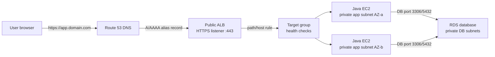
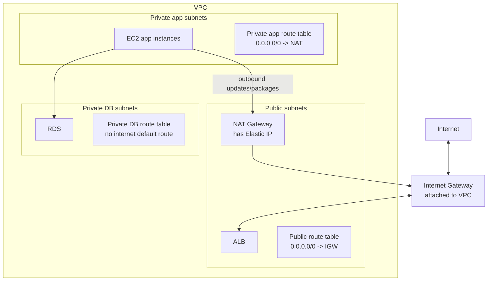

# AWS Network Flow

Use this when explaining how a request reaches a private Java application on EC2
through a public Application Load Balancer.

## Mental Model

```text
Public subnet:
  Things the internet can reach directly, such as ALB and NAT Gateway.

Private app subnet:
  Application servers. They receive traffic from ALB, not directly from users.

Private DB subnet:
  Database. It receives traffic from the app, not from ALB or users.

Route table:
  The subnet's traffic rulebook.

Security group:
  Instance/load-balancer firewall.
```

## Request Flow



## VPC Routing Map



## Important Correction

Internet Gateway is not created inside a public subnet.

```text
Internet Gateway:
  Attached to the VPC.

Public subnet:
  Has a route table route 0.0.0.0/0 -> Internet Gateway.

NAT Gateway:
  Created inside a public subnet.
  Uses an Elastic IP.
  Allows private instances to reach the internet outbound.
```

Interview answer:

```text
An Internet Gateway is attached to the VPC, not to a subnet. A subnet becomes
public when its route table has a default route to the Internet Gateway. A NAT
Gateway sits in a public subnet and lets private instances initiate outbound
internet traffic without allowing inbound internet traffic to those instances.
```

## Route Table Rules

Public subnet route table:

```text
VPC CIDR       -> local
0.0.0.0/0     -> Internet Gateway
```

Private app subnet route table:

```text
VPC CIDR       -> local
0.0.0.0/0     -> NAT Gateway
```

Private DB subnet route table:

```text
VPC CIDR       -> local
```

Why DB has no internet route:

```text
The database should only be reachable from inside the VPC, usually from the app
security group. It should not need direct internet access.
```

## Security Groups

ALB security group:

```text
Inbound:
  443 from internet
  80 from internet only if redirecting to HTTPS

Outbound:
  App port to app security group
```

App security group:

```text
Inbound:
  App port from ALB security group only

Outbound:
  DB port to DB security group
  HTTPS outbound for package/API access if needed
```

DB security group:

```text
Inbound:
  DB port from app security group only

Outbound:
  Usually default or restricted as needed
```

Memory hook:

```text
User talks to ALB.
ALB talks to app.
App talks to DB.
Nobody talks directly to private servers.
```

## ALB Path Routing

ALB listener:

```text
Listens on port 443.
Uses ACM certificate for TLS.
Evaluates listener rules.
Forwards traffic to a target group.
```

Example rules:

```text
/api/*       -> app target group
/health      -> app target group health endpoint
/admin/*     -> admin target group, if we create one later
```

If no rule matches:

```text
ALB uses the default action.
Usually forward to the main app or return a fixed 404.
```

## Health Checks

Target group health check example:

```text
Path: /health
Protocol: HTTP
Port: traffic-port
Interval: 30 seconds
Timeout: 5 seconds
Healthy threshold: 2
Unhealthy threshold: 2 or 3
Expected code: 200
```

What it means:

```text
ALB keeps asking each EC2 instance: "Are you healthy?"
If an instance fails enough checks, ALB stops sending user traffic to it.
```

Production note:

```text
The health endpoint should check that the app can respond, but it should not be
so heavy that the health check itself creates load.
```

## IAM Roles In This Architecture

GitHub Actions IAM role:

```text
Used by CI/CD to run Terraform or deploy.
Assumed through OIDC.
```

EC2 instance profile role:

```text
Attached to EC2 instances.
Allows app/server to read from S3, write CloudWatch logs, fetch SSM parameters,
or use Secrets Manager without hard-coded AWS keys.
```

RDS IAM:

```text
RDS itself does not usually need the app's IAM role for normal username/password
database access. IAM can be used for enhanced monitoring, backups, KMS, or IAM
database authentication later.
```

## Do We Need Route 53, ACM, And Domain Now?

Not immediately.

Learning order:

```text
1. VPC
2. Security groups
3. ALB + EC2
4. Access app using ALB DNS name
5. Add Route 53 custom domain
6. Add ACM certificate and HTTPS
7. Add CloudFront later if we need CDN/caching
```

Why:

```text
The ALB gives us a public DNS name even before buying a domain. That lets us
prove the app works first, then improve the user-facing domain and HTTPS story.
```

