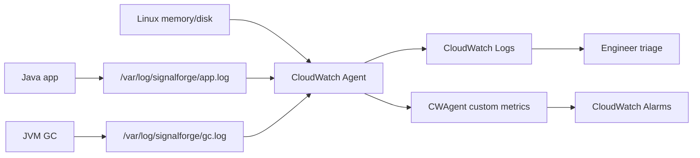

# CloudWatch Agent And Runtime Observability

Use this when someone asks:

```text
How do you monitor what is happening inside the EC2 server and Java process?
```

## Why This Was Missing

The first CloudWatch setup covered the outside view:

```text
ALB requests
ALB 4xx/5xx
Target 5xx
Target p95 latency
Healthy/unhealthy targets
ASG CPU
VPC Flow Logs
```

That is useful, but it does not answer:

```text
Is memory high inside the server?
Is disk filling?
What did systemd print when the app crashed?
Is the JVM doing frequent garbage collection?
Did the Java service fail while starting?
```

AWS default EC2 metrics give CPU, network, disk I/O, and status checks. They do
not automatically give memory, disk filesystem usage, application logs, or JVM
GC logs.

That is why we added CloudWatch Agent.

## Simple Mental Model



Memory hook:

```text
Process writes -> Agent ships -> CloudWatch stores -> Alarm notifies -> Engineer fixes
```

## What We Changed

The EC2 instance already had an IAM role with `CloudWatchAgentServerPolicy`.
That role gives the instance permission to publish logs and metrics.

Then the deploy workflow installs and configures:

```text
amazon-cloudwatch-agent
/var/log/signalforge/app.log
/var/log/signalforge/gc.log
/opt/aws/amazon-cloudwatch-agent/etc/amazon-cloudwatch-agent.json
```

The `signalforge.service` systemd unit now runs Java with GC logging:

```bash
/usr/bin/java \
  -Xlog:gc*:file=/var/log/signalforge/gc.log:time,uptime,level,tags:filecount=5,filesize=10M \
  -jar /opt/signalforge/signalforge-app.jar
```

Meaning:

```text
-Xlog:gc*:
  Tell Java to write garbage collection events.

file=/var/log/signalforge/gc.log:
  Write GC events to this file.

time,uptime,level,tags:
  Include useful fields in each GC log line.

filecount=5,filesize=10M:
  Rotate GC logs so the disk is not filled by one huge file.
```

The service also redirects application output:

```ini
StandardOutput=append:/var/log/signalforge/app.log
StandardError=append:/var/log/signalforge/app.log
```

Meaning:

```text
stdout and stderr from the Java process are appended to app.log.
CloudWatch Agent tails that file and sends it to CloudWatch Logs.
```

## systemd Logs vs CloudWatch Logs

`journalctl` is local to the instance:

```bash
journalctl -u signalforge.service -n 100 --no-pager
```

CloudWatch Logs is centralized:

```text
AWS Console -> CloudWatch -> Logs -> Log groups -> /aws/ec2/signalforge-dev/signalforge
```

Interview answer:

```text
I use journalctl for immediate instance-level debugging through Session Manager.
For team visibility, retention, search, and incident review, I ship application
logs and JVM GC logs to CloudWatch Logs using CloudWatch Agent.
```

## Metrics We Added

CloudWatch Agent publishes custom metrics in the `CWAgent` namespace:

```text
mem_used_percent
disk_used_percent
swap_used_percent
```

Important:

```text
These are custom metrics, so they can add CloudWatch cost.
For this lab, keep retention low and destroy resources after practice.
```

## Alarms We Added

Existing alarms:

```text
signalforge-dev-alb-5xx
signalforge-dev-target-5xx
signalforge-dev-target-p95-latency
signalforge-dev-unhealthy-targets
signalforge-dev-asg-cpu-high
```

Runtime alarms:

```text
signalforge-dev-asg-memory-high
signalforge-dev-asg-disk-high
```

Meaning:

```text
Memory alarm:
  CloudWatch Agent reports average memory used percent above 80%.

Disk alarm:
  CloudWatch Agent reports root filesystem usage above 80%.
```

In production, these alarms usually notify:

```text
CloudWatch Alarm -> SNS Topic -> Slack / PagerDuty
```

We have not wired Slack/PagerDuty yet. First we are making the signals visible.

## How To Create An Alarm

Terraform way:

```hcl
resource "aws_cloudwatch_metric_alarm" "asg_memory_high" {
  alarm_name          = "signalforge-dev-asg-memory-high"
  comparison_operator = "GreaterThanThreshold"
  evaluation_periods  = 3
  metric_name         = "mem_used_percent"
  namespace           = "CWAgent"
  period              = 60
  statistic           = "Average"
  threshold           = 80
  treat_missing_data  = "missing"

  dimensions = {
    AutoScalingGroupName = "signalforge-dev-app-asg"
  }
}
```

Console way:

```text
CloudWatch -> Alarms -> All alarms -> Create alarm
Select metric -> CWAgent -> AutoScalingGroupName -> mem_used_percent
Statistic: Average
Period: 1 minute
Threshold: Greater than 80
Evaluation periods: 3
Notification: SNS topic later
```

Interview answer:

```text
I prefer Terraform for alarms because alarms are production behavior, not a
manual console setting. If we create alarms manually during an incident, we
backport them into Terraform afterward so the next environment is consistent.
```

## JVM Heap, GC, And Threads

CloudWatch Agent gives OS-level memory. It does not automatically understand
Java heap internals.

For Java triage, start inside the EC2 instance:

```bash
pgrep -fa java
jcmd <pid> GC.heap_info
jstat -gc <pid> 1000 5
jcmd <pid> Thread.print | head -80
```

Meaning:

```text
pgrep -fa java:
  Find the Java process id and command line.

jcmd <pid> GC.heap_info:
  Show heap layout and usage.

jstat -gc <pid> 1000 5:
  Print GC stats every 1000 ms, five times.

jcmd <pid> Thread.print:
  Print thread dump to check blocked, waiting, or overloaded threads.
```

Production options for richer JVM metrics:

```text
Micrometer + CloudWatch registry:
  Sends Spring Boot JVM metrics directly to CloudWatch.

OpenTelemetry:
  Sends metrics, logs, and traces to an observability backend.

Prometheus + Grafana:
  Common for Kubernetes and microservices.

JMX exporter:
  Exposes JVM internals for scraping.
```

For a broader comparison of OpenTelemetry, Datadog, New Relic, Splunk, Fluent
Bit, Fluentd, Prometheus, Node Exporter, and Grafana, read:

```text
docs/29-observability-tools-comparison.md
```

For this lab:

```text
Step 1:
  CloudWatch Agent for logs, memory, disk, and GC logs.

Step 2:
  Micrometer/OpenTelemetry for heap, threads, request metrics, and traces.
```

## What To Start Today

Do this in order after infrastructure and deployment finish:

```text
1. Open the ALB URL and confirm the app works.
2. Open CloudWatch dashboard: signalforge-dev-ops-dashboard.
3. Open CloudWatch Logs: /aws/ec2/signalforge-dev/signalforge.
4. Use Session Manager to connect to one app instance.
5. Run local health checks.
6. Run JVM commands.
7. Trigger light traffic from your laptop.
8. Watch ALB request count and latency.
9. Trigger one controlled failure.
10. Explain what you saw using metrics + logs + commands.
```

Commands from your laptop:

```bash
curl -i http://<alb-dns-name>/
curl -i http://<alb-dns-name>/actuator/health
for i in {1..30}; do curl -s -o /dev/null -w "%{http_code} %{time_total}\n" http://<alb-dns-name>/; done
```

Commands inside EC2:

```bash
systemctl status signalforge.service --no-pager
journalctl -u signalforge.service -n 100 --no-pager
tail -f /var/log/signalforge/app.log
tail -f /var/log/signalforge/gc.log
free -h
df -h
ss -lntp | grep 8080
pgrep -fa java
```

## First Simulations To Practice

Start with these because they build confidence without too much risk.

### 1. App Process Down

Action:

```bash
sudo systemctl stop signalforge.service
```

Expected:

```text
ALB target becomes unhealthy.
ALB may return 503 if no healthy targets exist.
CloudWatch unhealthy target alarm should move toward ALARM.
App logs stop.
```

Fix:

```bash
sudo systemctl start signalforge.service
curl -i http://localhost:8080/actuator/health
```

Interview line:

```text
For 503 from ALB, I first check target health. If all targets are unhealthy, I
check the app process, health endpoint, security group, and recent deployment.
```

### 2. Port Not Listening

Check:

```bash
ss -lntp | grep 8080
```

Expected:

```text
If nothing listens on 8080, ALB cannot connect to the target.
This commonly causes target health failure and 502/503 symptoms.
```

### 3. Memory Pressure

Check:

```bash
free -h
ps aux --sort=-%mem | head
jcmd <pid> GC.heap_info
```

Expected:

```text
OS memory tells whether the box is under pressure.
JVM heap tells whether Java object memory is under pressure.
Both are needed before blaming a heap leak.
```

### 4. Disk Pressure

Check:

```bash
df -h
du -sh /var/log/signalforge
```

Expected:

```text
If disk fills, the app may fail to write logs, create temp files, or start.
Log rotation matters.
```

## How To Explain This In Interview

```text
For observability, I separate edge, infrastructure, runtime, and application
signals. ALB metrics tell me request rate, 4xx, 5xx, target health, and latency.
EC2/ASG metrics tell me CPU and scaling behavior. CloudWatch Agent fills the
default EC2 gap by publishing memory, disk, and application logs. For Java, I
also enable GC logs and use jcmd/jstat during incidents to inspect heap and GC.
Then alarms are managed in Terraform so environments stay consistent.
```

Follow-up answer:

```text
If memory is high, I do not immediately restart the server. I check whether the
issue is OS memory, another process, Java heap, native memory, thread growth, or
traffic volume. If customers are impacted, I mitigate first by scaling out,
rolling back, restarting one unhealthy instance, or throttling non-critical
traffic. Then I collect heap/thread/GC evidence for root cause.
```
