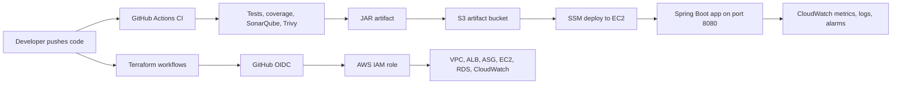
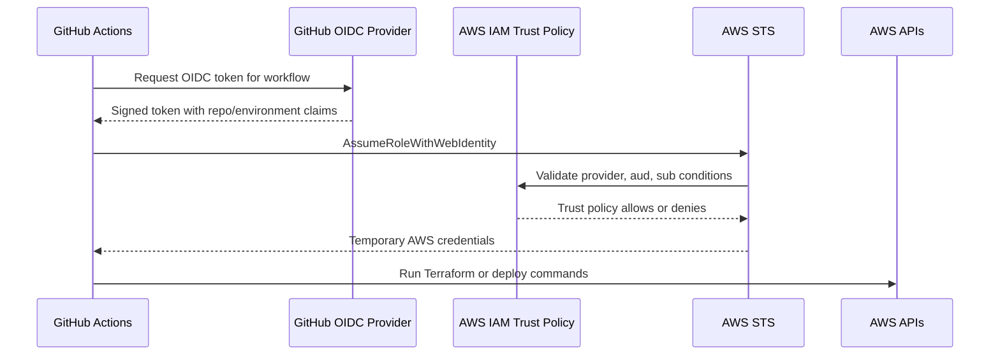

# Master Interview And Simulation Guide

Use this as the single control-tower document. The other docs go deeper, but
this one tells the story in the right order.

Memory hook:

```text
Code -> Build -> Scan -> Artifact -> OIDC -> Terraform -> Deploy -> Request -> Observe -> Simulate -> Fix
```

## 1. What We Built



Interview answer:

```text
I built a production-style DevOps lab where GitHub Actions builds and validates
a Java Spring Boot application, Terraform provisions AWS infrastructure, GitHub
uses OIDC to assume an AWS IAM role without long-lived access keys, and the
application is deployed to private EC2 instances behind an Application Load
Balancer. Then I use CloudWatch, logs, alarms, and runtime commands to simulate
and troubleshoot production incidents.
```

## 2. The GitHub Actions Workflows

Current workflow files:

```text
.github/workflows/java-ci.yaml
.github/workflows/aws-oidc-smoke-test.yml
.github/workflows/terraform-dev-plan.yml
.github/workflows/terraform-dev-apply.yml
.github/workflows/terraform-dev-destroy.yml
.github/workflows/deploy-dev.yml
```

### Java CI

File:

```text
.github/workflows/java-ci.yaml
```

Purpose:

```text
Prove the application is buildable, tested, scanned, and packaged before we
think about deployment.
```

Flow:

```text
checkout repo
set up Java 21
mvn -B verify
SonarQube scan
Trivy filesystem scan
upload Trivy report
upload JAR artifact
```

Key terms:

```text
checkout:
  Downloads the repository code onto the GitHub-hosted runner.

setup-java:
  Installs/configures Java on the runner.

mvn -B verify:
  Runs Maven in batch mode through test/package/verify lifecycle phases.

artifact:
  A build output that can be stored, downloaded, deployed, or audited.
```

### AWS OIDC Smoke Test

File:

```text
.github/workflows/aws-oidc-smoke-test.yml
```

Purpose:

```text
Prove GitHub can securely assume the AWS dev role before Terraform or deploy
workflows rely on it.
```

What it does:

```text
GitHub workflow requests an OIDC token.
AWS validates the token against the IAM trust policy.
AWS STS returns temporary credentials.
Workflow runs aws sts get-caller-identity.
```

### Terraform Plan, Apply, Destroy

Files:

```text
.github/workflows/terraform-dev-plan.yml
.github/workflows/terraform-dev-apply.yml
.github/workflows/terraform-dev-destroy.yml
```

Purpose:

```text
Plan:
  Preview what Terraform will create, update, or delete.

Apply:
  Create or update dev infrastructure.

Destroy:
  Delete dev infrastructure so the lab does not keep costing money.
```

Enterprise pattern:

```text
Feature branch:
  Run terraform fmt, validate, and plan.

Dev branch:
  Allow apply to dev.

Main branch:
  Apply to production only after approvals, change review, and controlled window.
```

### Deploy Dev Application

File:

```text
.github/workflows/deploy-dev.yml
```

Purpose:

```text
Build the tested JAR, upload it to S3, then use SSM to deploy it onto private
EC2 instances without SSH.
```

Flow:

```text
checkout
set up Java 21
mvn -B verify
assume AWS role through OIDC
upload JAR to S3
send SSM command to EC2
copy JAR from S3 to /opt/signalforge/signalforge-app.jar
create/update systemd service
install/configure CloudWatch Agent
restart app
verify /actuator/health
```

## 3. Bigger Enterprise Setup

For a small learning project, app and infrastructure can live in one repo.

For a larger enterprise, common patterns are:

```text
App repo:
  application code, unit tests, Dockerfile/JAR build, app deployment workflow.

Infra repo:
  Terraform modules, environment definitions, network, IAM, RDS, ALB, EKS, etc.

Platform repo:
  reusable GitHub Actions workflows, security templates, policy-as-code.
```

Reusable workflows:

```text
If 100 repos all need the same CI process, we do not copy/paste every step.
We create a reusable workflow and call it from each repo.
```

Environment strategy:

```text
dev:
  Faster feedback. Lower cost. Used for frequent testing.

stage:
  Production-like validation. Used before release.

prod:
  Controlled deployment, approvals, stricter IAM, stricter alarms.
```

## 4. GitHub OIDC To AWS

Problem with access keys:

```text
Long-lived AWS access keys can leak, be copied, or remain valid for too long.
```

OIDC solution:

```text
GitHub gets a short-lived identity token for the workflow run.
AWS checks that token against the IAM role trust policy.
If repo, branch, environment, and audience match, AWS STS issues temporary credentials.
```

Flow:



Interview answer:

```text
I configured AWS IAM with GitHub as an OIDC identity provider and created an IAM
role trusted only by my specific repository and environment. In GitHub Actions I
do not store AWS access keys. The workflow requests an OIDC token, AWS validates
the token claims through the trust policy, and STS returns temporary
credentials. This reduces credential exposure and lets us control access by
repo, branch, and environment.
```

## 5. Terraform Structure

Important files:

```text
backend.tf:
  Remote state configuration.

providers.tf:
  Which providers and versions Terraform uses.

variables.tf:
  Inputs that can change by environment.

main.tf:
  Resources or modules to create.

outputs.tf:
  Values Terraform prints or exposes for other workflows.

terraform.tfvars:
  Environment-specific values.

.terraform.lock.hcl:
  Provider version lock file for consistency.
```

Modules vs environment files:

```text
Modules:
  Reusable building blocks, like VPC, ALB, compute, RDS, observability.

envs/dev:
  The dev environment composition. It calls modules and passes dev-specific values.
```

Why not write everything in one dev file?

```text
You can, but it becomes hard to reuse. Modules let us create the same pattern for
dev, stage, and prod while changing only inputs like instance size, subnet CIDR,
capacity, or retention.
```

State:

```text
Terraform state is not backend.tf.
backend.tf tells Terraform where to store state.
The state file is Terraform's memory of what it created.
```

Drift:

```text
Drift means real AWS resources no longer match Terraform code/state, often
because someone changed something manually in the AWS console.
```

How to detect:

```bash
terraform plan -input=false
```

Interview answer:

```text
I use Terraform modules for reusable infrastructure and environment folders for
dev/stage/prod composition. Remote state lets the team share the same source of
truth. I detect drift with terraform plan, and if an emergency manual change is
made in production, I either import/update Terraform afterward or revert the
manual change once the incident is mitigated.
```

## 6. Java Spring Boot Build And Artifact

Maven is the Java build tool.

In our CI:

```bash
mvn -B verify
```

Meaning:

```text
-B:
  Batch mode. Good for CI because Maven will not prompt interactively.

verify:
  Runs lifecycle phases up to verify, including compile, test, package, and checks.
```

Common Maven lifecycle:

```text
validate -> compile -> test -> package -> verify -> install -> deploy
```

What comes out:

```text
app/target/signalforge-app-0.1.0-SNAPSHOT.jar
```

Unit tests:

```text
Usually run during the test phase.
They test small pieces of code quickly.
```

Integration tests:

```text
Usually run later, often verify phase or a separate job.
They test multiple components together, such as app + database.
```

Code quality:

```text
Code quality means maintainability and risk signals: bugs, code smells,
duplication, complexity, coverage, and risky patterns.
```

Static analysis:

```text
Static analysis checks source code without running the application.
SonarQube is static analysis plus quality gate reporting.
```

Trivy:

```text
Trivy scans filesystem, dependencies, containers, IaC, and secrets depending on
configuration. In this project we use it as a CI security scan.
```

Artifact store:

```text
Current lab:
  S3 artifact bucket.

Enterprise:
  JFrog Artifactory, Nexus, GitHub Packages, or cloud-native artifact registry.
```

Deployment:

```text
The deploy workflow downloads the exact tested JAR from S3 to EC2 and restarts
systemd. In production, this could be handled by CodeDeploy, Ansible, SSM,
Jenkins, Spinnaker, Argo CD, or a platform deployment service.
```

## 7. User Request Flow Through AWS

Current flow without domain:

```text
Browser -> ALB DNS -> ALB listener port 80 -> target group -> EC2 private IP:8080 -> Spring Boot app
```

Future flow with domain and TLS:

```text
Browser -> Route 53 -> ALB HTTPS listener :443 -> TLS termination -> target group -> EC2 private IP:8080
```

### What TLS Termination Means

TLS protects traffic between browser and ALB.

```text
Browser opens HTTPS connection to ALB.
ALB presents ACM certificate.
Browser validates certificate.
Encrypted connection is established.
ALB decrypts HTTP request.
ALB forwards a new request to the backend target.
```

Simple analogy:

```text
The browser sends a locked envelope to the ALB. The ALB opens it, reads the
destination/path, then sends a new internal request to the app target.
```

### What ALB Understands

ALB works at Layer 7.

Layer 7 means application protocol level:

```text
HTTP
HTTPS
host header
path
method
headers
cookies
query string
status code
```

Example request:

```http
GET /cart?user=123 HTTP/1.1
Host: app.example.com
User-Agent: Chrome
Cookie: session_id=abc123
Accept: text/html
```

Terms:

```text
Host:
  The domain the user requested, such as app.example.com.

Path:
  The part after the domain, such as /cart.

Query string:
  Extra parameters after ?, such as ?user=123.

Headers:
  Metadata about the request, such as browser type, auth token, content type.

Payload/body:
  Data sent in POST/PUT requests, such as JSON form data.

Endpoint:
  A specific URL path handled by the app, such as /actuator/health or /api/orders.
```

ALB routing examples:

```text
Host-based:
  api.example.com -> API target group
  app.example.com -> web target group

Path-based:
  /api/* -> API target group
  /admin/* -> admin target group
  / -> web target group
```

## 8. Production Simulations

### 200 OK

Meaning:

```text
Request succeeded.
```

Test:

```bash
curl -i http://<alb-dns-name>/actuator/health
```

Expected:

```text
HTTP/1.1 200
```

### 404 Not Found

Meaning:

```text
The ALB/app is reachable, but the requested path does not exist.
```

Test:

```bash
curl -i http://<alb-dns-name>/not-a-real-page
```

What to check:

```text
Is the URL path correct?
Was the route removed in a recent deployment?
Is ALB forwarding to the right target group?
```

### 401 Unauthorized

Meaning:

```text
Authentication is missing or invalid.
```

Common causes:

```text
Missing token
Expired session
Wrong auth header
Secret or identity provider issue
```

### 502 Bad Gateway

Meaning:

```text
ALB reached a target, but the target response was invalid or connection failed.
```

Common causes:

```text
App not listening on expected port
App crashed while ALB tried to connect
Security group issue
Backend closed connection
Timeout mismatch
TLS mismatch if backend expects HTTPS but ALB sends HTTP
```

Commands:

```bash
systemctl status signalforge.service --no-pager
ss -lntp | grep 8080
curl -i http://localhost:8080/actuator/health
journalctl -u signalforge.service -n 100 --no-pager
```

### 503 Service Unavailable

Meaning:

```text
ALB has no healthy targets or service cannot handle the request.
```

How to simulate:

```bash
sudo systemctl stop signalforge.service
```

What to watch:

```text
Target group health becomes unhealthy.
CloudWatch UnHealthyHostCount increases.
ALB may return 503 if all targets are unhealthy.
```

Fix:

```bash
sudo systemctl start signalforge.service
curl -i http://localhost:8080/actuator/health
```

### 504 Gateway Timeout

Meaning:

```text
ALB waited for the backend target, but the backend took too long to respond.
```

Common causes:

```text
Slow database query
Thread pool exhausted
External API slow
Backend timeout larger than ALB idle timeout
CPU/memory pressure
```

## 9. Observability Reading Order

When something breaks, read signals in this order:

```text
1. Browser or curl response code
2. ALB RequestCount and 4xx/5xx
3. TargetResponseTime p95/p99
4. HealthyHostCount and UnHealthyHostCount
5. ASG CPU
6. CloudWatch Agent memory/disk
7. Application logs
8. JVM GC logs
9. Session Manager commands
10. Recent deployment or Terraform change
```

Why this order works:

```text
Start from user impact, then move inward layer by layer until you find where the
signal changes from healthy to unhealthy.
```

CloudWatch Agent collects:

```text
memory used percent
disk used percent
swap used percent
app log file
JVM GC log file
```

AWS services publish without CloudWatch Agent:

```text
ALB request count
ALB 4xx and 5xx
Target 5xx
Target response time
Target health
EC2 CPU/network/status checks
VPC Flow Logs
```

## 10. JVM, Heap, GC, Threads

JVM:

```text
Java Virtual Machine. It is the runtime that executes the Java application.
```

Heap:

```text
Memory area where Java stores objects created by the app.
```

GC:

```text
Garbage Collection. JVM cleanup process that removes unreachable objects from heap.
```

Thread:

```text
A unit of execution. Web requests, DB calls, and background work use threads.
```

Thread pool:

```text
A managed group of reusable threads. If all threads are busy, new requests wait
or fail.
```

Commands:

```bash
pgrep -fa java
jcmd <pid> GC.heap_info
jstat -gc <pid> 1000 5
jcmd <pid> Thread.print
```

What to send to application team:

```text
Time window of issue
ALB status codes and latency
App logs with stack traces
GC logs around the issue
Thread dump if requests are stuck
Heap information if memory is high
Recent deployment SHA
```

## 11. Java vs Node.js vs Python

Common deployment pattern:

```text
Build/package -> store artifact -> deploy to server -> run as service -> health check -> observe
```

### Java

Build tool:

```text
Maven or Gradle
```

Output:

```text
JAR or WAR
```

Runtime:

```bash
java -jar app.jar
```

Troubleshooting:

```bash
jcmd <pid> GC.heap_info
jstat -gc <pid> 1000 5
jcmd <pid> Thread.print
journalctl -u app.service -n 100 --no-pager
```

### Node.js

Build/package tool:

```text
npm, yarn, pnpm
```

Output:

```text
JavaScript bundle, dist folder, Docker image, or package artifact
```

Runtime:

```bash
node server.js
npm start
```

Troubleshooting:

```bash
node --version
npm ls
ps aux --sort=-%mem | head
journalctl -u app.service -n 100 --no-pager
curl -i http://localhost:<port>/health
```

Common Node.js issues:

```text
Event loop blocked
Memory leak in V8 heap
Too many open connections
Bad environment variable
Dependency mismatch
```

### Python

Build/package tool:

```text
pip, poetry, pipenv, uv
```

Output:

```text
Wheel, source package, virtual environment, Docker image
```

Runtime:

```bash
python app.py
gunicorn app:app
uvicorn app:app
```

Troubleshooting:

```bash
python --version
pip freeze
ps aux --sort=-%mem | head
journalctl -u app.service -n 100 --no-pager
curl -i http://localhost:<port>/health
```

Common Python issues:

```text
Virtual environment mismatch
Missing dependency
Gunicorn worker exhaustion
Slow database calls
Memory growth from large objects
Wrong environment variables
```

## 12. What To Practice Today

Practice in this order:

```text
1. Deploy infrastructure with Terraform apply workflow.
2. Deploy app with deploy-dev workflow.
3. Open ALB URL.
4. Open CloudWatch dashboard.
5. Connect to EC2 with Session Manager.
6. Run service/log/port/health commands.
7. Simulate 503 by stopping service.
8. Start service and watch target recover.
9. Generate curl traffic and watch RequestCount/latency.
10. Check app logs and GC logs in CloudWatch.
```

Say this out loud after the practice:

```text
I started from the user symptom, checked ALB status and target health, connected
to the private EC2 instance through Session Manager, checked systemd, logs, port
8080, and health endpoint, then used CloudWatch metrics and logs to confirm the
issue and recovery.
```

## 13. Deep Docs To Open From Here

```text
GitHub Actions:
  docs/03-github-actions-learning-path.md
  docs/11-github-actions-ci.md

OIDC:
  docs/16-oidc-explained-human-version.md
  docs/15-aws-oidc-terraform-bootstrap.md

Terraform:
  docs/04-terraform-operations.md
  docs/17-terraform-enterprise-runbook.md

Java/Maven/artifacts:
  docs/12-java-maven-pom-artifacts.md
  docs/13-quality-gates-and-ci-security.md

AWS request/network flow:
  docs/18-aws-network-flow.md
  docs/20-end-to-end-dev-test-runbook.md

Runtime troubleshooting:
  docs/21-linux-aws-command-reference.md
  docs/25-aws-console-runtime-navigation.md
  docs/26-cloudwatch-agent-runtime-observability.md

Scenarios:
  docs/05-interview-troubleshooting-notes.md
  docs/09-scenario-catalog.md
```
