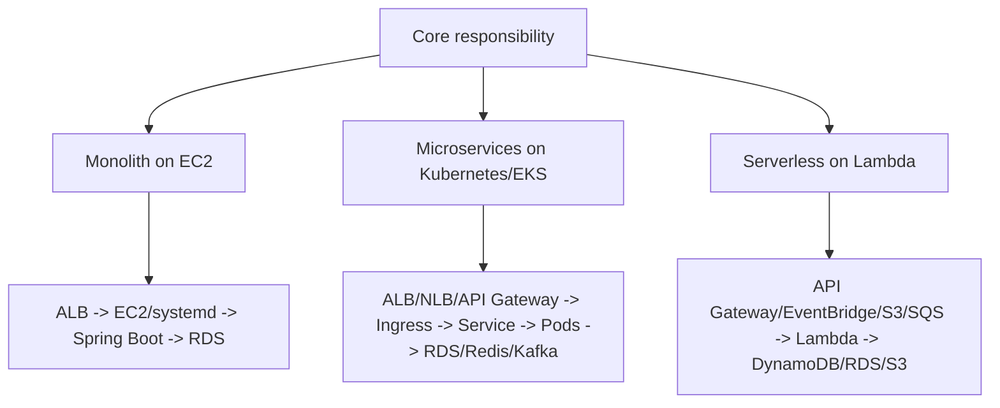

# Architecture Patterns: Monolith, Microservices, Serverless

Use this when the interviewer moves beyond this EC2 lab and asks:

```text
How would this change for microservices on Kubernetes or serverless on Lambda?
```

The key is not to memorize three separate worlds. The key is to map the same
responsibilities to different runtimes.

Memory hook:

```text
Frontend -> Entry point -> Compute -> Service logic -> Data -> Observability -> Release strategy
```

## 1. Same Concepts, Different Runtime



Interview answer:

```text
I think in responsibilities first, not tools first. Every architecture needs an
entry point, compute runtime, service logic, data layer, security boundary,
deployment process, and observability. In my EC2 lab those map to ALB, EC2,
systemd, Spring Boot, RDS, IAM, GitHub Actions, and CloudWatch. In Kubernetes
they map to Ingress, Services, Pods, Helm, EKS IAM, and Prometheus/CloudWatch.
In serverless they map to API Gateway or events, Lambda, managed data services,
IAM execution roles, and CloudWatch/X-Ray.
```

## 2. Frontend, Backend, Database

### Frontend

Frontend is what the user sees.

Examples:

```text
React
Angular
Vue
Next.js
Static HTML/CSS/JS
Mobile app
```

Where it can run:

```text
S3 + CloudFront:
  Static frontend.

ECS/EKS/EC2:
  Server-rendered frontend or full web app.

Vercel/Netlify:
  Managed frontend platform.
```

What it calls:

```text
Backend APIs such as /api/orders, /api/users, /api/cart.
```

### Backend

Backend is the service logic.

Examples:

```text
Java Spring Boot
Node.js Express/NestJS
Python FastAPI/Django/Flask
Go service
.NET API
```

Where it can run:

```text
EC2:
  Long-running process managed by systemd.

EKS:
  Containerized service running as pods.

ECS/Fargate:
  Containerized service without managing EC2 nodes directly.

Lambda:
  Function invoked by HTTP request or event.
```

### Database

Database stores state.

Examples:

```text
RDS PostgreSQL/MySQL:
  Relational data, transactions, SQL.

DynamoDB:
  Serverless key-value/document access, high scale.

ElastiCache/Redis:
  Cache, sessions, fast lookups.

S3:
  Object storage for files/artifacts/data lake.

OpenSearch:
  Search and log analytics.
```

Interview answer:

```text
Frontend handles user interaction, backend handles business logic, and the
database stores durable state. The deployment target can change, but the
separation stays similar: user interface, API/service layer, and data layer.
```

## 3. Monolith On EC2

Our current lab is closest to this.

Flow:

```text
Browser -> ALB -> EC2 private subnet -> systemd -> Spring Boot app -> RDS
```

Build:

```text
Maven builds a JAR.
```

Deploy:

```text
GitHub Actions uploads JAR to S3.
SSM command copies JAR to EC2.
systemd restarts the service.
```

Scale:

```text
Auto Scaling Group adds/removes EC2 instances.
ALB sends traffic to healthy targets.
```

Observe:

```text
ALB metrics
EC2 CPU
CloudWatch Agent memory/disk/app logs/GC logs
RDS metrics
VPC Flow Logs
```

Best for:

```text
Simple deployment
Small/medium teams
One application released together
Learning infrastructure fundamentals
```

Challenges:

```text
One deployment can affect the whole app.
Scaling is coarse-grained.
Large codebase can become harder to maintain.
```

## 4. Microservices On Kubernetes/EKS

Microservices split the backend into smaller services.

Example:

```text
user-service
order-service
payment-service
inventory-service
notification-service
```

Flow:

```text
Browser -> Route 53 -> ALB -> Kubernetes Ingress -> Service -> Pod -> Database/message broker
```

Kubernetes terms:

```text
Pod:
  Smallest deployable unit. Usually one application container.

Deployment:
  Desired number/version of pods.

Service:
  Stable internal network name/load balancer for pods.

Ingress:
  HTTP routing from outside the cluster to services.

ConfigMap:
  Non-secret configuration.

Secret:
  Sensitive configuration.

Horizontal Pod Autoscaler:
  Scales pods based on CPU, memory, or custom metrics.

Node group:
  EC2 worker nodes that run pods.
```

Build:

```text
Build container image.
Run unit tests, scans, quality gates.
Push image to ECR/JFrog/GitHub Container Registry.
```

Deploy:

```text
Helm chart or Kubernetes manifests update deployment image tag.
Argo CD/Flux/GitHub Actions applies the change.
Kubernetes rolls pods gradually.
```

Scale:

```text
HPA scales pods.
Cluster Autoscaler/Karpenter scales nodes.
```

Observe:

```text
Pod logs
Container CPU/memory
Ingress/ALB metrics
Service latency/error rate
Prometheus metrics
Grafana dashboards
CloudWatch Container Insights
OpenTelemetry traces
```

Interview answer:

```text
For microservices on EKS, I package each service as a container image, push it to
a registry, and deploy it through Helm or GitOps. ALB Ingress handles external
routing, Kubernetes Services route traffic inside the cluster, and Deployments
manage desired pod replicas. For observability I look at ingress metrics, pod
logs, container CPU/memory, service-level latency/error rate, and distributed
traces because one user request may travel across multiple services.
```

Common follow-up:

```text
How do you know which microservice failed?
```

Answer:

```text
I use correlation IDs and distributed tracing. The edge service receives the
request and passes a trace/correlation ID to downstream services. Logs and
traces are tied to the same ID, so I can follow one request from API gateway or
ingress through service A, service B, database, and response.
```

## 5. Serverless On Lambda

Serverless means we do not manage servers directly.

HTTP flow:

```text
Browser -> Route 53 -> CloudFront optional -> API Gateway -> Lambda -> DynamoDB/RDS/S3
```

Event-driven flow:

```text
S3 upload -> Lambda
SQS message -> Lambda
EventBridge schedule -> Lambda
DynamoDB stream -> Lambda
```

Build:

```text
Package function code and dependencies.
Run tests/scans.
Create deployment artifact or container image.
```

Deploy:

```text
Terraform, SAM, Serverless Framework, CDK, or GitHub Actions.
```

Scale:

```text
Lambda scales by concurrent executions.
No EC2 ASG or Kubernetes HPA needed for the function itself.
```

Observe:

```text
CloudWatch Logs per function
Lambda duration
Errors
Throttles
Concurrent executions
Iterator age for stream processing
DLQ messages
X-Ray traces
```

Interview answer:

```text
For serverless, I move from server-level thinking to invocation-level thinking.
There is no systemd service or EC2 memory to manage. I monitor Lambda duration,
errors, throttles, concurrency, cold starts, and downstream failures. For HTTP
APIs, API Gateway becomes the front door. For async workflows, SQS, EventBridge,
S3, or streams trigger the function.
```

Common follow-up:

```text
What is throttling in Lambda?
```

Answer:

```text
Lambda throttling means invocations are rejected or delayed because concurrency
limits are reached. I check account concurrency, reserved concurrency,
downstream limits, retry behavior, and DLQ messages.
```

## 6. CI/CD Comparison

```text
Monolith on EC2:
  Build JAR -> store artifact -> deploy to EC2 -> restart service -> health check.

Microservices on EKS:
  Build image -> scan image -> push registry -> update Helm/image tag -> rolling deploy pods.

Serverless on Lambda:
  Package function/image -> scan -> deploy version -> shift alias traffic -> monitor errors.
```

Quality gates are common to all:

```text
Unit tests
Integration tests
Code quality
Security/dependency scan
Secret scan
Artifact/image immutability
Approval gates for production
Post-deploy smoke tests
Rollback plan
```

## 7. Deployment Strategies

### Rolling

```text
Replace old instances/pods gradually.
```

Used in:

```text
ASG instance refresh
Kubernetes Deployment rolling update
```

### Blue-Green

```text
Run old and new environments side by side, then switch traffic.
```

Used when:

```text
You want fast rollback by switching traffic back.
```

### Canary

```text
Send small percentage of traffic to new version first.
```

Used when:

```text
You want to detect problems before all users are impacted.
```

Serverless version:

```text
Lambda version + alias traffic shifting.
```

Kubernetes version:

```text
Argo Rollouts, Flagger, service mesh, or weighted ingress.
```

## 8. Troubleshooting Translation Map

### User Gets 5xx

EC2:

```text
Check ALB target health, systemd service, port 8080, app logs, EC2 CPU/memory.
```

Kubernetes:

```text
Check ingress, service endpoints, pod readiness, pod logs, container restarts,
resource limits, downstream services.
```

Lambda:

```text
Check API Gateway logs, Lambda errors, timeout, throttles, permissions,
downstream service errors.
```

### High Latency

EC2:

```text
Check ALB p95/p99, CPU, memory, GC logs, DB latency, thread pool.
```

Kubernetes:

```text
Check ingress latency, pod CPU/memory throttling, HPA, service-to-service traces,
node pressure.
```

Lambda:

```text
Check duration, cold starts, VPC networking, downstream latency, concurrency.
```

### Memory Growth

EC2 Java:

```text
Check OS memory, JVM heap, GC, thread count, app logs.
```

Kubernetes:

```text
Check pod memory usage, OOMKilled events, memory limits, heap dumps, HPA/VPA.
```

Lambda:

```text
Check configured memory, duration, max memory used in REPORT logs, code-level leaks across warm invocations.
```

## 9. Technology Translation

### Java

```text
Build:
  Maven/Gradle

Output:
  JAR/WAR/container image

Runtime:
  JVM

Watch:
  heap, GC, threads, DB pool, CPU/memory
```

### Node.js

```text
Build:
  npm/yarn/pnpm

Output:
  JS bundle/container image/package

Runtime:
  Node.js/V8

Watch:
  event loop lag, heap, open handles, CPU, memory, dependency versions
```

### Python/FastAPI

```text
Build:
  pip/poetry/uv

Output:
  wheel/package/container image

Runtime:
  Python interpreter + Uvicorn/Gunicorn

Watch:
  worker count, request latency, dependency mismatch, memory, DB pool
```

## 10. How To Speak This In Interview

Short version:

```text
The architecture changes by runtime, but the engineering flow is consistent. I
need a secure entry point, compute layer, deployment pipeline, data layer,
observability, and rollback strategy. For EC2, that is ALB, ASG, systemd, S3
artifact, and CloudWatch Agent. For EKS, that becomes Ingress, Services, Pods,
container registry, Helm/GitOps, and Prometheus/CloudWatch. For Lambda, it
becomes API Gateway or event source, Lambda function, IAM execution role,
managed data services, CloudWatch, and X-Ray.
```

Follow-up version:

```text
For troubleshooting, I always start from user impact and move inward. In EC2 I
move from ALB to target health to systemd and JVM. In Kubernetes I move from
ingress to service endpoints to pod readiness/logs and resource limits. In
Lambda I move from API Gateway or event source to Lambda errors, duration,
throttles, permissions, and downstream dependencies.
```

## 11. What To Build Later In This Lab

After the EC2 version is comfortable:

```text
1. Containerize Orbit.
2. Push image to ECR.
3. Deploy same app to EKS with Helm.
4. Add Kubernetes Ingress and HPA.
5. Add Prometheus/Grafana or CloudWatch Container Insights.
6. Build one FastAPI Lambda or Java Lambda service.
7. Compare EC2 vs EKS vs Lambda troubleshooting side by side.
```
