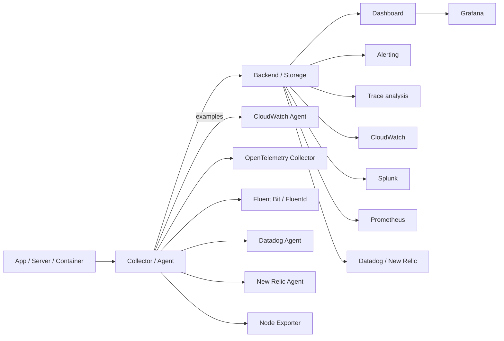

# Observability Tools Comparison

Use this when someone asks:

```text
What tools do you use for observability, and why?
```

The beginner mistake is thinking every tool does the same thing. They do not.
Some tools collect data, some store/search data, some visualize, some alert,
and some trace requests across services.

Memory hook:

```text
Collect -> Store -> Visualize -> Alert -> Trace -> Explain
```

## 1. Logs, Metrics, Traces

```text
Metrics:
  Numbers over time.
  Example: CPU 82%, p95 latency 1.4s, 5xx count 12.

Logs:
  Timestamped text/events.
  Example: "Database connection timeout" or Java stack trace.

Traces:
  Request journey across components.
  Example: browser -> ALB -> API -> payment service -> database.
```

Memory:

```text
Metrics tell you something is wrong.
Logs tell you what happened.
Traces tell you where it happened.
```

Example:

```text
Metric:
  p95 latency increased from 200 ms to 2 seconds.

Log:
  order-service logs show connection timeout to database.

Trace:
  One request spent 40 ms in API, 30 ms in auth, and 1.8 sec waiting on DB.
```

## 2. Observability Tool Categories



Important:

```text
Agent:
  Runs near the workload and collects data.

Backend:
  Stores, indexes, queries, and analyzes the data.

Dashboard:
  Human-friendly view of metrics/logs/traces.

Alerting:
  Turns a bad signal into Slack/PagerDuty/email.
```

## 3. CloudWatch Agent

What it does:

```text
Runs on EC2 or servers.
Collects OS metrics like memory, disk, swap.
Tails log files and ships them to CloudWatch Logs.
Can collect some StatsD/collectd metrics.
```

What it is good for:

```text
AWS-native EC2 monitoring.
Shipping app/system logs into CloudWatch.
Publishing memory/disk metrics that EC2 does not provide by default.
Simple AWS-first production setups.
```

What it does not fully solve:

```text
It does not automatically give full distributed traces.
It does not automatically understand every application runtime.
It is not a full APM product by itself.
```

In our lab:

```text
CloudWatch Agent ships:
  /var/log/signalforge/app.log
  /var/log/signalforge/gc.log

CloudWatch Agent publishes:
  mem_used_percent
  disk_used_percent
  swap_used_percent
```

Interview line:

```text
CloudWatch Agent fills the EC2 visibility gap. AWS gives CPU and network by
default, but for memory, filesystem disk usage, and application log files, I
install CloudWatch Agent and manage its config through deployment automation.
```

## 4. OpenTelemetry

OpenTelemetry is an open standard for telemetry.

What it can collect:

```text
Metrics
Logs
Traces
Context propagation
Service-to-service request timing
```

Main pieces:

```text
Instrumentation:
  Code/library/agent that creates telemetry from the app.

OpenTelemetry Collector:
  Receives, processes, batches, filters, and exports telemetry.

Exporter:
  Sends telemetry to a backend such as CloudWatch, X-Ray, Datadog, New Relic,
  Splunk, Prometheus, Grafana Tempo, or another platform.
```

Why it matters:

```text
It reduces vendor lock-in.
One instrumentation approach can send data to different observability backends.
It is very useful for microservices because one request crosses many services.
```

Example flow:

```text
Spring Boot app -> OpenTelemetry Java agent -> OTel Collector -> X-Ray/Tempo/Datadog
```

Interview line:

```text
For distributed systems, I use OpenTelemetry to generate traces and propagate
trace IDs across services. That lets me follow one request across API, service,
database, queue, and downstream calls instead of guessing from separate logs.
```

## 5. AWS X-Ray

What it does:

```text
AWS-native distributed tracing.
Shows service map and request segments.
Works well with Lambda, API Gateway, ECS/EKS/EC2 apps, and AWS SDK calls.
```

Good for:

```text
Finding which downstream service is slow.
Tracing Lambda/API Gateway/serverless requests.
AWS-native tracing without buying a third-party APM tool.
```

How it compares with OpenTelemetry:

```text
OpenTelemetry:
  Standard/instrumentation and collection approach.

X-Ray:
  AWS tracing backend/viewer.

Together:
  App emits OTel traces -> collector/exporter sends to X-Ray.
```

## 6. Datadog

What it does:

```text
Commercial observability/APM platform.
Provides infrastructure metrics, logs, traces, dashboards, alerts, synthetics,
APM, RUM, and many integrations.
```

Agent:

```text
Datadog Agent runs on EC2, containers, Kubernetes nodes, or as DaemonSet.
It collects host/container metrics, logs, traces, and integrations.
```

Good for:

```text
Enterprise-wide observability across AWS, Kubernetes, apps, databases.
APM dashboards with service maps.
Strong alerting and integration ecosystem.
```

Interview line:

```text
Datadog is a full observability platform. Instead of building everything from
CloudWatch, Prometheus, log search, and tracing separately, many teams use the
Datadog Agent and APM to centralize metrics, logs, traces, dashboards, and
alerts across services.
```

## 7. New Relic

What it does:

```text
Commercial observability/APM platform focused on application performance,
infrastructure, logs, traces, browser/mobile monitoring, and dashboards.
```

Good for:

```text
APM and code-level transaction visibility.
Understanding slow transactions, external calls, and database timing.
Full-stack views from frontend to backend.
```

Interview line:

```text
New Relic is similar to Datadog in that it provides a managed observability/APM
platform. It is useful when teams want application transaction visibility,
distributed tracing, infrastructure monitoring, and dashboards in one place.
```

## 8. Splunk

What it does:

```text
Log/search/analytics platform.
Often used for centralized log search, security analysis, audit logs, and SIEM.
```

Good for:

```text
Searching large volumes of logs.
Security investigations.
Audit trails.
Compliance.
Correlating events across systems.
```

How logs get there:

```text
Splunk Universal Forwarder
HTTP Event Collector
Fluent Bit / Fluentd
OpenTelemetry Collector
Cloud integrations
```

Interview line:

```text
Splunk is strongest for log analytics and security-style event investigation.
If I need to search application, access, audit, and security logs across many
systems, Splunk is commonly used as the centralized log analytics platform.
```

## 9. Fluent Bit And Fluentd

Both are log collectors/forwarders.

Fluent Bit:

```text
Lightweight.
Fast.
Common in Kubernetes as a DaemonSet.
Good for collecting container logs and forwarding them.
```

Fluentd:

```text
Heavier and more feature-rich.
Large plugin ecosystem.
Often used where more complex log routing/transformation is needed.
```

Common destinations:

```text
CloudWatch Logs
OpenSearch
Splunk
Kafka
S3
Datadog
New Relic
```

Interview line:

```text
Fluent Bit and Fluentd are usually log pipelines, not the final observability
backend. They collect, parse, filter, enrich, and forward logs to systems like
CloudWatch, Splunk, OpenSearch, or Datadog.
```

## 10. Prometheus

What it does:

```text
Open-source metrics collection and time-series database.
Scrapes metrics endpoints over HTTP.
Common in Kubernetes.
```

How it works:

```text
App exposes /metrics.
Prometheus scrapes /metrics every N seconds.
Prometheus stores time-series metrics.
Alerts can be handled with Alertmanager.
Grafana visualizes the metrics.
```

Good for:

```text
Kubernetes/container metrics.
Application metrics.
Custom service-level metrics.
Alerting on SLO-style metrics.
```

Not primarily for:

```text
Full text log search.
Long request traces by itself.
```

Interview line:

```text
Prometheus is my metrics system. It scrapes metrics from apps and Kubernetes
components, stores time-series data, and works with Alertmanager and Grafana for
alerting and dashboards.
```

## 11. Node Exporter

Node Exporter is a Prometheus exporter for Linux host metrics.

What it exposes:

```text
CPU
memory
disk/filesystem
network
load average
system-level Linux metrics
```

Common use:

```text
Install node_exporter on Linux hosts or run it as a Kubernetes DaemonSet.
Prometheus scrapes it.
Grafana displays host dashboards.
```

Comparison:

```text
CloudWatch Agent:
  Publishes host metrics to CloudWatch.

Node Exporter:
  Exposes host metrics for Prometheus to scrape.
```

Interview line:

```text
Node Exporter is commonly used with Prometheus to collect Linux host-level
metrics, similar in purpose to CloudWatch Agent memory/disk collection, but in
the Prometheus ecosystem.
```

## 12. Grafana

What it does:

```text
Visualization and dashboards.
Can query many data sources.
```

Data sources:

```text
Prometheus
CloudWatch
Loki
Tempo
Elasticsearch/OpenSearch
InfluxDB
Datadog and others
```

Important:

```text
Grafana usually visualizes data; it is not always the collector or primary
storage by itself.
```

Common stack:

```text
Prometheus:
  Metrics

Loki:
  Logs

Tempo:
  Traces

Grafana:
  Dashboards and exploration
```

Interview line:

```text
Grafana is the dashboard and exploration layer. I connect it to Prometheus for
metrics, Loki or CloudWatch for logs, and Tempo or X-Ray-compatible sources for
traces, depending on the platform.
```

## 13. Tool Comparison Table

```text
CloudWatch:
  AWS-native metrics, logs, dashboards, alarms.

CloudWatch Agent:
  EC2/server agent for memory, disk, and log file shipping.

OpenTelemetry:
  Open standard for metrics, logs, traces, and context propagation.

AWS X-Ray:
  AWS-native distributed tracing backend.

Datadog:
  Managed full-stack observability/APM platform.

New Relic:
  Managed observability/APM platform with strong application transaction views.

Splunk:
  Log analytics, search, security, audit, SIEM use cases.

Fluent Bit:
  Lightweight log collector/forwarder, common in Kubernetes.

Fluentd:
  Richer log collector/forwarder with many plugins.

Prometheus:
  Metrics/time-series scraping and alerting ecosystem.

Node Exporter:
  Linux host metrics exporter for Prometheus.

Grafana:
  Dashboards and visualization across many data sources.
```

## 14. What Would I Say We Use In This Project?

Current implemented stack:

```text
CloudWatch:
  Dashboard, alarms, AWS service metrics, log groups.

CloudWatch Agent:
  EC2 memory/disk custom metrics and app/GC log shipping.

VPC Flow Logs:
  Network accept/reject visibility.

SonarQube, JaCoCo, Trivy:
  CI quality, coverage, and security checks.
```

Planned next observability layer:

```text
OpenTelemetry or AWS X-Ray:
  Distributed traces and request journey across app/database/services.

Slack/PagerDuty:
  Alert notification and incident response.

Grafana/Prometheus later:
  Useful when we move to Kubernetes/EKS microservices.
```

Interview answer:

```text
In this AWS EC2 lab, I use CloudWatch for service metrics, dashboards, logs, and
alarms. I use CloudWatch Agent on EC2 because default EC2 metrics do not include
memory, filesystem usage, or application log files. For distributed tracing, the
next layer would be OpenTelemetry or AWS X-Ray. In a Kubernetes microservices
environment, I would commonly use Prometheus for metrics, Grafana for dashboards,
Fluent Bit for log forwarding, and OpenTelemetry for traces. In enterprises,
teams may also use managed platforms like Datadog, New Relic, or Splunk.
```

## 15. How To Choose

AWS-first EC2/simple workloads:

```text
CloudWatch + CloudWatch Agent + CloudWatch Alarms
```

Kubernetes open-source stack:

```text
Prometheus + Grafana + Fluent Bit + Loki/Tempo + OpenTelemetry
```

Enterprise managed observability:

```text
Datadog or New Relic for metrics/logs/traces/APM
Splunk for heavy log analytics/security/SIEM
```

Distributed tracing standard:

```text
OpenTelemetry instrumentation + chosen backend
```

Memory hook:

```text
CloudWatch for AWS-native.
Prometheus for metrics.
Grafana for dashboards.
Fluent Bit for logs.
OpenTelemetry for traces.
Datadog/New Relic for managed APM.
Splunk for log analytics/security.
```
