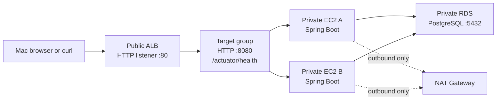

# Live Production Operations Lab

This is the hands-on operating guide for the deployed SignalForge dev lab.

Its purpose is not to memorize commands. It teaches one repeatable incident
loop:

```text
Create one controlled symptom
-> record the time
-> observe the user-facing result
-> inspect CloudWatch metrics
-> inspect ALB target health
-> inspect service, logs, JVM, or network evidence
-> recover
-> explain what happened
```

Use only the dev lab. Run one drill at a time and restore it before starting
the next one.

## 0. Production Operating Check Card

Use this compact sequence whenever someone says, "the application is slow or
not working."

```text
1. External symptom: browser, curl, synthetic monitor, or customer report.
2. Load balancer: listener, request count, 4xx/5xx, p95 latency.
3. Target group: healthy/unhealthy count and health-check reason.
4. Compute: ASG desired/current capacity, EC2 status, CPU, memory, disk.
5. App host: service state, listening port, local health, app logs.
6. Runtime: JVM heap, GC, threads, process CPU/memory.
7. Dependencies: DNS, routes, security groups, Flow Logs, RDS state/metrics.
8. Change context: recent deployment, artifact SHA, secret/config, Terraform drift.
9. Mitigate, verify recovery, record timeline, prevent recurrence.
```

### Is curl Always Used?

`curl` is the fastest common manual tool, but it is not the only production
check. Use the tool that matches the question:

```text
Browser:
  Does the real user experience and UI journey work?

curl:
  What exact URL, HTTP status, headers, DNS/TCP/TTFB timing, and response body
  does the service return?

ALB target health check:
  Is the application health endpoint healthy from the load balancer's view?

CloudWatch Synthetics or another synthetic monitor:
  Does a scheduled external user journey work continuously?

k6, JMeter, Locust, or Gatling:
  What happens under controlled concurrent load? Do not use curl loops as the
  final load-testing tool.

CloudWatch metrics/logs/traces:
  What changed over time, where, and for which requests?
```

For this lab, use Mac `curl` to create or reproduce external customer traffic,
then prove the result with CloudWatch and Target Groups. Use Session Manager
only when you need host/runtime evidence or a controlled one-host failure.

## 1. The Three Places You Work

```text
Mac terminal:
  Behave like an external user. Send requests through the public ALB.

AWS Console:
  Read evidence from CloudWatch, Target Groups, Auto Scaling Groups,
  Systems Manager, VPC, and RDS.

Session Manager terminal on one EC2 instance:
  Inspect or alter one exact application host. Use it for systemd, logs,
  port 8080, JVM, memory, CPU, routes, and target-health drills.
```

Do not use an EC2 terminal to prove that the public ALB is working. A local
`curl http://localhost:8080/...` proves only the app on that one host. A Mac
`curl http://<alb-dns>/...` proves the whole public request path.

## 2. Architecture You Are Operating



Current settings that matter during drills:

```text
ALB listener:                  HTTP port 80
Target protocol and port:      HTTP port 8080
Target health path:            /actuator/health
Target health interval:        30 seconds
Healthy threshold:             2 successful checks (about 60 seconds)
Unhealthy threshold:           3 failed checks (about 90 seconds)
ASG desired/min/max:           2 / 2 / 3
ASG health check type:         ELB
ASG CPU target tracking:       60 percent
CloudWatch dashboard period:   60 seconds
```

### HTTPS, TLS, and Port Choices

The current deployed lab has this public path:

```text
Browser -> HTTP port 80 -> ALB listener -> HTTP port 8080 -> private EC2 app
```

HTTPS is not deployed yet. Do not claim that the current ALB has an ACM
certificate or a port 443 listener. The next HTTPS design will be:

```text
Browser -> HTTPS port 443 -> ALB listener + ACM certificate
        -> ALB terminates TLS
        -> new HTTP connection to private EC2 port 8080
```

Plain-English TLS flow:

```text
1. Browser connects to the ALB on 443.
2. Browser and ALB complete the TLS handshake.
3. ALB presents the ACM certificate; browser validates the certificate name.
4. Browser-to-ALB traffic is encrypted.
5. ALB decrypts it, evaluates host/path/header listener rules, and opens or
   reuses a separate backend connection to a healthy target.
6. ALB forwards useful context such as X-Forwarded-For, X-Forwarded-Proto,
   and X-Forwarded-Port.
```

### TLS vs SSL: The Simple, Accurate Explanation

```text
SSL:
  The older family of protocols. It is obsolete/insecure in modern systems, but
  people still casually say "SSL certificate."

TLS:
  Transport Layer Security. The modern protocol actually used for HTTPS.

ACM certificate:
  The certificate managed by AWS Certificate Manager. It proves the ALB is
  allowed to serve a domain and participates in the TLS handshake.
```

TLS gives the browser-to-ALB connection three protections:

```text
Confidentiality:
  Others cannot read the request/response contents in transit.

Authentication:
  Browser validates that the certificate matches the requested domain and was
  issued by a trusted certificate authority.

Integrity:
  Tampering with encrypted traffic is detected.
```

Simple handshake memory hook:

```text
ClientHello -> ALB certificate -> browser validates domain -> shared session
keys -> encrypted HTTPS request
```

TLS termination means that encrypted browser traffic ends at ALB. ALB decrypts
it, applies Layer-7 listener rules, then creates a separate backend connection
to the target. In this lab that backend connection is HTTP port 8080 inside the
private VPC. A stricter production design can also use HTTPS from ALB to target
when end-to-end encryption or compliance requires it.

Ports are conventions, not magic requirements:

```text
80:
  Standard default HTTP port. Browsers use it when the URL is http://host.

443:
  Standard default HTTPS port. Browsers use it when the URL is https://host.

8080:
  Common application HTTP port. Spring Boot uses 8080 by default, and this
  project explicitly sets server.port: 8080 in application.yml. We chose it.
  It could have been 8081, 3000, or another unused port.

5432:
  Conventional PostgreSQL port.
```

All connected layers must agree on the chosen app port:

```text
Spring Boot server.port = 8080
systemd starts Java app on 8080
Target group forwards HTTP to 8080
ALB security group allows outbound 8080 to app security group
App security group allows inbound 8080 only from ALB security group
```

## 3. Time: UTC, Periods, and Delay

The dashboard shown in AWS uses UTC when the top-right selector says `UTC
timezone`. Before every drill, write down the start and finish time:

```bash
date -u
date
```

Meaning:

```text
date -u:
  UTC time. Compare this directly to the dashboard and CloudWatch Logs.

date:
  Your Mac's local time. Helpful for your own notes, but not for matching a
  UTC dashboard unless you convert it.
```

A `60 second` metric period is not 60 milliseconds. It is one one-minute
bucket. CloudWatch adds all requests, errors, or observations in that minute
and plots one data point. AWS service metrics can appear one to two minutes
after the request. During a drill:

```text
1. Set dashboard range to 15 minutes.
2. Keep UTC selected.
3. Record UTC start time.
4. Run the drill for one or two minutes if an alarm needs multiple periods.
5. Refresh the dashboard.
6. Compare graph movement immediately after the recorded time.
```

UTC means Coordinated Universal Time. It is the global reference clock used by
cloud systems, logs, APIs, and incident timelines. It does not change for
daylight saving time. Your local time changes by location and sometimes by
season. For example, New York in July is EDT, which is UTC minus four hours:

```text
20:00 UTC = 16:00 EDT in New York during July
```

During an incident, pick one timezone and keep it consistent. UTC is usually
best because CloudWatch, deployment logs, GitHub Actions, and teams in multiple
regions can use the same timeline.

## 4. Console Map

Open these pages in separate browser tabs before a drill:

```text
CloudWatch -> Dashboards -> signalforge-dev-ops-dashboard
  Metrics: request count, ALB/target 5xx, p95 latency, target health, CPU,
  OS memory/disk, app logs, GC logs, VPC rejected flows.

EC2 -> Load Balancers -> signalforge-dev-alb
  Listener port 80 and default forward action.

EC2 -> Target Groups -> signalforge-dev-app-tg -> Targets
  Exact healthy/unhealthy state and health-check reason.

EC2 -> Auto Scaling Groups -> signalforge-dev-app-asg
  Desired/current capacity, activity history, and scaling activity.

EC2 -> Instances
  Instance state, status checks, private IP, and Session Manager connection.

Systems Manager -> Fleet Manager or Session Manager
  Connect safely to private EC2 without opening SSH port 22.

CloudWatch -> Logs Insights
  Search app, GC, and VPC Flow Logs with exact UTC time windows.

VPC -> Route Tables and Security Groups
  Prove public/private routes and ALB-to-app rules.
```

## 5. Endpoint Map

Set the external ALB once in your Mac terminal:

```bash
ALB="http://signalforge-dev-alb-861720759.us-east-1.elb.amazonaws.com"
```

The endpoints below are intentionally safe dev drills.

| Endpoint | Expected learning signal |
|---|---|
| `/` | Normal browser/UI request |
| `/actuator/health` | Spring Boot health used by the target group |
| `/api/signals` | Normal API request |
| `/api/incidents` | Normal API request |
| `/api/ops/snapshot` | Orbit's in-memory view of recent requests |
| `/simulate/error?status=500` | Target-side application 5xx |
| `/simulate/error?status=401` | Authentication story |
| `/simulate/error?status=403` | Authorization story |
| `/simulate/error?status=404` | Missing path/resource story |
| `/simulate/error?status=429` | Throttling story |
| `/simulate/latency?ms=1800` | Slow target / p95 and p99 story |
| `/simulate/cpu?seconds=60` | CPU pressure on one target |
| `/simulate/memory?mb=128` | Retained memory on one JVM |
| `/simulate/memory/clear` | Releases retained simulation memory |

## 5.1 HTTP Requests, Endpoints, Headers, Metadata, and JSON

An endpoint is one address in an application that accepts a particular HTTP
method and performs one job. For example:

```text
GET /api/signals
```

means, "read the signals resource." The method and path together matter. A
future `POST /api/incidents` would mean, "create an incident." The current
Orbit API intentionally uses GET endpoints because it is a read/simulation lab.
In a production application, state-changing actions normally use POST, PUT,
PATCH, or DELETE rather than GET.

### URL Anatomy

```text
http://signalforge-dev-alb-861720759.us-east-1.elb.amazonaws.com:80/api/signals?limit=10
|----|  |----------------------------------------------------------| |--| |-----------| |-------|
scheme                         host                               port    path       query string
```

```text
scheme:
  http today; https after ACM/TLS is added.

host:
  The ALB DNS name today; a friendly Route 53 name later.

port:
  80 is implied for HTTP and usually omitted from the URL.

path:
  Which endpoint the ALB/app should handle, such as /api/signals.

query string:
  Optional input after ?. For example, ms=1800 tells the latency simulator how
  long to wait.
```

### Read One Real JSON Response

Run from your Mac terminal:

```bash
curl -i -H "Accept: application/json" "$ALB/api/signals"
```

Typical shape of the response:

```http
HTTP/1.1 200
Content-Type: application/json

[
  {"name":"latency","value":"normal","timestamp":"2026-07-10T...Z"},
  {"name":"error_rate","value":"normal","timestamp":"2026-07-10T...Z"}
]
```

Spring Boot converts Java `List` and `Map` values into JSON automatically. This
is why `/api/signals`, `/api/incidents`, and `/api/ops/snapshot` return JSON.

### What an HTTP Request Contains

Conceptual request sent by curl/browser:

```http
GET /api/signals HTTP/1.1
Host: signalforge-dev-alb-861720759.us-east-1.elb.amazonaws.com
Accept: application/json
User-Agent: curl/8.x
```

Important pieces:

```text
Method:
  GET means read. POST usually creates. PUT/PATCH updates. DELETE removes.

Headers:
  Key/value metadata about the request, not the main business data.

Body:
  The main payload, usually JSON for POST/PUT/PATCH. GET usually has no body.

Status code:
  The result: 200 success, 404 missing path, 500 app failure, and so on.

Response headers:
  Metadata about the reply, such as Content-Type, cache policy, request ID, or
  server behavior.
```

Headers added or forwarded by an ALB are particularly important:

```text
X-Forwarded-For:
  Original client IP. The backend connection itself came from ALB, so this tells
  the application who made the original request.

X-Forwarded-Proto:
  http today; https after TLS is terminated at ALB.

X-Forwarded-Port:
  80 today; 443 after HTTPS is added.

Host:
  Hostname the client requested. ALB listener rules can route by host.
```

### Forwarded Header Example

Today, a browser sends this to the public ALB:

```http
GET /api/signals HTTP/1.1
Host: signalforge-dev-alb-861720759.us-east-1.elb.amazonaws.com
```

The ALB then opens a separate backend request to a private EC2 target on port
8080. The backend connection source is the ALB, not the original browser. To
preserve the useful original context, ALB forwards headers like:

```http
GET /api/signals HTTP/1.1
Host: signalforge-dev-alb-861720759.us-east-1.elb.amazonaws.com
X-Forwarded-For: 203.0.113.24
X-Forwarded-Proto: http
X-Forwarded-Port: 80
```

Meaning:

```text
X-Forwarded-For: 203.0.113.24
  The original browser/client IP. Without it, the application sees the ALB as
  the TCP peer and cannot identify the original client address for logging,
  rate limiting, audit records, or security investigation.

X-Forwarded-Proto: http
  The protocol used by the browser at the public edge. In the current lab that
  is HTTP. After ACM and an HTTPS listener are added, it becomes https even if
  ALB forwards plain HTTP to EC2 port 8080.

X-Forwarded-Port: 80
  The public port the browser used to reach the ALB. After HTTPS is added it
  becomes 443. It is not the private target port 8080.
```

Future HTTPS example:

```text
Browser -> https://app.example.com:443 -> ALB
ALB terminates TLS -> http://private-ec2:8080

Backend receives:
  X-Forwarded-Proto: https
  X-Forwarded-Port: 443
  X-Forwarded-For: original browser IP
```

This is why an application behind an ALB must be configured to trust forwarded
headers only from a known proxy/load balancer. Blindly trusting a client-supplied
`X-Forwarded-For` header lets an attacker spoof an IP address.

Useful metadata you correlate in a production incident:

```text
UTC timestamp, HTTP method, path, status code, response time, client/request
ID, trace ID, source IP, authenticated user/tenant, deployment SHA, target ID,
and error message. Never log raw passwords, tokens, cookies, or secret values.
```

### Read Headers and Timing

```bash
# Response headers plus JSON body.
curl -i "$ALB/api/ops/snapshot"

# Verbose request/response exchange. Good for connectivity and headers.
curl -v -H "Accept: application/json" "$ALB/api/signals"

# Headers only. -D - writes headers to terminal; -o /dev/null discards body.
curl -sS -D - -o /dev/null "$ALB/api/signals"
```

Do not paste a real `Authorization: Bearer ...`, `Cookie: ...`, session token,
or database password into a terminal recording, ticket, screenshot, or chat.

### Future Database-Backed JSON Request

After Orbit is connected to RDS, a realistic create request can look like this:

```bash
curl -i -X POST "$ALB/api/incidents" \
  -H "Content-Type: application/json" \
  -d '{"title":"P95 latency breach","severity":"high"}'
```

`-X POST` selects the HTTP method. `Content-Type: application/json` tells the
server how to parse the body. `-d` sends the JSON request body. This endpoint is
not implemented yet; it is the next database integration milestone.

## 6. Commands You Must Know

Run these from your Mac when you are testing the public customer path:

```bash
curl -i "$ALB/actuator/health"
curl -v "$ALB/api/signals"
curl -sS -o /dev/null \
  -w "status=%{http_code} dns=%{time_namelookup}s connect=%{time_connect}s ttfb=%{time_starttransfer}s total=%{time_total}s\n" \
  "$ALB/api/signals"
```

Meaning:

```text
-i:
  Include HTTP response headers and status code.

-v:
  Verbose connection details. Useful for DNS, TCP, headers, redirects, and TLS.

-sS:
  Silent normal output but still print errors.

-o /dev/null:
  Discard the response body. Useful when only status/timing matters.

-w:
  Print selected timing fields after the request completes.

time_namelookup:
  DNS lookup time.

time_connect:
  TCP connection establishment time.

time_starttransfer (TTFB):
  Time until the first response byte. Useful for backend delay.

time_total:
  Total request duration.
```

Run these after connecting to exactly one EC2 host through Session Manager:

```bash
hostname
pgrep -fa java
sudo systemctl status signalforge.service --no-pager
sudo ss -lntp | grep 8080
curl -i http://localhost:8080/actuator/health
sudo tail -n 100 /var/log/signalforge/app.log
sudo tail -n 100 /var/log/signalforge/gc.log
sudo journalctl -u signalforge.service -n 50 --no-pager
free -h
ps -eo pid,%cpu,%mem,rss,cmd --sort=-%mem | head
ip route
```

Meaning:

```text
pgrep -fa java:
  Find Java process IDs. -f searches full command line; -a prints it.

systemctl status:
  Service lifecycle state: active, failed, stopped, restart count, recent errors.

ss -lntp:
  Listening sockets. -l listening, -n numeric ports, -t TCP, -p process.

tail -n 100:
  Last 100 lines of a file. app.log is application stdout/stderr; gc.log is
  Java garbage collection output.

journalctl -u:
  systemd lifecycle logs for one unit. Use it for start/stop/restart failures.

free -h:
  Operating-system memory in human-readable units.

ps -eo ... --sort=-%mem:
  Process list with CPU, memory percentage, resident memory, and command.
  The minus sign sorts highest first.

ip route:
  Routing table. The private subnet should show its default route through NAT,
  not directly to the Internet Gateway.
```

## 7. Drill 1: Baseline

Location: Mac terminal, then CloudWatch dashboard.

```bash
date -u

for i in {1..20}; do
  curl -sS -o /dev/null -w "status=%{http_code} total=%{time_total}s\n" \
    "$ALB/api/signals"
done

date -u
```

Expected evidence after one to two minutes:

```text
Dashboard request count:     increases
Target 5xx:                  zero
ALB 5xx:                     zero
P95 latency:                 low milliseconds
HealthyHostCount:            2
UnHealthyHostCount:          0
ASG CPU:                     low
```

Conclusion:

```text
The full external request path works. This is the baseline you compare every
later incident against.
```

## 8. Drill 2: Target-Side HTTP 500

Location: Mac terminal, then CloudWatch dashboard.

```bash
date -u

for i in {1..10}; do
  curl -sS -o /dev/null -w "status=%{http_code}\n" \
    "$ALB/simulate/error?status=500"
done

date -u
```

Expected evidence:

```text
Target 5xx:                  increases
ALB 5xx:                     stays zero
Healthy targets:             remain 2
P95:                          usually normal
```

Why:

```text
The Java app intentionally returned a valid HTTP 500 response. ALB successfully
communicated with a healthy target, so this is Target_5XX, not ELB_5XX.
```

The target 5xx alarm is configured to breach when there are more than five
errors in one 60-second period. Ten requests make the signal clear.

Important limitation:

```text
This is an intentional HTTP status response, not a thrown Java exception.
Do not expect a stack trace merely because Target_5XX rises. A future
/simulate/exception drill will teach logged application exceptions.
```

## 9. Drill 3: Latency and P95

Location: Mac terminal, then CloudWatch dashboard.

```bash
date -u

for i in {1..10}; do
  curl -sS -o /dev/null -w "status=%{http_code} total=%{time_total}s\n" \
    "$ALB/simulate/latency?ms=1800" &
done

wait
date -u
```

The `&` starts each request in the background. `wait` waits for all background
requests to finish.

Expected evidence:

```text
P95 TargetResponseTime:      approaches 1.8 seconds
Target 5xx:                  zero
Healthy targets:             remain 2
```

The latency alarm requires p95 greater than one second for two consecutive
60-second periods. Repeat this workload for about two minutes when practicing
the alarm state transition.

## 10. Drill 4: One Unhealthy Target

Location: Session Manager on one EC2 instance, then Target Group console and
CloudWatch.

Before changing anything, identify the host:

```bash
hostname
sudo systemctl status signalforge.service --no-pager
```

Stop only one app instance:

```bash
date -u
sudo systemctl stop signalforge.service
```

Wait about 90 seconds. The target group needs three failed checks at a 30-second
interval before it marks the target unhealthy.

Expected evidence:

```text
Target Group -> Targets:     one unhealthy, one healthy
Dashboard HealthyHostCount:  1
Dashboard UnHealthyHostCount: 1
Mac curl to ALB:             still 200 because ALB uses the other target
```

Recovery:

```bash
sudo systemctl start signalforge.service
sudo systemctl status signalforge.service --no-pager
curl -i http://localhost:8080/actuator/health
```

Wait about 60 seconds for two successful health checks.

## 11. 502, 503, and 504: Do Not Confuse Them

```text
Target returns /simulate/error?status=502:
  A target-side HTTP 502. CloudWatch counts Target_5XX.

True ALB 502:
  ALB cannot obtain a valid backend response. Typical causes are a stopped app,
  wrong target port, security-group block, reset connection, or protocol mismatch.
  In dev, stopping one service can produce intermittent failure before health
  checks remove that target. Do not depend on it as a deterministic 502 drill.

True ALB 503:
  No healthy targets are available. Stop both app services only after mastering
  the one-target drill, then restore both promptly. Expect about 90 seconds for
  both targets to become unhealthy.

Target returns /simulate/error?status=504:
  A target-side 504 status, counted as Target_5XX.

True ALB 504:
  ALB waits longer than its idle timeout for the backend response. The current
  latency endpoint caps at 30 seconds and the ALB default idle timeout is 60
  seconds, so this lab currently teaches high latency, not a true ALB 504.
  A real 504 drill requires a reviewed Terraform change to timeout settings or
  a deliberately slower backend.
```

## 12. JVM, GC, and Memory Drill

Location: Session Manager on one exact EC2 instance.

First establish baseline:

```bash
PID="$(pgrep -f signalforge-app.jar)"
echo "$PID"
free -h
command -v jcmd
command -v jstat
```

Apply gradual pressure on this exact host:

```bash
date -u
curl -i "http://localhost:8080/simulate/memory?mb=128"
free -h
sudo tail -n 100 /var/log/signalforge/gc.log
```

If the JDK tools exist:

```bash
jcmd "$PID" GC.heap_info
jstat -gc "$PID" 1000 10
jcmd "$PID" Thread.print
```

Meaning:

```text
JVM heap:
  Java object memory. The memory endpoint deliberately retains byte arrays.

GC:
  Garbage Collection. JVM removes objects that are no longer reachable.

jcmd GC.heap_info:
  Current heap layout and occupancy.

jstat -gc PID 1000 10:
  Print GC counters every 1000 ms, ten times.

jcmd Thread.print:
  Thread dump. Use it when requests are slow, blocked, or CPU is high.
```

CloudWatch Agent publishes OS memory and disk, not JVM heap percentage. Use
CloudWatch for `mem_used_percent`; use `jcmd`, `jstat`, and GC logs for JVM
details.

Always clear this test before moving on:

```bash
curl -i "http://localhost:8080/simulate/memory/clear"
```

## 13. CPU Drill and Auto Scaling

The current ASG target-tracking target is 60 percent. The CPU alarm requires
average ASG CPU above 70 percent for three consecutive 60-second periods. One
six-second request will not demonstrate either behavior.

Use this only after baseline, 500, latency, and unhealthy-target drills:

```bash
seq 1 20 | xargs -P 10 -I {} \
  curl -sS -o /dev/null "$ALB/simulate/cpu?seconds=60"
```

Meaning:

```text
seq 1 20:
  Produce 20 work items.

xargs -P 10:
  Run up to 10 requests concurrently.

cpu?seconds=60:
  Each request performs CPU work for up to one minute.
```

Watch for several minutes:

```text
CloudWatch ASG CPU:          rises
CloudWatch P95:              may rise
ASG Activity history:        may add a third instance
Target group:                new target starts initial, then healthy
```

Stop if CPU stays high longer than needed. This can add a third EC2 instance and
increase cost.

## 14. Logs Insights and VPC Flow Logs

Open CloudWatch -> Logs Insights. Select this app log group:

```text
/aws/ec2/signalforge-dev/signalforge
```

Application/log stream query:

```sql
fields @timestamp, @logStream, @message
| filter @logStream like /app/
| sort @timestamp desc
| limit 50
```

GC log query:

```sql
fields @timestamp, @logStream, @message
| filter @logStream like /gc/
| sort @timestamp desc
| limit 50
```

For rejected network flows, select:

```text
/aws/vpc/signalforge-dev/flow-logs
```

Then run:

```sql
fields @timestamp, srcAddr, dstAddr, dstPort, protocol, action
| filter action = "REJECT"
| sort @timestamp desc
| limit 50
```

VPC Flow Logs prove connection metadata and ACCEPT/REJECT decisions. They do not
show packet payloads. Use `sudo tcpdump -ni any port 8080` only during a short,
approved host-level capture when you need packet-level evidence.

## 14.1 Database Operations and Database Limits of the Current Lab

The infrastructure currently creates a real private PostgreSQL RDS instance:

```text
Engine:                       PostgreSQL 16
Port:                         5432
Public access:                disabled
Encryption at rest:           enabled
Database security-group rule: only app security group can reach port 5432
Credential storage:           AWS Secrets Manager
Backup retention:             one day
```

However, the current Java application is not yet database-backed. It has no
PostgreSQL driver, datasource configuration, JDBC/JPA layer, migrations, or
database query endpoint. Therefore:

```text
Today we can practice:
  RDS state, private DNS, TCP reachability, security groups, Secrets Manager,
  RDS metrics, and network triage.

Today we cannot honestly practice:
  A Java query failure, connection-pool exhaustion, slow SQL, deadlock, or a
  database-caused application 500. Those require the next milestone: connecting
  Orbit to RDS through Secrets Manager.
```

### Safe Database Connectivity Check

Location: Session Manager on one EC2 app instance.

In the RDS console, copy the endpoint under `Connectivity & security`. Do not
copy or print the database password in terminal output, logs, screenshots, or
chat.

```bash
DB_HOST="<paste-rds-endpoint-here>"

getent hosts "$DB_HOST"
timeout 5 bash -c "</dev/tcp/${DB_HOST}/5432" && echo "TCP 5432 reachable"
```

Interpretation:

```text
DNS lookup fails:
  Wrong endpoint, VPC DNS issue, or host typo.

TCP check succeeds:
  Network route and app-SG -> DB-SG port 5432 rule are working.

TCP timeout/refused:
  Check RDS status, DB security group inbound source, app security group
  outbound rule, NACLs, route/VPC boundary, and RDS endpoint.
```

### Where to Look During a Real Database Incident

```text
RDS -> Databases -> signalforge-dev-postgres:
  Database status, endpoint, VPC/security groups, maintenance, events.

RDS -> Monitoring:
  CPUUtilization, DatabaseConnections, FreeStorageSpace, FreeableMemory,
  ReadLatency, WriteLatency, ReadIOPS, WriteIOPS.

CloudWatch -> Metrics -> AWS/RDS:
  Compare the time of an application latency/error spike with RDS metrics.

CloudWatch Logs / Application logs:
  Look for connection refused, timeout, authentication failure, pool exhausted,
  SQL error, or transaction failure messages once the application uses RDS.
```

Database triage logic after RDS is integrated:

```text
App P95/P99 rises + RDS Read/WriteLatency rises:
  Suspect slow query, I/O pressure, lock, or database CPU pressure.

App 5xx + connection errors in app logs:
  Suspect security group, DNS, rotated/incorrect secret, RDS unavailable, or
  exhausted connection pool.

App is healthy but requests wait:
  Check database connections, active queries, locks, and thread pool waits.
```

## 15. Production Triage Order

Use this order for every real incident and say it in interviews:

```text
1. Confirm customer impact: browser or curl status, path, time, affected users.
2. Check ALB: RequestCount, ELB 4xx/5xx, target 5xx, P95 latency.
3. Check target group: healthy count and health-check reason.
4. Check ASG/EC2: desired vs current capacity, instance status, CPU.
5. Check app host: systemctl, port 8080, local health endpoint, app logs.
6. Check JVM: heap, GC log, thread dump, process CPU/memory.
7. Check network/dependencies: routes, security groups, Flow Logs, RDS state.
8. Check recent change: deployment SHA, artifact, secret/config, Terraform plan.
9. Mitigate safely, verify recovery, document the timeline and permanent fix.
```

## 16. Drill Record Template

After each drill, save a short note using this structure:

```text
Drill:
UTC start/end:
User symptom:
Command and location:
Metrics that moved:
Target health:
Log/JVM/network evidence:
Immediate mitigation:
Recovery proof:
Interview explanation:
```

## 17. Learning Order

Do not run all scenarios in one session.

```text
Session 1: baseline -> target-side 500 -> latency
Session 2: one unhealthy target -> recovery -> all targets 503
Session 3: JVM memory -> GC logs -> thread dump -> CPU/ASG
Session 4: security group or route drift -> VPC Flow Logs -> Terraform plan
Session 5: Slack alarm delivery -> advisory AI incident summary
```
