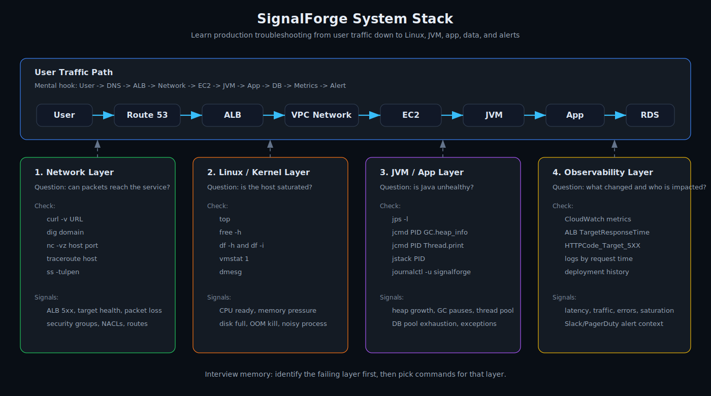
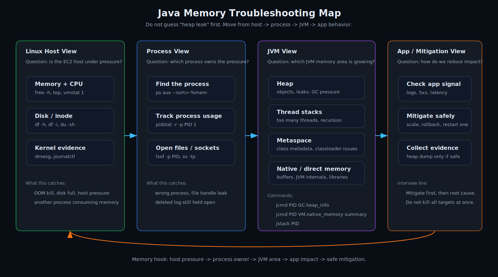
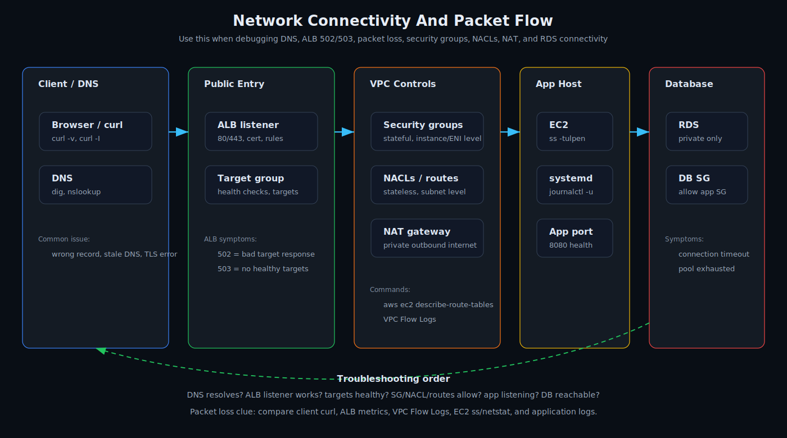
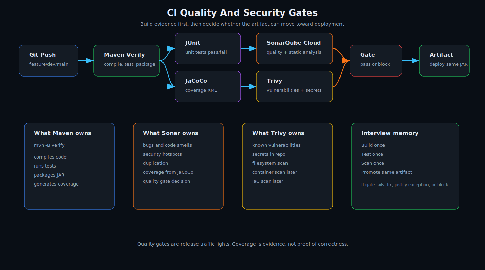
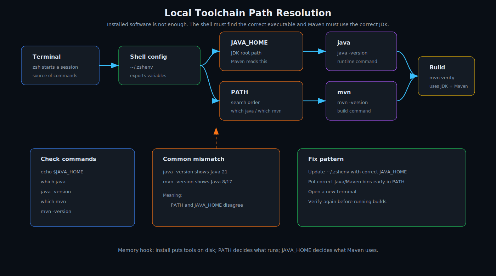
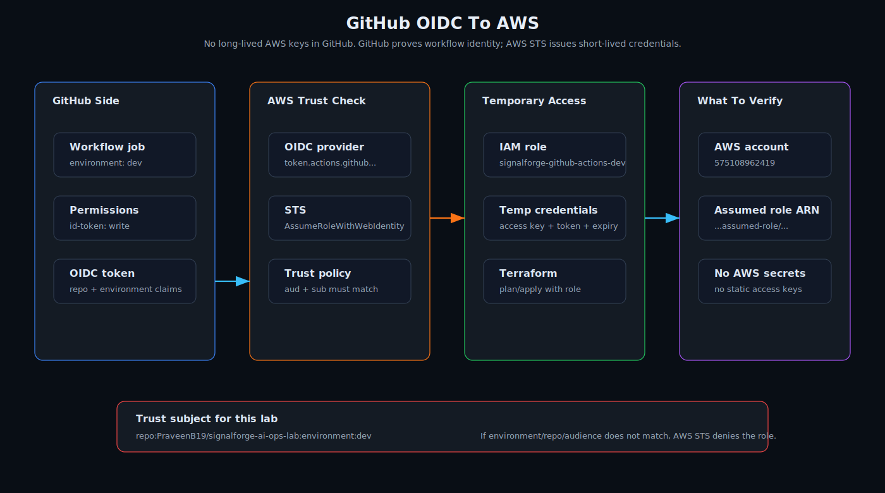
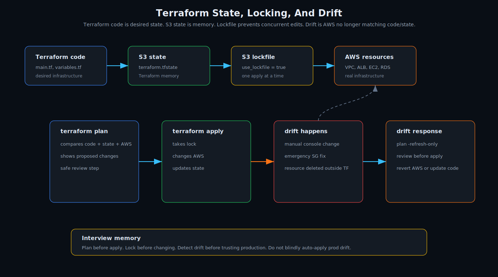

# SignalForge Visual Learning Pack

These diagrams are designed for memory first. Each one focuses on one concept so
the page does not become cluttered.

## How To Use These

Study in this order:

```text
1. System stack:
   Learn which layer owns which problem.

2. Java/Linux memory:
   Learn why high memory is not always a heap leak.

3. Network connectivity:
   Learn the request path and where 502/503/packet loss can appear.

4. CI quality/security gates:
   Learn which tool owns build, quality, coverage, and vulnerability checks.

5. Local toolchain path:
   Learn why installed Java/Maven can still point to the wrong place.

6. GitHub OIDC to AWS:
   Learn how GitHub gets short-lived AWS credentials without stored AWS keys.

7. Terraform state and drift:
   Learn why state, locking, and drift detection matter in production.
```

## Diagrams

### SignalForge System Stack



Memory hook:

```text
User -> DNS -> ALB -> Network -> EC2 -> JVM -> App -> DB -> Metrics -> Alert
```

### Java Linux Memory Map



Memory hook:

```text
Host pressure -> process owner -> JVM memory area -> app impact -> safe mitigation
```

### Network Connectivity Map



Memory hook:

```text
DNS resolves? ALB listens? targets healthy? network allows? app listens? DB reachable?
```

### CI Quality And Security Gates



Memory hook:

```text
Build once -> test once -> scan once -> promote same artifact
```

### Local Toolchain Path Map



Memory hook:

```text
Install puts tools on disk. PATH decides what runs. JAVA_HOME decides what Maven uses.
```

### GitHub OIDC To AWS



Memory hook:

```text
GitHub job -> OIDC token -> AWS STS -> IAM role -> temporary credentials
```

### Terraform State And Drift



Memory hook:

```text
Code says desired state. S3 stores memory. Lockfile prevents collision. Plan detects drift.
```

## Next Visuals To Add

```text
Security group vs NACL:
  stateful instance-level control vs stateless subnet-level control

Incident decision tree:
  502 vs 503 vs latency vs CPU vs memory vs disk
```
